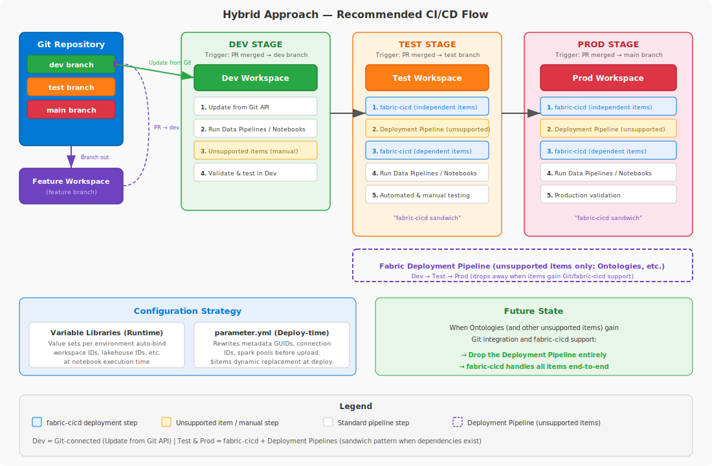

# Microsoft Fabric SDLC Patterns

A reference implementation for CI/CD in Microsoft Fabric, demonstrating how to version-control, deploy, and manage Fabric workspace items across dev, test, and production environments using GitHub Actions and the [fabric-cicd](https://microsoft.github.io/fabric-cicd) Python library.

---

## Who is this for?

Teams and engineers who need to establish a reliable software development lifecycle (SDLC) for Microsoft Fabric — including automated deployments, environment-specific configuration, and Git-based version control for Fabric items.

---

## Architecture

```
Git repo (dev branch)
  │
  │  PR merge → test branch
  ▼
┌──────────────────────────────────────────────┐
│  deploy-test.yml                             │
│    └─ fabric-cicd: publish_all_items()       │
│                    ↓ on success               │
│  etl-test.yml                                │
│    └─ Fabric REST API: run notebook          │
└──────────────────────────────────────────────┘
  │
  │  PR merge → main branch
  ▼
┌──────────────────────────────────────────────┐
│  deploy-prod.yml                             │
│    └─ fabric-cicd: publish_all_items()       │
│                    ↓ on success               │
│  etl-prod.yml                                │
│    └─ Fabric REST API: run notebook          │
└──────────────────────────────────────────────┘
```



---

## Documentation

| Document | Description |
|---|---|
| [CI/CD Release Options](fabric-cicd-release-options.md) | Evaluates all CI/CD release options for Fabric (Deployment Pipelines, Git-based, Build-based, Hybrid) and recommends the Hybrid approach. **Start here** if you're deciding on a strategy. |
| [Hybrid CI/CD Implementation Guide](fabric-hybrid-cicd-guide.md) | Deep dive into the implementation: workflow structure, sandwich pattern, configuration strategy, prerequisites, setup steps, and gotchas. |
| [Development Process](fabric-development-process.md) | How developers work day-to-day: branch-out workflow, environment bootstrap/reset script, and PR validation. |

---

## Key Concepts

Before choosing a CI/CD approach or development workflow, understand these two realities about Fabric items.

### Item Tracking Categories

Not all Fabric items can be managed the same way. From a lifecycle management perspective, items fall into three categories:

| Category | Description | Examples |
|---|---|---|
| **Git-tracked** | Items supported by [Fabric Git integration](https://learn.microsoft.com/en-us/fabric/cicd/git-integration/intro-to-git-integration#supported-items). Their definitions are serialized to files in the repo, enabling version control, branching, and code-review workflows. | Notebooks, Semantic Models, Lakehouses, Reports, Variable Libraries, Data Pipelines, Environments |
| **Deployment Pipeline–only** | Items not supported by Git integration but supported by [Fabric Deployment Pipelines](https://learn.microsoft.com/en-us/fabric/cicd/deployment-pipelines/intro-to-deployment-pipelines#supported-items). They can be promoted workspace-to-workspace but cannot be version-controlled in Git. | Template Apps (at the time of writing) |
| **Manual** | Items supported by neither Git integration nor Deployment Pipelines. These must be created and configured manually in each workspace. | Varies as Microsoft continues adding support — always check the official supported items lists |

> **Important:** Both supported items lists evolve as Microsoft adds capabilities. Always verify against the official documentation before assuming an item falls into a particular category.

This categorization directly impacts your CI/CD strategy. The [Hybrid CI/CD Implementation Guide](fabric-hybrid-cicd-guide.md) uses the "sandwich pattern" specifically to handle the gap between git-tracked and deployment-pipeline-only items.

### Variable Libraries: Dynamic vs Static Metadata

Some Fabric items resolve environment-specific values **at runtime** through [Variable Libraries](https://learn.microsoft.com/en-us/fabric/cicd/variable-library/variable-library-cicd), while others have environment-specific IDs **hardcoded in their definitions**.

| Type | How it works | Examples |
|---|---|---|
| **Dynamic (Variable Library)** | The item reads IDs from the Variable Library at runtime. Changing the active value set automatically switches the environment context — no file changes needed. | Notebooks using `notebookutils.variableLibrary.getLibrary()` |
| **Static (hardcoded)** | The item definition contains literal workspace/lakehouse GUIDs that must be rewritten per environment — either at deploy time (via `parameter.yml`) or via script (`branch_env.py`). | Semantic Model Direct Lake URL (`expressions.tmdl`), Notebook META dependency blocks (`default_lakehouse`, `default_lakehouse_workspace_id`) |

When designing your development and CI/CD processes, identify which items in your workspace are dynamic vs static. Static items need either deploy-time parameterization (`parameter.yml` for CI/CD) or script-based rewriting (`branch_env.py` for feature branches). The [Development Process](fabric-development-process.md) doc covers how this repo handles both.

---

## Quick Start

### Prerequisites

1. **Fabric Capacity** — A Fabric or Power BI Premium capacity for all workspaces
2. **Three Fabric Workspaces** — Dev (Git-connected), Test, and Prod
3. **Service Principal** — With Contributor role on Test and Prod workspaces
4. **GitHub Environments** — `Test` and `Prod` with environment-scoped secrets
5. **Fabric Admin Setting** — "Service principals can use Fabric APIs" enabled

### Setup

1. Create a Service Principal and add it as Contributor on Test and Prod workspaces
2. Create GitHub Environments (`Test`, `Prod`) with secrets: `AZURE_TENANT_ID`, `AZURE_CLIENT_ID`, `AZURE_CLIENT_SECRET`, `FABRIC_WORKSPACE_ID`
3. Connect the Dev workspace to the `dev` branch via Fabric Git integration (folder: `data/fabric/`)
4. Create `dev`, `test`, and `main` branches
5. Develop on `dev`, merge to `test` (triggers Test deploy), merge to `main` (triggers Prod deploy)

For detailed setup instructions, see the [Implementation Guide](fabric-hybrid-cicd-guide.md#prerequisites--setup).

---

## References

- [fabric-cicd Python Library](https://microsoft.github.io/fabric-cicd) — Docs, getting started, supported item types
- [Fabric Git Integration](https://learn.microsoft.com/en-us/fabric/cicd/git-integration/intro-to-git-integration) — Official documentation
- [GitHub Actions Reusable Workflows](https://docs.github.com/en/actions/sharing-automations/reusing-workflows) — `workflow_call`, inputs, secrets
