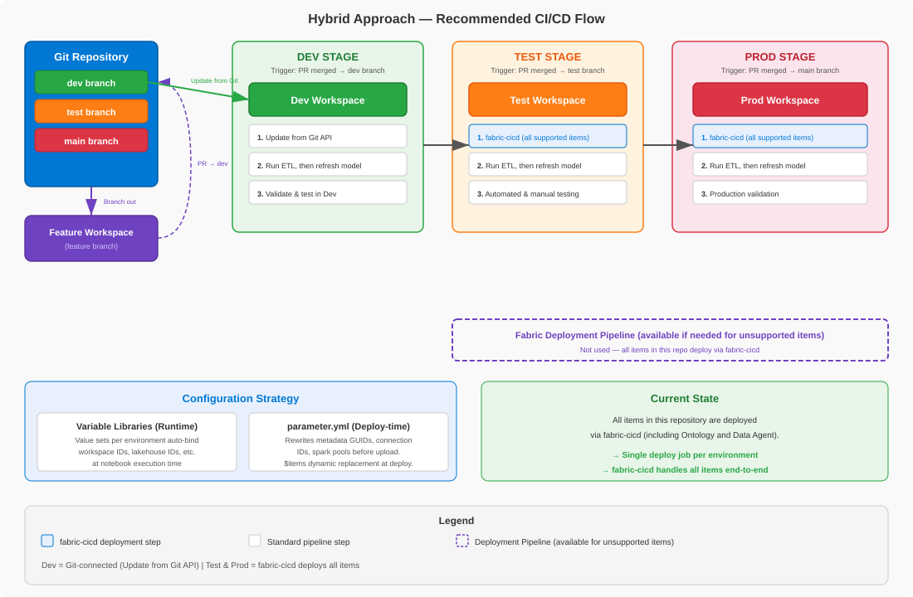

**English** | [Español](translations/es/README.md)

# Microsoft Fabric SDLC Patterns

A reference implementation for Microsoft Fabric development and CI/CD using GitHub Actions and the [fabric-cicd](https://microsoft.github.io/fabric-cicd) Python library. It includes a Branch Out developer workflow, four selectable deployment implementations, and a post-deployment notebook job followed by a semantic model refresh. The guides also discuss production controls and architectural extensions that are not all implemented by the examples.

*Based on field experience with Microsoft Fabric customers and partners. Opinions expressed here are my own and do not represent Microsoft's official guidance.*

---

## Who is this for?

Engineers and platform teams responsible for getting Microsoft Fabric workloads from a developer's laptop to production safely and repeatably — covering the developer workflow, the deployment pipeline itself, and the governance layered on top.

Architects and decision-makers evaluating Fabric will also find the [CI/CD Release Options](fabric-cicd-release-options.md) and [Governance Considerations](fabric-cicd-governance-considerations.md) useful for understanding the operating model before committing.

## Start Here

- **Run your own fork:** follow [Setup](SETUP.md), starting with **fabric-cicd non-bulk**, the repository default.
- **Choose an architecture:** read [Release Options](fabric-cicd-release-options.md), then compare the implementations below.
- **Understand the automation:** use the [shared workflow reference](fabric-hybrid-cicd-guide.md#github-actions-workflows) for triggers, callers, templates, and runners.
- **Work and release safely:** use [Development Process](fabric-development-process.md), [Governance](fabric-cicd-governance-considerations.md), and [Quality Gates](fabric-cicd-quality-gates-and-release-controls.md).

## Choose a Deployment Method

Set the repository variable `DEPLOY_METHOD` to select the deployment job for
both Test and Prod. Unset selects `fabric-cicd`. These capabilities describe
the implementations shipped here, not every feature of the underlying APIs.
Yes/No indicates use, not a quality ranking.

Find the exact values and GitHub UI locations in
[Setup: deployment method variables](SETUP.md#deployment-method-variables).
For fabric-cicd bulk specifically, use the
[fabric-cicd-bulk settings](SETUP.md#fabric-cicd-bulk-settings).

| `DEPLOY_METHOD` | Publisher | Bulk definitions | Ordering / plan handling | Replacement file |
|---|---|---|---|---|
| [`fabric-cicd`](fabric-hybrid-cicd-guide.md) — non-bulk default | fabric-cicd | No | Custom Python phases + fabric-cicd order | [parameter.yml](data/fabric/parameter.yml) |
| [`fabric-cicd-plan`](fabric-deployment-plan-guide.md#how-it-works) | fabric-cicd | No | Deployment Plan (client-read) | [parameter.yml](data/fabric/parameter.yml) |
| [`fabric-cicd-bulk`](fabric-deployment-plan-guide.md#isolated-bulk-adapter-14x) | fabric-cicd | Yes | Deployment Plan (client-read) | [parameter.yml](data/fabric/parameter.yml) |
| [`bulk`](fabric-bulk-cicd-guide.md) | Direct REST — custom Python | Yes | Custom Python phases | [bulk-parameter.yml](data/fabric/bulk-parameter.yml) |

Ordering labels:

- **Custom Python phases:** the runner chooses phases without reading a Deployment Plan.
- **Deployment Plan (client-read):** our adapters parse `DEPLOYMENT_PLAN_PATH`, normally [this plan.yml](data/fabric/DeploymentPlan.DeploymentPlan/plan.yml), to choose fabric-cicd item selections. Non-bulk uses sequential groups; bulk combines ready groups. The plan is not passed to fabric-cicd or included in REST requests.
- **Deployment Plan (platform-executed):** reserved for a future route that includes the plan in the REST request so Fabric executes its ordering. Not implemented or selectable today.

- The fabric-cicd Python library also calls REST APIs. "Direct REST" means the repository owns publishing and substitutions without fabric-cicd.
- None of these routes uses native **Fabric Deployment Pipelines**, a separate service from Deployment Plans.
- **Hybrid** describes an optional architecture that combines publishers for a workload's needs; it is not another `DEPLOY_METHOD` value or the default recommendation.
- fabric-cicd non-bulk is this repository's recommended starting point. Both plan adapters use experimental selective deployment; fabric-cicd bulk and the raw Bulk API have additional experimental/preview boundaries. Read the [plan support warning](fabric-deployment-plan-guide.md) before choosing either adapter.
- The fabric-cicd workflows use `fabric-cicd>=1.4.0,<1.5.0` and Python 3.12. fabric-cicd bulk supports the filtered dynamic replacements in this repository; the raw REST route owns a separate replacement engine.
- Both plan routes require `DEPLOYMENT_PLAN_PATH`. A route change alone does not start a run; see [workflow triggers](fabric-hybrid-cicd-guide.md#github-actions-workflows).

### Implemented Examples versus Production Guidance

The workflows currently use service-principal client secrets. Fork owners must
configure GitHub branch rules and Environment protection; workflow YAML does
not create those policies. Completing the ETL notebook and semantic model refresh
is not a complete enterprise quality-gate suite. The [release guidance](fabric-cicd-quality-gates-and-release-controls.md)
describes the additional evidence and controls to design for your workloads.
Dedicated [approval](https://github.com/michaeldeongreen/microsoft-fabric-sdlc-patterns/issues/82),
[rollback](https://github.com/michaeldeongreen/microsoft-fabric-sdlc-patterns/issues/81),
[OIDC](https://github.com/michaeldeongreen/microsoft-fabric-sdlc-patterns/issues/84), and
[Azure DevOps](https://github.com/michaeldeongreen/microsoft-fabric-sdlc-patterns/issues/85)
examples are tracked as future work.

---

## Architecture

The default fabric-cicd non-bulk route is shown below. The other methods replace its
deployment implementation and share the Test/Prod ETL listeners. Those listeners
wait for the existing loader notebook to succeed, then refresh
`Patterns_Semantic_Model` and wait for that refresh to complete.

```
Feature branch (feature/*)
  │
  │  PR → dev branch
  ▼
Git repo (dev branch)
  │
  │  PR merge → test branch (source must be dev)
  ▼
┌─────────────────────────────────────────────────────┐
│  deploy-test.yml                                    │
│    └─ fabric-cicd: publish_all_items()              │
│                    ↓ on success                     │
│  etl-test.yml                                       │
│    ├─ Fabric REST API: run notebook + wait          │
│    └─ Power BI REST API: refresh model + wait       │
└─────────────────────────────────────────────────────┘
  │
  │  PR merge → main branch (source must be test)
  ▼
┌─────────────────────────────────────────────────────┐
│  deploy-prod.yml                                    │
│    └─ fabric-cicd: publish_all_items()              │
│                    ↓ on success                     │
│  etl-prod.yml                                       │
│    ├─ Fabric REST API: run notebook + wait          │
│    └─ Power BI REST API: refresh model + wait       │
└─────────────────────────────────────────────────────┘
```

For this sample's **Direct Lake on OneLake** model, refresh performs framing of
the Delta table references after ETL; it is not another data load or a storage
mode conversion. Notebook-only callers can omit the optional model input.
See the [shared follow-up contract](fabric-hybrid-cicd-guide.md#post-etl-semantic-model-refresh)
and [refresh permissions](SETUP.md#post-etl-refresh-permissions).

Branch protection (PR required, source-branch restrictions, status checks) is enforced by GitHub branch rulesets and the [enforce-promotion-path.yml](.github/workflows/enforce-promotion-path.yml) workflow — see the [Governance Considerations](fabric-cicd-governance-considerations.md).

### Optional Architecture Extensions

Start with the non-bulk route above. If the selected publisher cannot cover a
workload, verify another route's item and identity support before adding it.
Native Deployment Pipelines are one possible extension, not an automatic
fallback for items outside Git integration.



The illustration includes an optional native Deployment Pipelines extension.
See [Optional Extensions for Unsupported Items](fabric-cicd-release-options.md#optional-extensions-for-unsupported-items)
for its support and implementation boundaries; none of the four shipped
methods invokes it.

---

## Documentation

| Document | Description |
|---|---|
| [Setup Guide](SETUP.md) | **Start here to run your own fork.** Covers required access, Fabric workspaces, reference-ID replacement, GitHub configuration, and first deployment. |
| [CI/CD Release Options](fabric-cicd-release-options.md) | Compares Fabric deployment architectures and recommends fabric-cicd non-bulk as the starting point. Covers optional hybrid extensions and a [comparison of fabric-cicd vs Bulk Import / Export APIs](fabric-cicd-release-options.md#tooling-within-option-3-fabric-cicd-vs-bulk-apis) (Preview) within Option 3. **Start here** if you're deciding on a strategy. |
| [fabric-cicd Non-Bulk CI/CD Guide](fabric-hybrid-cicd-guide.md) | Default implementation and shared workflow reference: configuration, deployment flow, post-ETL refresh, and gotchas. |
| [Raw REST Bulk CI/CD Guide](fabric-bulk-cicd-guide.md) | Direct Bulk Import API comparison: custom substitutions, value-set activation, caller phases, and limitations. Not the fabric-cicd bulk route. |
| [Deployment Plan CI/CD Guide](fabric-deployment-plan-guide.md) | Independent non-bulk and grouped bulk ordering adapters, remaining-item discovery, configuration, and validation boundaries. |
| [Shared Workflow Reference](fabric-hybrid-cicd-guide.md#github-actions-workflows) | All workflow files, their triggers, route selectors, reusable templates, runners, and ETL handoffs. |
| [Development Process](fabric-development-process.md) | How developers work day-to-day: branch-out workflow, the workspace swap script, and PR readiness check. |
| [CI/CD Governance Considerations](fabric-cicd-governance-considerations.md) | Considerations on identities, RBAC, branch protection, and approval gates for the CI/CD pipeline. Includes pointers to adjacent controls owned outside the pipeline (security/compliance topics). |
| [CI/CD Quality Gates and Release Controls](fabric-cicd-quality-gates-and-release-controls.md) | Practical automated artifact validation, test evidence, staged approvals, release tags, support checks, and rollback examples. Complements the governance controls. |

---

## Key Concepts

Before choosing a CI/CD approach or development workflow, understand these two realities about Fabric items.

### Item Tracking Categories

Git integration, file-based publishing, and native deployment support are
independent capabilities, not mutually exclusive item categories. Check each
one for the item subtype, tool version, and identity you intend to use:

| Capability | What to verify | Effect on your workflow |
|---|---|---|
| **Git integration** | Is the item supported by [Fabric Git integration](https://learn.microsoft.com/en-us/fabric/cicd/git-integration/intro-to-git-integration#supported-items)? | Supported definitions sync to Git for branching and review. Lack of Git integration does not establish whether another API can export or deploy the item. |
| **Selected publisher** | Does the chosen fabric-cicd version or item API support the item and identity? See [fabric-cicd item types](https://microsoft.github.io/fabric-cicd/latest/reference/item_types/). | Determines whether that route can publish retained definitions and apply the required configuration. |
| **Native Deployment Pipelines** | Is the item supported by [Fabric Deployment Pipelines](https://learn.microsoft.com/en-us/fabric/cicd/deployment-pipelines/intro-to-deployment-pipelines#supported-items) under the intended identity? | Can provide workspace-to-workspace promotion where supported. This is an optional separate route, not proof that Git or file-based publishing is unavailable. |

> **Important:** Support evolves. Check the official documentation for every selected surface; do not infer one support boundary from another.

The [fabric-cicd Non-Bulk CI/CD Guide](fabric-hybrid-cicd-guide.md) explains the
default route. If it cannot cover your workload, see the
[optional extensions](fabric-cicd-release-options.md#optional-extensions-for-unsupported-items)
and retain a reviewed source and recovery method for every item. The default
route covers this repository's workload items without a native pipeline;
DeploymentPlan is ordering configuration, not published by the client-read adapters.

### Variable Libraries: Dynamic vs Static Metadata

Some Fabric items resolve environment-specific values **at runtime** through [Variable Libraries](https://learn.microsoft.com/en-us/fabric/cicd/variable-library/variable-library-cicd), while others have environment-specific IDs **hardcoded in their definitions**.

| Type | How it works | Examples |
|---|---|---|
| **Dynamic (Variable Library)** | The item reads IDs from the Variable Library at runtime. Changing the active value set automatically switches the environment context — no file changes needed. | Notebooks using `notebookutils.variableLibrary.getLibrary()` |
| **Static (hardcoded)** | The item definition contains literal workspace/lakehouse GUIDs that must be rewritten per environment — either at deploy time (via `parameter.yml`) or via script (`workspace_swap.py`). | Semantic Model Direct Lake URL (`expressions.tmdl`), Notebook META dependency blocks (`default_lakehouse`, `default_lakehouse_workspace_id`) |

When designing your development and CI/CD processes, identify which items in your workspace are dynamic vs static. Static items need either deploy-time parameterization (`parameter.yml` for CI/CD) or script-based rewriting (`workspace_swap.py` for feature branches). The [Development Process](fabric-development-process.md) doc covers how this repo handles both.

---

## Quick Start

### Prerequisites

1. **Fabric Capacity** — A Fabric or Power BI Premium capacity for all workspaces
2. **Three Fabric Workspaces** — Dev (Git-connected), Test, and Prod
3. **Service Principal** — With Contributor role on Test and Prod workspaces, plus verified model-refresh and source permissions; see [Setup](SETUP.md#post-etl-refresh-permissions)
4. **GitHub Environments** — `Test` and `Prod` with environment-scoped secrets
5. **Fabric Admin Setting** — Service principal access to Fabric APIs enabled in the Fabric Admin portal under Developer settings (see [developer tenant settings](https://learn.microsoft.com/en-us/fabric/admin/service-admin-portal-developer))

### Setup

Fork owners should follow the [Setup Guide](SETUP.md). It provides one ordered
path through required access, workspace creation, Git initialization, reference
ID replacement, GitHub configuration, and first deployment.

After setup, use the [Development Process](fabric-development-process.md) for
day-to-day feature work and the [Governance Considerations](fabric-cicd-governance-considerations.md)
for production control decisions.

Use the [method matrix](#choose-a-deployment-method) when evaluating an
alternative after the default non-bulk route works. The [plan guide](fabric-deployment-plan-guide.md)
documents fabric-cicd bulk's known fallback checks, post-publish mode detection, and
remaining live-binding validation. Do not infer Production readiness from
offline transport tests.
