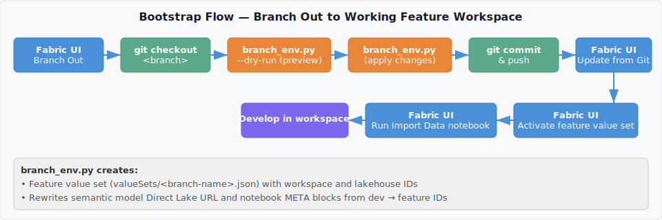
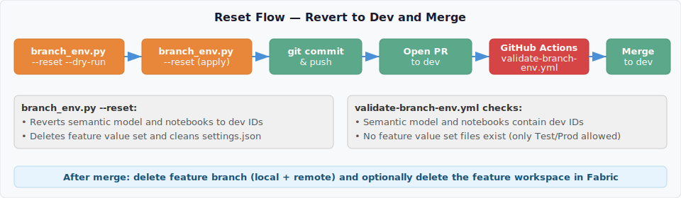

# Development Process

This document describes the two primary approaches for feature branch development in Microsoft Fabric with Git integration, the tradeoffs of each, and how this repository implements the **Branch Out** pattern.

## Scenario Comparison

### Scenario A: Short-Lived Feature Workspaces (Not Git-Synced)

In this scenario, `dev` is the only workspace connected to Git. Feature workspaces are created independently and are **not** git-synced. Code is deployed into them using [fabric-cicd](https://microsoft.github.io/fabric-cicd/latest/).

**How it works:**

1. Developer creates a feature branch in Git from `dev`.
2. A standalone Fabric workspace is created for the feature (not connected to Git).
3. A CI/CD pipeline uses `fabric-cicd` to deploy items from the feature branch into the workspace.
4. `fabric-cicd` handles metadata replacement (workspace IDs, lakehouse IDs) via `parameter.yml` at deploy time.
5. Developer works in the Fabric UI, then commits changes back to the feature branch.
6. PR is opened to merge the feature branch into `dev`.

**Positive:** You can use `fabric-cicd` to update metadata because the target workspace is not git-synced. Deployed workspaces are only updated through script-based deployments — this is the [recommended flow from fabric-cicd](https://microsoft.github.io/fabric-cicd/latest/how_to/getting_started/#git-flow):

> *"Deployed branches are not connected to workspaces via GIT Sync. Feature branches are connected to workspaces via GIT Sync. Deployed workspaces are only updated through script-based deployments."*
> — [fabric-cicd Getting Started: GIT Flow](https://microsoft.github.io/fabric-cicd/latest/how_to/getting_started/#git-flow)

**Issue:** All development happens in the Fabric UI. Syncing changes back to the feature branch is manual and error-prone, especially for items that cannot be fully tracked in Git.

---

### Scenario B: Branch Out (Git-Synced Feature Workspaces)

In this scenario, you use Fabric's [Branch Out](https://learn.microsoft.com/en-us/fabric/cicd/git-integration/manage-branches#scenario-2---branch-out-to-another-workspace) feature. The feature workspace **is** git-synced to the feature branch.

**How it works:**

1. Developer uses the Fabric UI Source Control panel to **Branch out to another workspace**.
2. Fabric creates a new branch and a new workspace, syncing all items automatically.
3. The workspace is connected to the feature branch via Git Sync.
4. Developer works in the workspace, commits changes directly to the feature branch.
5. PR is opened to merge the feature branch into `dev`.

**Positive:** Fabric moves all supported items to the feature workspace automatically. Development and source control are tightly integrated.

**Issue:** You **cannot** use `fabric-cicd` to deploy into a git-synced workspace. `fabric-cicd` pushes changes directly via Fabric APIs, which creates **workspace drift** — the workspace state diverges from what Git expects. When Git Sync next runs, it can overwrite the `fabric-cicd` changes or produce conflicts, destabilizing the workspace.

This is explicitly documented:

> *"Deployed branches are not connected to workspaces via GIT Sync ... Deployed workspaces are only updated through script-based deployments, such as through the fabric-cicd library."*
> — [fabric-cicd Getting Started: GIT Flow](https://microsoft.github.io/fabric-cicd/latest/how_to/getting_started/#git-flow)

The inverse is also true: **git-synced workspaces should not be targets for `fabric-cicd` deployments.**

Additionally, when branching out, only [Git-supported items](https://learn.microsoft.com/en-us/fabric/cicd/git-integration/intro-to-git-integration#supported-items) are available in the new workspace, and certain workspace settings are not copied:

> *"When branching out, a new branch is created and the settings from the original branch aren't copied. Adjust any settings or definitions to ensure that the new meets your organization's policies."*
> — [Basic concepts in Git integration: Branching out limitations](https://learn.microsoft.com/en-us/fabric/cicd/git-integration/git-integration-process#branching-out-limitations)

---

## How This Repository Implements Branch Out

This repository uses **Scenario B (Branch Out)** for feature development. Since `fabric-cicd` cannot be used on git-synced workspaces, a Python script handles the metadata updates that would normally be done by `fabric-cicd` at deploy time.

### The Problem

When you branch out from `dev`, all Fabric items are copied to the feature workspace. However, several items contain **hardcoded dev workspace and lakehouse IDs**:

- **Semantic Model** (`expressions.tmdl`) — Direct Lake connection URL contains dev workspace and lakehouse GUIDs.
- **Notebooks** (`notebook-content.py`) — META dependency blocks reference dev workspace and lakehouse GUIDs.
- **Variable Library** (`variables.json`) — Default value set contains dev IDs (this is expected and not modified).

Without intervention, the feature workspace semantic model points to the dev lakehouse, and notebooks with hardcoded dependencies attach to dev.

### The Solution: `branch_env.py`

A Python script at `scripts/branch_env.py` handles the full lifecycle of feature branch environment management.

#### Step-by-Step: Setting Up a Feature Branch



1. **Branch out** from the Fabric UI Source Control panel.
2. **Clone/pull** the feature branch locally:
   ```
   git fetch origin
   git checkout <feature-branch-name>
   ```
3. **Run the bootstrap script** (preview first with `--dry-run`):
   ```
   python scripts/branch_env.py --dry-run
   python scripts/branch_env.py
   ```
   The script automatically:
   - Detects the current branch name (no arguments needed).
   - Reads dev IDs from `variables.json` (the default value set).
   - Resolves feature workspace/lakehouse IDs via Fabric API or interactive prompt.
   - Creates a feature branch value set (e.g., `valueSets/<branch-name>.json`).
   - Adds the value set to `settings.json`.
   - Rewrites the semantic model Direct Lake connection in `expressions.tmdl`.
   - Rewrites notebook META dependency blocks in all `notebook-content.py` files.
   - Validates no dev IDs remain in critical files.
4. **Commit and push** the changes to the feature branch:
   ```
   git add -A
   git commit -m "Bootstrap <branch-name> workspace environment"
   git push
   ```
5. **Sync** the feature workspace from the Fabric UI (Update from Git).
6. **Activate the feature value set** in the Fabric UI: open the Variable Library → select the feature value set → activate it.
7. **Run the import data notebook** to populate the feature lakehouse.

#### Step-by-Step: Reverting Before PR to Dev



Before merging back to `dev`, all feature-specific changes must be reverted so dev IDs are restored:

1. **Run the reset script** (preview first with `--dry-run`):
   ```
   python scripts/branch_env.py --reset --dry-run
   python scripts/branch_env.py --reset
   ```
   The script automatically:
   - Reads feature IDs from the branch value set.
   - Reverts the semantic model connection to dev IDs.
   - Reverts notebook META blocks to dev IDs.
   - Deletes the feature value set file.
   - Removes the feature entry from `settings.json`.
   - Validates no feature IDs remain in critical files.
2. **Commit and push**:
   ```
   git add -A
   git commit -m "Reset environment to dev for merge"
   git push
   ```
3. **Open a PR** to `dev`.

#### PR Validation

A GitHub Actions workflow (`.github/workflows/validate-branch-env.yml`) runs on every PR targeting `dev`. It verifies:

- The semantic model contains dev workspace and lakehouse IDs.
- Notebooks with lakehouse dependencies contain dev IDs.
- No feature branch value set files exist (only `Test.json` and `Prod.json` are allowed).

If any check fails, the PR is blocked until the developer runs `branch_env.py --reset`.

#### Running the Script with GitHub Copilot Chat

Instead of running the script manually in the terminal, you can use **GitHub Copilot Chat in VS Code** (Agent mode) to execute it for you. In the chat panel, type a natural language request such as:

- *"Run the branch environment bootstrap script"*
- *"Run branch_env.py with dry-run"*
- *"Reset the branch environment back to dev"*

Copilot will execute the script in the VS Code integrated terminal, handle the interactive prompts (workspace ID, lakehouse ID), and show you the output. This is particularly useful when you are already working in Copilot Chat and want to stay in the same workflow without switching to the terminal.

Note: Copilot cannot auto-trigger the script on branch checkout. You still need to ask it or run it yourself after pulling a feature branch.

### Permissions for API Lookup

The script's automatic ID discovery calls two Fabric REST APIs against the **feature workspace**. These calls are optional — if they fail or the required packages are not installed, the script falls back to interactive manual input.

| API Call | Required Workspace Role | Delegated Scope |
|----------|------------------------|-----------------|
| [List Workspaces](https://learn.microsoft.com/en-us/rest/api/fabric/core/workspaces/list-workspaces) | Any role (only returns workspaces you have access to) | `Workspace.Read.All` or `Workspace.ReadWrite.All` |
| [List Lakehouses](https://learn.microsoft.com/en-us/rest/api/fabric/lakehouse/items/list-lakehouses) | **Viewer** or above on the feature workspace | `Workspace.Read.All` or `Workspace.ReadWrite.All` |

These are **read-only** calls — the script never creates, modifies, or deletes anything in Fabric via the API. All changes happen locally in repo files.

**Authentication:** The script uses `DefaultAzureCredential` from `azure-identity`. For local development, the simplest method is `az login` (Azure CLI). If you created the feature workspace, you already have the Admin role and no additional permissions are needed.

**No tenant-level permissions required.** The Fabric REST API does not use granular OAuth scopes like Microsoft Graph. You request the token scope `https://api.fabric.microsoft.com/.default`, and the API filters results based on your workspace role assignments. You cannot see workspaces or lakehouses you do not have access to.

### Scope of Metadata Rewriting

The script currently rewrites hardcoded IDs only in **Semantic Models** (`expressions.tmdl`) and **Notebooks** (`notebook-content.py` META blocks). Other Fabric item types (Data Pipelines, Dataflows, Spark Job Definitions, etc.) are intentionally excluded. Each item type stores metadata differently — some resolve IDs at runtime through the Variable Library, some embed them in item definitions, and some use a combination of both. Adding a new item type to the script requires careful inspection of how that item stores workspace and lakehouse references before it can be safely included in the rewrite process.

### Files Involved

| File | Role |
|------|------|
| `scripts/branch_env.py` | Bootstrap and reset feature branch environment bindings |
| `data/fabric/Patterns_Variables.VariableLibrary/variables.json` | Default (dev) value set — read-only reference for dev IDs |
| `data/fabric/Patterns_Variables.VariableLibrary/valueSets/` | Per-environment value sets (Test, Prod, feature branches) |
| `data/fabric/Patterns_Variables.VariableLibrary/settings.json` | Value set ordering |
| `data/fabric/Patterns_Semantic_Model.SemanticModel/definition/expressions.tmdl` | Direct Lake connection — rewritten by the script |
| `data/fabric/Import_Patterns_Data.Notebook/notebook-content.py` | Notebook with hardcoded lakehouse dependency — rewritten by the script |
| `.github/workflows/validate-branch-env.yml` | PR check to block feature IDs from merging to dev |
| `data/fabric/parameter.yml` | Deploy-time parameterization for fabric-cicd (used in CI/CD, not by the bootstrap script) |

## References

- [fabric-cicd: Getting Started — GIT Flow](https://microsoft.github.io/fabric-cicd/latest/how_to/getting_started/#git-flow)
- [Microsoft Fabric: Manage branches — Branch out to another workspace](https://learn.microsoft.com/en-us/fabric/cicd/git-integration/manage-branches#scenario-2---branch-out-to-another-workspace)
- [Microsoft Fabric: Basic concepts in Git integration — Branching out limitations](https://learn.microsoft.com/en-us/fabric/cicd/git-integration/git-integration-process#branching-out-limitations)
- [Microsoft Fabric: Git integration best practices](https://learn.microsoft.com/en-us/fabric/cicd/best-practices-cicd)
