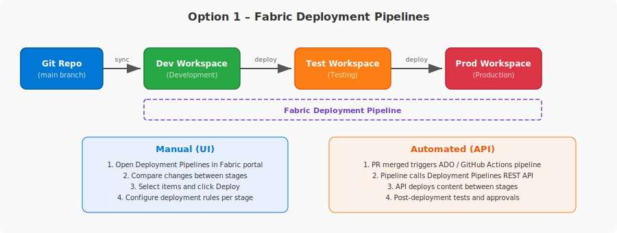
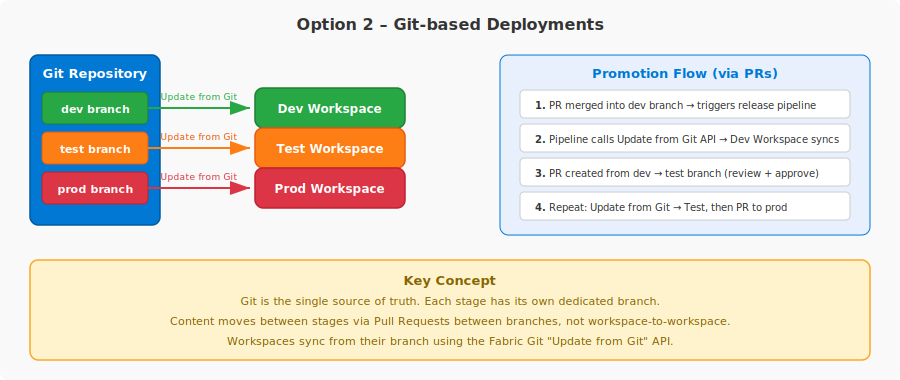
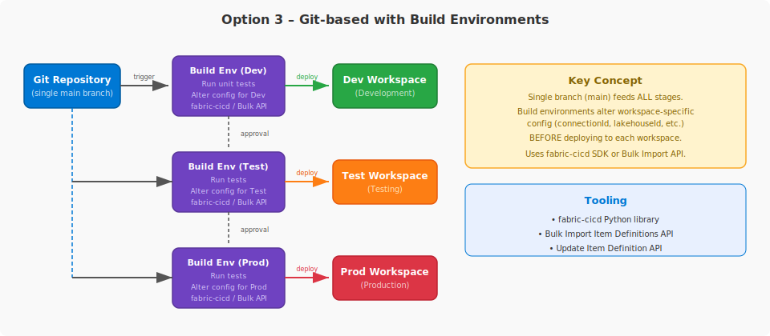

# Best Practices with Fabric CI/CD Overview

## Table of Contents

- [Introduction — Why CI/CD in Fabric?](#introduction--why-cicd-in-fabric)
- [Git Integration in Fabric](#git-integration-in-fabric)
- [Development Process](#development-process)
- [Release Options](#release-options)
  - [Option 1 – Fabric Deployment Pipelines](#option-1--fabric-deployment-pipelines)
  - [Option 2 – Git-based Deployments](#option-2--git-based-deployments)
  - [Option 3 – Git-based with Build Environments](#option-3--git-based-with-build-environments)
- [Infrastructure & Resource Provisioning](#infrastructure--resource-provisioning)
- [Comparison Summary](#comparison-summary)
- [My Recommendation](#my-recommendation)
- [Best Practices](#best-practices)
- [References](#references)
- [Acknowledgments](#acknowledgments)

---

## Introduction — Why CI/CD in Fabric?

Microsoft Fabric workspaces contain items — notebooks, pipelines, lakehouses, semantic models, and more — that need to move reliably between development, test, and production environments. Beyond items, **data** must also be ingested and transformed in each stage to validate that everything works end-to-end. CI/CD in Fabric provides the mechanisms to version-control these items, track changes over time, and automate their deployment and data workflows across stages.

---

## Git Integration in Fabric

### How It Works

- **Workspace-level integration** — Git integration operates at the workspace level. Developers connect a Fabric workspace to a Git repository and sync all supported items in a single process.
- **Supported Git providers** — Azure DevOps (cloud), GitHub (cloud), and GitHub Enterprise (cloud).
- **Two-way sync** — Changes made in the Fabric workspace are **committed** to the Git branch. Changes made in the Git repo are **pulled** into the workspace via update. Only one direction can sync at a time.
- **Connect a workspace** — A workspace admin connects the workspace to a specific repo, branch, and folder. Once connected, anyone with permissions can commit and update.
- **Item definitions stored as files** — Fabric items are serialized into file-based definitions in the repo (JSON, Python, etc.). Workspace folder structure is preserved in Git.
- **Unsupported items are ignored** — If the workspace contains items not supported by Git integration, they remain in the workspace but aren't synced. They're not deleted.
- **Branch out** — Developers can create a new branch and a new workspace from an existing connected workspace, enabling isolated development.
- **Tenant admin switches required** — Git sync, GitHub sync, and workspace creation switches must be enabled in the Fabric admin portal.
- **Fabric capacity required** — A Fabric or Power BI Premium capacity is needed to use Git integration.

### Unsupported Items

Git integration only works with a specific set of Fabric items. **Any item not on the supported list is ignored** — it stays in the workspace but is not synced, committed, or deleted.

For the full list of supported items, see the [official documentation](https://learn.microsoft.com/en-us/fabric/cicd/git-integration/intro-to-git-integration#supported-items) linked in the References section.

> **Important:** **Ontologies are not supported** by Git integration at this time.

---

## Development Process

### Isolated Environments

The development process is the same regardless of which deployment option you choose. Developers should always work in isolation — never directly in the shared team workspace.

In Fabric, the recommended approach for most developers is to **branch out to a separate workspace**:

1. The shared **Dev workspace** is connected to a shared branch (e.g., `main`) in the Git repository.
2. A developer uses the **Branch out** feature in the Fabric UI to create a new feature branch and a new isolated workspace from the Dev workspace.
3. The developer makes changes in their **feature workspace**, which is synced to their feature branch.
4. When changes are ready, the developer **commits** them to the feature branch.
5. The developer creates a **Pull Request (PR)** in the Git provider (Azure DevOps or GitHub) to merge the feature branch back into the `main` branch.
6. The PR goes through the team's **review and approval process**.
7. Once approved and merged, the Dev workspace is prompted to **update** with the new commit. How that update happens depends on the release option chosen (discussed in later sections).

Alternatively, developers working on items available in client tools (e.g., Power BI Desktop, VS Code) can **clone the repo locally**, make changes, commit, push, and create a PR — without needing a separate Fabric workspace.

> **Key takeaway:** The Fabric workspace is a shared, live environment. Any changes made directly in it affect all users. Always work in an isolated feature workspace or local environment and merge changes through PRs.

---

## Release Options

### Option 1 – Fabric Deployment Pipelines

With this option, Git is connected only to the **Dev** workspace. From there, deployments happen **workspace-to-workspace** (Dev → Test → Prod) using Fabric's built-in Deployment Pipelines feature.

**How it works:**
- A Deployment Pipeline is created in Fabric with stages (e.g., Dev, Test, Prod), each assigned to a workspace.
- Content is promoted from one stage to the next. Paired items in the target stage are overwritten; new items are created.
- **Deployment rules** can be configured per stage to swap configurations (e.g., database connections, parameters) during deployment.
- The pipeline supports 2–10 stages, full or selective deployment, and deployment history tracking.

---

**Manual (UI):**
1. Open **Deployment Pipelines** in the Fabric portal.
2. Compare changes between stages to see what has been modified.
3. Select the items to deploy and click **Deploy**.
4. Optionally configure **deployment rules** to adjust stage-specific settings (e.g., connection strings, data sources).

---

**Automated (API):**
1. A PR is merged, triggering an **Azure DevOps** or **GitHub Actions** pipeline.
2. The pipeline calls the **Deployment Pipelines REST API** to promote content between stages.
3. Post-deployment operations (tests, data ingestion, approvals) are orchestrated within the CI/CD pipeline.
4. The same API enables deployment history, selective deployment, and deployment rules programmatically.

> See the [fabric-toolbox accelerator](https://github.com/microsoft/fabric-toolbox/tree/main/accelerators/CICD/Deploy-using-Fabric-deployment-pipelines) for a reference implementation using ADO and GitHub Actions.

---

**APIs Used (Automated):**

| Step | Trigger | Source | Target | Fabric REST API |
|---|---|---|---|---|
| Sync Dev | PR merged → `main` branch | Git: `main` branch | Fabric: Dev workspace | [Update from Git](https://learn.microsoft.com/en-us/rest/api/fabric/core/git/update-from-git) |
| Promote to Test | Manual or automated promotion | Fabric: Dev workspace | Fabric: Test workspace | [Deploy Stage Content](https://learn.microsoft.com/en-us/rest/api/fabric/core/deployment-pipelines/deploy-stage-content) |
| Promote to Prod | Manual or automated promotion | Fabric: Test workspace | Fabric: Prod workspace | [Deploy Stage Content](https://learn.microsoft.com/en-us/rest/api/fabric/core/deployment-pipelines/deploy-stage-content) |

---

**When to consider this option:**
- You prefer to use **source control only for development** and deploy changes directly between stages.
- Deployment rules, autobinding, and available APIs are sufficient to manage configuration differences between stages.
- You want Fabric-native features like **visual change comparison** and **deployment history**.
- Note: Deployment Pipelines have a **linear structure** and require specific permissions to create and manage.

---

**Considerations / Tradeoffs:**
- **API lacks related-items awareness** — The Deployment Pipelines REST API does not have the concept of "related items" like the UI does. You must either deploy all content or explicitly specify each item and its dependencies manually.
- **Linear structure only** — Deployment Pipelines enforce a linear promotion path (e.g., Dev → Test → Prod). You cannot skip stages or deploy in a non-linear fashion.
- **Git connected to Dev only** — Git is not the single source of truth for all stages. Since Git is connected only to Dev, the Test and Prod workspaces become the de facto source of truth for those stages. If the Dev workspace is lost or corrupted, downstream stages are not recoverable from Git alone.
- **Limited configuration management** — Deployment rules support only a subset of item properties (e.g., data source connections, parameters). Complex workspace-specific configuration changes may require additional API calls post-deployment.
- **Permissions overhead** — Creating and managing Deployment Pipelines requires workspace admin permissions on all assigned stages, plus a Fabric capacity for each workspace.

### Option 2 – Git-based Deployments

With this option, all deployments originate from the **Git repository**. Each stage in the release pipeline has its own **dedicated branch** (e.g., `dev`, `test`, `prod`), and each branch is connected to its corresponding Fabric workspace. Content moves between stages via **Pull Requests between branches**, not workspace-to-workspace.

**How it works:**
- The Git repo is the **single source of truth** for all stages.
- Each stage (Dev, Test, Prod) has a dedicated primary branch that feeds its workspace.
- The workspace syncs from its branch using the **Update from Git** API — the same mechanism as clicking "Update all" in the Fabric Source Control panel.
- No build environment is needed — files are uploaded directly from the repo into the workspace.
- Post-deployment, you may call other Fabric APIs for configuration changes or data ingestion.

---

**Promotion flow:**
1. A PR is merged into the `dev` branch → a release pipeline is triggered.
2. The pipeline calls the **Fabric Git Update from Git API** to sync the Dev workspace with the latest commit.
3. A PR is created from `dev` → `test` (often via a release branch that cherry-picks content). The PR goes through the team's review and approval process.
4. Once merged, another pipeline triggers and calls Update from Git on the Test workspace.
5. A PR is created from `test` → `prod`, following the same review and approval process.
6. Once merged, the Prod workspace is updated via the same API.

---

**APIs Used:**

| Step | Trigger | Source | Target | Fabric REST API |
|---|---|---|---|---|
| Sync Dev | PR merged → `dev` branch | Git: `dev` branch | Fabric: Dev workspace | [Update from Git](https://learn.microsoft.com/en-us/rest/api/fabric/core/git/update-from-git) |
| Sync Test | PR merged `dev` → `test` branch | Git: `test` branch | Fabric: Test workspace | [Update from Git](https://learn.microsoft.com/en-us/rest/api/fabric/core/git/update-from-git) |
| Sync Prod | PR merged `test` → `prod` branch | Git: `prod` branch | Fabric: Prod workspace | [Update from Git](https://learn.microsoft.com/en-us/rest/api/fabric/core/git/update-from-git) |

---

**What makes this different from Option 1:**
- **No Deployment Pipelines involved** — there is no Fabric Deployment Pipeline resource. Promotion happens entirely through Git PRs and the Update from Git API.
- **Git is source of truth for every stage** — if a workspace is lost, it can be fully reconstructed from the corresponding branch.
- **Branching strategy matters** — this approach aligns with **Gitflow**, where multiple long-lived branches map to environments.

---

**When to consider this option:**
- You want Git to be the **single source of truth** and the origin of all deployments.
- Your team follows **Gitflow** as its branching strategy, with multiple primary branches.
- Files can be uploaded directly into the workspace without needing a build environment to alter them first.
- You want full recoverability — every stage can be rebuilt from its Git branch.

---

**Considerations / Tradeoffs:**
- **Multiple long-lived branches** — Requires maintaining and synchronizing dedicated branches per stage (dev, test, prod), which adds merge complexity.
- **No visual change comparison** — Unlike Deployment Pipelines, there is no Fabric-native UI to compare content between stages. You rely on Git diffs in your PR tool.
- **No deployment rules** — Configuration changes between stages must be handled via Fabric APIs post-deployment or through parameterization in the item definitions, since there are no Deployment Pipeline rules.
- **PR discipline required** — The promotion process depends entirely on PR quality. Incomplete or poorly reviewed PRs directly affect the target stage workspace.
- **Cherry-pick complexity** — Moving a subset of changes between stages often requires release branches with cherry-picked commits rather than a simple full merge.

### Option 3 – Git-based with Build Environments

With this option, all deployments originate from a **single branch** (e.g., `main`) in the Git repository. Each stage has its own **build and release pipeline** that spins up a build environment to run tests and **alter workspace-specific configurations** before deploying to the target workspace.

**How it works:**
- A single branch (`main`) is the **source of truth** for all stages.
- When a PR is merged to `main`, a build pipeline is triggered for the first stage (Dev).
- The build environment runs **unit tests** and applies **environment-specific configuration changes** before deploying to the target workspace. With **fabric-cicd**, this is handled declaratively via a `parameter.yml` file — not custom scripts. The file defines find-and-replace rules, JSONPath key replacements, spark pool mappings, and semantic model bindings per environment.
- The modified content is then uploaded to the workspace using the **fabric-cicd** Python library, the **Bulk Import Item Definitions API**, or the **Update Item Definition API**.
- **fabric-cicd performs a full deployment every time** — it does not calculate diffs or deltas between commits. Every item in scope is published on each run.
- After the Dev deployment completes (including any data ingestion and approval), the same process repeats for Test, then Prod — each with its own stage-specific configuration.

---

**Promotion flow:**
1. A PR is merged into `main` → a **build pipeline** is triggered for the Dev stage.
2. The build environment runs unit tests, then a **release pipeline** applies environment-specific configuration (via `parameter.yml` in fabric-cicd) and uploads content to the Dev workspace.
3. After deployment, data ingestion and testing occur. A **release manager approves** promotion to Test.
4. A new build and release pipeline for Test is triggered — same process, with Test-specific configuration applied.
5. After automated and manual tests pass, the release manager approves promotion to Prod.
6. The Prod build and release pipeline runs, applying Prod-specific configuration and deploying to the Prod workspace.

---

**APIs Used:**

| Step | Trigger | Source | Target | Fabric REST API |
|---|---|---|---|---|
| Deploy to Dev | PR merged → `main` branch | Git: `main` branch → Build Env | Fabric: Dev workspace | [fabric-cicd](https://microsoft.github.io/fabric-cicd) wraps [Create Item](https://learn.microsoft.com/en-us/rest/api/fabric/core/items/create-item) + [Update Item Definition](https://learn.microsoft.com/en-us/rest/api/fabric/core/items/update-item-definition) |
| Deploy to Test | Approval after Dev | Git: `main` branch → Build Env | Fabric: Test workspace | Same |
| Deploy to Prod | Approval after Test | Git: `main` branch → Build Env | Fabric: Prod workspace | Same |

> Alternative: [Bulk Import Item Definitions API](https://learn.microsoft.com/en-us/rest/api/fabric/core/items/bulk-import-item-definitions) can be used directly instead of fabric-cicd.

---

**What makes this different from Option 2:**
- **Single branch vs. multiple branches** — Option 2 uses a dedicated branch per stage (Gitflow). Option 3 uses a single `main` branch and relies on build environments to differentiate stages.
- **Build-time configuration changes** — Option 2 deploys files as-is from the branch. Option 3 transforms item definitions before deploying (e.g., rewriting connection strings, lakehouse IDs). With fabric-cicd, this is done declaratively via `parameter.yml` rather than custom scripts.
- **Trunk-based workflow** — Aligns with trunk-based development rather than Gitflow.
- **Different APIs** — Option 2 uses the Update from Git API. Option 3 uses the Update Item Definition API, fabric-cicd library, or Bulk Import API.

---

**Tooling:**
- **[fabric-cicd](https://microsoft.github.io/fabric-cicd)** — A Python library designed for Fabric workspaces that supports code-first CI/CD automations. Uses a declarative `parameter.yml` file for environment-specific configuration. Supports:
  - `find_replace` — Generic string find-and-replace (supports regex, file filters by item type/name/path)
  - `key_value_replace` — JSONPath-based key replacement in JSON/YAML files (e.g., connection IDs in pipelines)
  - `spark_pool` — Swaps spark pool configuration per environment
  - `semantic_model_binding` — Auto-binds semantic models to data source connections per environment
  - **Dynamic replacement** — `$items.<type>.<name>.$id` resolves the deployed item's ID at runtime; `$workspace.$id` for workspace ID
  - **`$ENV:` variables** — Pulls values from CI/CD pipeline environment variables
  - **Template files** — Split large parameter files into smaller templates via `extend`
  - See the [fabric-cicd and Azure DevOps tutorial](https://learn.microsoft.com/en-us/fabric/cicd/tutorial-fabric-cicd-azure-devops) for an end-to-end example.
- **[Bulk Import Item Definitions API](https://learn.microsoft.com/en-us/rest/api/fabric/core/items/bulk-import-item-definitions)** — Supports creating and updating items in place, with built-in dependency handling for correct deployment order. See the [Bulk Import tutorial](https://learn.microsoft.com/en-us/fabric/cicd/tutorial-bulkapi-cicd).
- **[Update Item Definition API](https://learn.microsoft.com/en-us/rest/api/fabric/core/items/update-item-definition)** — Updates individual item definitions in the workspace.

---

**When to consider this option:**
- You want Git as the **single source of truth** and the origin of all deployments.
- Your team follows a **trunk-based workflow** as its branching strategy.
- You need a build environment to **alter workspace-specific attributes** (e.g., `connectionId`, `lakehouseId`) before deployment.
- You need a release pipeline to retrieve item content from Git and call Fabric Item APIs for creating, updating, or deleting items. With **fabric-cicd**, much of this is handled declaratively via `parameter.yml`.

---

**Considerations / Tradeoffs:**
- **Most complex to set up** — Requires building and maintaining build/release pipelines for each stage. More engineering effort upfront than Options 1 or 2, though fabric-cicd's declarative `parameter.yml` significantly reduces the custom code needed.
- **Parameter file maintenance** — The `parameter.yml` file must be kept in sync with your item definitions. If lakehouse IDs, connection IDs, or item names change, the parameter file needs updating.
- **Full deployment every time** — fabric-cicd does not calculate diffs. Every item in scope is published on each run, which can increase deployment time for large workspaces.
- **No Fabric-native UI** — Like Option 2, there is no visual comparison or deployment history in Fabric. All visibility is through your CI/CD tool.
- **Build environment overhead** — Each deployment spins up a build environment, adding time and compute cost to the pipeline.
- **Trunk-based discipline** — Requires that `main` is always in a deployable state. Broken commits to `main` can cascade to all stages.

---

## Infrastructure & Resource Provisioning

### Bicep & Terraform

Bicep and Terraform operate at a **different layer** than the release options above. They are **infrastructure-as-code (IaC)** tools for provisioning and managing the *containers and resources* that Fabric runs on — not for deploying content between environments.

> **Key distinction:** Bicep/Terraform provision the **infrastructure** (capacities, workspaces, role assignments). fabric-cicd, Deployment Pipelines, and Git APIs handle **content deployment** (notebooks, pipelines, semantic models moving between Dev → Test → Prod).

---

**Bicep / ARM Templates:**
- Can provision **Fabric capacities only** (`Microsoft.Fabric/capacities`) — the Azure resource that backs Fabric.
- Supports setting SKU, region, and capacity administrators.
- **Does not manage** workspaces, items, deployment pipelines, Git connections, or any Fabric-level resources.
- An [Azure Verified Module (AVM)](https://aka.ms/avm) is available for the `Microsoft.Fabric/capacities` resource.

---

**Terraform (microsoft/fabric provider):**
- The official [Microsoft Fabric Terraform provider](https://registry.terraform.io/providers/microsoft/fabric/latest/docs) (v1.9.1) is significantly broader than Bicep.
- **Infrastructure resources:** Fabric capacities, workspaces, workspace role assignments, domains, domain assignments, gateways, gateway role assignments, connections, tenant settings.
- **CI/CD setup resources:** Deployment pipelines, deployment pipeline role assignments, workspace Git connections.
- **Can also create individual items:** Notebooks, lakehouses, data pipelines, variable libraries, environments, semantic models, reports, ontologies, and more.

---

**Can Terraform deploy content between environments?**

Technically, the Terraform provider can *create* items like notebooks in a target workspace. However, **it is not designed for CI/CD content promotion:**

- **No parameterization** — There is no `parameter.yml` equivalent. No `find_replace`, no `$items` dynamic replacement, no semantic model binding. Environment-specific configuration swaps must be handled manually in `.tf` files.
- **State drift conflicts** — Terraform tracks resource state. If a developer edits a notebook in the Fabric UI (which is normal workflow), Terraform detects drift and attempts to revert it on the next `apply`.
- **Not promotion** — Terraform independently manages resource state per workspace. There is no concept of "promoting" content from one stage to another.
- **fabric-cicd was built for this** — Microsoft built fabric-cicd specifically for Fabric content deployment. Terraform is designed for provisioning infrastructure.

---

**Recommendation for the Customer:**
- Use **Bicep** for provisioning Fabric **capacities** as part of your existing Azure IaC pipelines.
- For **workspace setup**, **deployment pipeline creation**, **role assignments**, and **Git connections**, use either the Fabric Terraform provider, Fabric REST APIs, or manual setup in the portal — depending on your team's IaC preference.
- Use **fabric-cicd** and **Deployment Pipelines** for content deployment (as described in the Release Options and My Recommendation sections).

---

## Comparison Summary

| | **Option 1 – Deployment Pipelines** | **Option 2 – Git-based** | **Option 3 – Git-based + Build Env** |
|---|---|---|---|
| **Source of truth** | Git (Dev only) + workspaces | Git (all stages) | Git (single branch) |
| **Branching strategy** | Any (Git only for Dev) | Gitflow (branch per stage) | Trunk-based (single main) |
| **Deployment mechanism** | Fabric Deployment Pipelines (UI or API) | Update from Git API | fabric-cicd / Bulk Import / Update Item Definition API |
| **Config management** | Deployment rules + autobinding | Post-deployment API calls or parameterization | Declarative `parameter.yml` (fabric-cicd) or custom scripts before deploy |
| **Visual comparison** | Yes (Fabric-native UI) | No (Git diffs only) | No (Git diffs only) |
| **Deployment history** | Yes (built into Fabric) | No | No |
| **Stage recoverability** | Dev from Git; Test/Prod from last deployment only | All stages recoverable from Git branches | All stages recoverable from main + `parameter.yml` |
| **Setup complexity** | Low | Medium | High |
| **CI/CD pipeline needed** | Optional (can use UI manually) | Yes | Yes |
| **Related items awareness** | UI: Yes / API: No | N/A | Yes — fabric-cicd `$items` dynamic replacement resolves item IDs at deploy time |
| **Key limitation** | Linear structure; API lacks dependency resolution | Multi-branch merge complexity; no deployment rules | Full deploy every run (no diffs); parameter file maintenance |
| **Best for** | Teams wanting Fabric-native tooling with minimal setup | Teams wanting Git as full source of truth with Gitflow | Teams needing build-time config transformation per stage |

---

## My Recommendation

### Hybrid Approach — fabric-cicd + Deployment Pipelines

I recommend a **hybrid approach** that uses **fabric-cicd** for all supported items and **Fabric Deployment Pipelines** for unsupported items (e.g., Ontologies). This gives us Git as the single source of truth for the majority of items, with a clean path to drop the Deployment Pipelines component as items gain support.

---

### Git Branches & Workspaces

- **Three branches:** `dev`, `test`, `main` (production)
- **Three workspaces:** Dev, Test, Prod
- **Dev workspace** is connected to the `dev` branch via Fabric Git integration — this is the shared development workspace
- **Test and Prod workspaces** are NOT Git-connected — they receive deployments via fabric-cicd and Deployment Pipelines
- A **Fabric Deployment Pipeline** is created with stages pointing to Dev → Test → Prod (used only for unsupported items)

---

### Development Flow

1. Developers use **Branch out** in the Fabric UI to create a **feature workspace** and feature branch from the Dev workspace.
2. Developers make changes in their isolated feature workspace/branch.
3. When done, developers **commit** changes and create a **PR** to merge back into the `dev` branch.
4. The PR goes through review and approval, then changes are merged into `dev`.

---

### Deployment Flow

#### Dev Stage (Trigger: PR merged → `dev` branch)
1. **Update from Git API** syncs the Dev workspace with the latest commit on the `dev` branch.
2. Run **Data Pipelines / Notebooks** for ETL jobs as needed.
3. **Unsupported items** (e.g., Ontologies) are **manually created and updated** in the Dev workspace only. These items are not in Git and have no version history — they exist only in the workspace and move between stages via Deployment Pipelines.
4. Validate and test in the Dev workspace.

#### Test Stage (Trigger: PR merged → `test` branch)
Use the **fabric-cicd sandwich** pattern when dependencies on unsupported items exist:
1. **fabric-cicd** deploys supported items that do **not** depend on unsupported items (using `item_type_in_scope` to limit scope).
2. **Deployment Pipeline** promotes unsupported items from Dev → Test.
3. **fabric-cicd** deploys supported items that **depend on** unsupported items (they will now be present in the workspace after step 2).
4. Run **Data Pipelines / Notebooks** for ETL jobs.
5. Perform automated and manual testing.

#### Prod Stage (Trigger: PR merged → `main` branch)
Same sandwich pattern as Test:
1. **fabric-cicd** deploys independent supported items.
2. **Deployment Pipeline** promotes unsupported items from Test → Prod.
3. **fabric-cicd** deploys dependent supported items.
4. Run **Data Pipelines / Notebooks** for ETL jobs.
5. Production validation.

---

### Configuration Strategy

Two complementary mechanisms handle environment-specific configuration:

| | **Variable Libraries (Runtime)** | **`parameter.yml` (Deploy-time)** |
|---|---|---|
| **When it runs** | At notebook execution time | Before items are uploaded to the workspace |
| **What it handles** | Workspace IDs, lakehouse names/IDs, and other runtime values resolved via `notebookutils.variableLibrary.getLibrary()` | Metadata GUIDs baked into notebook META blocks, connection IDs in pipeline JSON, spark pool configs, semantic model bindings |
| **How it works** | Value sets auto-bind per workspace — notebooks automatically resolve the correct values for the environment they're running in | fabric-cicd `find_replace`, `key_value_replace`, `$items` dynamic replacement rewrite item definitions before upload |

**Use Variable Libraries as the primary mechanism** for auto-binding. They provide clean, runtime resolution without deployment-time rewrites. Fall back to `parameter.yml` for deployment-time metadata that Variable Libraries cannot reach (e.g., `default_lakehouse` GUIDs in notebook metadata, connection IDs in Data Pipeline JSON).

---

### Why This Approach

- **Git as source of truth** for all supported items across all stages.
- **fabric-cicd's `parameter.yml`** handles environment-specific configuration declaratively — no custom scripts.
- **Deployment Pipelines** fill the gap for unsupported items (Ontologies) with minimal overhead.
- **Variable Libraries** provide clean runtime auto-binding, reducing the surface area of deployment-time parameterization.
- **Forward-looking** — when Ontologies gain Git integration and fabric-cicd support, the Deployment Pipeline steps drop away entirely, simplifying the flow to fabric-cicd end-to-end.
- **Git, branching strategies, and CI/CD pipelines** align with the Customer's DevSecOps Strategy document.

---

### Future State

When Ontologies (and any other currently unsupported items) gain Git integration and fabric-cicd support:
- **Drop the Deployment Pipeline entirely.**
- **fabric-cicd handles all items end-to-end** — the sandwich pattern is no longer needed.
- The flow simplifies to: PR merged → fabric-cicd deploys → run ETL → validate.

---

### Hotfix & Rollback

#### Hotfix Flow (Supported Items via fabric-cicd)

1. Cut a **hotfix branch** from `main` (e.g., `hotfix/2026-04-16`).
2. Reproduce and fix in isolation: branch out to a temporary workspace or use client tools; commit changes to the hotfix branch.
3. **PR → merge to `main`** after review.
4. CI/CD triggers **fabric-cicd** to deploy the changed items to the Prod workspace.
5. Validate; run **Data Pipelines / Notebooks** as needed (post-deploy ingestion).
6. Cherry-pick or merge the hotfix into `dev`/`test` branches to keep branches consistent.

> **Tip:** This keeps hotfix scope tight and auditable, and leverages Git history for later rollbacks.

#### Hotfix Flow (Unsupported Items via Deployment Pipelines)

- If the hotfix touches **Ontology or other unsupported items**, promote via Deployment Pipelines from the previous stage (e.g., Test → Prod).
- Automate with the [Deploy Stage Content](https://learn.microsoft.com/en-us/rest/api/fabric/core/deployment-pipelines/deploy-stage-content) API; selective deploy requires explicitly listing items (no "select related" in API).

> **Note:** Deployment Pipelines provide the governance path but don't give you Git-based version history. Keep a known-good version in the earlier stage so you can re-deploy forward if needed.

#### Rollback Playbook

**Supported items (fabric-cicd):**
1. Identify the last known-good commit.
2. Use `git revert` (or `git reset`) to make it the current commit on the target branch.
3. Re-deploy with **fabric-cicd** to the affected workspace(s).

**Unsupported items (Deployment Pipelines):**
1. Re-deploy the previous stage's version forward (e.g., re-run Dev → Test or Test → Prod for the last known-good state).
2. If automated via API, run the same [Deploy Stage Content](https://learn.microsoft.com/en-us/rest/api/fabric/core/deployment-pipelines/deploy-stage-content) call with the specific items listed.

**Data considerations:**
- Data isn't versioned by Git. Plan and execute ETL after rollback to restore state (seed/test data or reprocessing). Post-deploy ingestion is part of every release stage.

#### Validation Checklist (Prod)

- **Smoke tests:** Key reports open and refresh; pipelines/notebooks run successfully.
- **Connections/configs** match Prod targets (Variable Libraries and deploy-time parameters applied correctly).
- **Deployment history and pairing** look correct in the pipeline (for unsupported items).

---

## Best Practices

- Use service principals for automation
- Use Terraform or Bicep to provision Fabric CI/CD environment infrastructure *(Note: The Customer uses Bicep today — Bicep covers Fabric capacities; for broader resource management such as workspaces and deployment pipelines, consider supplementing with the Fabric Terraform provider or REST APIs)*
- Use Variable Libraries to parameterize settings that change across environments
- Abstract logic for ETL jobs into workspace items such as notebooks and pipelines
- Write automation scripts to run ETL jobs as an essential aspect of the CI/CD lifecycle
- Build a development process based on feature workspaces and pull requests
- Develop workflows to automate syncing workspace items from Git branches
- Develop workflows to automate continuous deployment using the fabric-cicd library

---

## References

- [What is Microsoft Fabric Git integration?](https://learn.microsoft.com/en-us/fabric/cicd/git-integration/intro-to-git-integration)
- [Get started with Git integration](https://learn.microsoft.com/en-us/fabric/cicd/git-integration/git-get-started)
- [Manage Git branches in Microsoft Fabric workspaces](https://learn.microsoft.com/en-us/fabric/cicd/git-integration/manage-branches)
- [Choose the best Fabric CI/CD workflow option for you](https://learn.microsoft.com/en-us/fabric/cicd/manage-deployment)
- [Introduction to Deployment Pipelines](https://learn.microsoft.com/en-us/fabric/cicd/deployment-pipelines/intro-to-deployment-pipelines)
- [Get started with Deployment Pipelines](https://learn.microsoft.com/en-us/fabric/cicd/deployment-pipelines/get-started-with-deployment-pipelines)
- [Automate deployment pipeline using Fabric APIs](https://learn.microsoft.com/en-us/fabric/cicd/deployment-pipelines/pipeline-automation-fabric)
- [fabric-toolbox: Deploy using Fabric Deployment Pipelines (ADO/GitHub)](https://github.com/microsoft/fabric-toolbox/tree/main/accelerators/CICD/Deploy-using-Fabric-deployment-pipelines)
- [Fabric Git APIs – Update from Git](https://learn.microsoft.com/en-us/rest/api/fabric/core/git/update-from-git)
- [Automate Git integration using APIs and Azure DevOps](https://learn.microsoft.com/en-us/fabric/cicd/git-integration/git-automation)
- [fabric-cicd Python library](https://microsoft.github.io/fabric-cicd)
- [fabric-cicd Parameterization (parameter.yml)](https://microsoft.github.io/fabric-cicd/latest/how_to/parameterization/)
- [fabric-cicd Supported Item Types](https://microsoft.github.io/fabric-cicd/latest/#supported-item-types)
- [Tutorial: fabric-cicd and Azure DevOps](https://learn.microsoft.com/en-us/fabric/cicd/tutorial-fabric-cicd-azure-devops)
- [Tutorial: Fabric CI/CD with Bulk Import Item Definitions API](https://learn.microsoft.com/en-us/fabric/cicd/tutorial-bulkapi-cicd)
- [Bulk Import Item Definitions API](https://learn.microsoft.com/en-us/rest/api/fabric/core/items/bulk-import-item-definitions)
- [Bicep: Microsoft.Fabric/capacities](https://learn.microsoft.com/en-us/azure/templates/microsoft.fabric/capacities)
- [Microsoft Fabric Terraform Provider](https://registry.terraform.io/providers/microsoft/fabric/latest/docs)
- [Terraform Fabric Provider – Workspace Resource](https://registry.terraform.io/providers/microsoft/fabric/latest/docs/resources/workspace)
- [Best practices for lifecycle management in Fabric](https://learn.microsoft.com/en-us/fabric/cicd/best-practices-cicd)
- [FabricDevCamp: fabric-cicd-best-practices](https://github.com/FabricDevCamp/fabric-cicd-best-practices)

---

## Acknowledgments

Thanks to **Ted Pattison** for his excellent presentations on Fabric CI/CD and to the **Microsoft Fabric CAT Team** for the CAT AI Agent — both were valuable resources in developing this content.