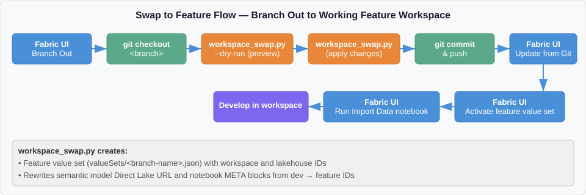
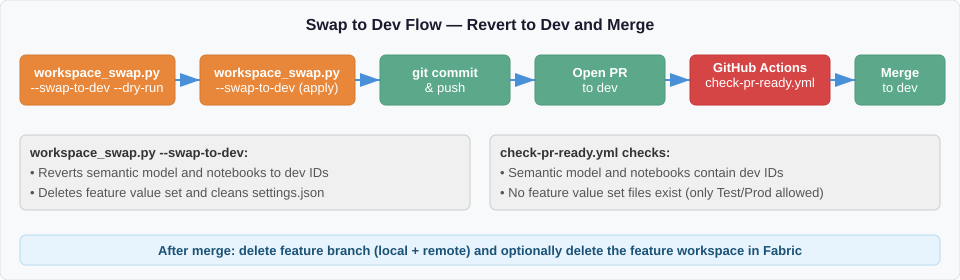
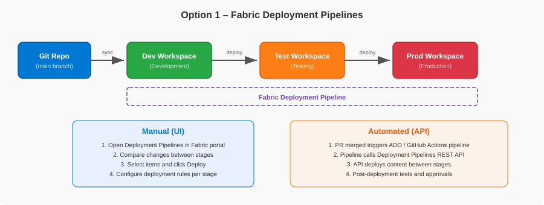
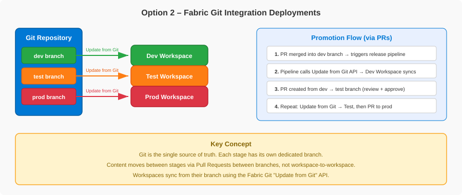
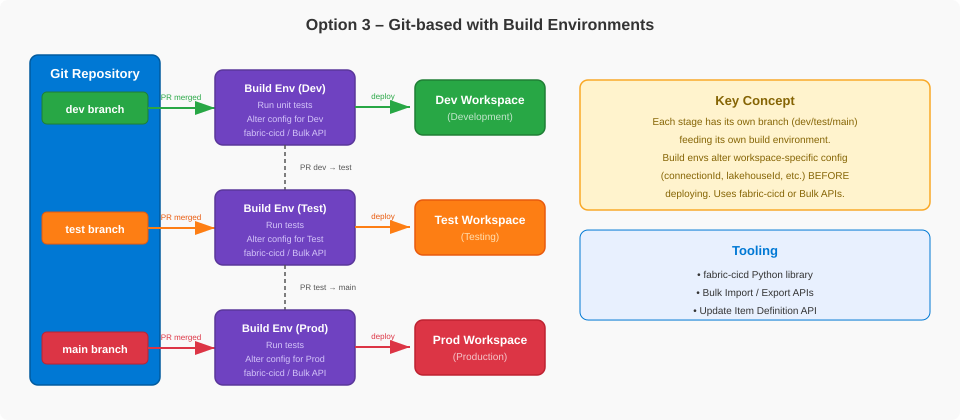
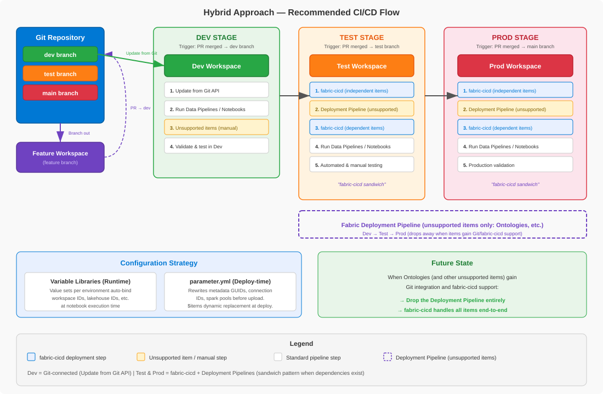

# Microsoft Fabric — SDLC & CI/CD

<div align="center">

**[▶ Start the walkthrough](#1-why-cicd-in-fabric)**  ·  **[Jump to the agenda](#agenda)**  ·  **[One‑slide summary](#one-slide-summary)**

</div>

---

## One-slide summary

| | |
|---|---|
| **The problem** | A Fabric workspace is a *shared, live* environment. Editing it directly affects everyone. You need a disciplined way to move items **and data** from Dev → Test → Prod. |
| **The building blocks** | Git integration (version control), a development process (isolated feature work), and a release strategy (how content is promoted). |
| **The decision** | Three release options exist. This repo recommends **Option 3 — Git‑based with a build environment**, implemented with the GA **`fabric-cicd`** library. |
| **The shape** | Three branches (`dev`, `test`, `main`) → three workspaces (Dev, Test, Prod). Dev is Git‑connected; Test/Prod receive deployments via CI/CD. |
| **The guardrails** | Branch protection + an enforced `dev → test → main` promotion path, environment approvals on Prod, least‑privilege service principals, and a full audit trail in Git + GitHub Actions. |
| **The payoff** | Git is the single source of truth for every stage. Every change is reviewed, approved, deployed, and auditable — and fully recoverable from Git. |
| **The proof** | This isn't slideware — it's a working **reference implementation and solution accelerator**. Every pattern here runs end-to-end in this repository: both the developer workflow and the full CI/CD pipeline. |

<div align="center">

**[▶ Begin: Why CI/CD in Fabric](#1-why-cicd-in-fabric)**

</div>

---

## Agenda

| # | Section | What you'll take away |
|---|---------|------------------------|
| 1 | [Why CI/CD in Fabric](#1-why-cicd-in-fabric) | The core problem CI/CD solves in Fabric |
| 2 | [Two realities to understand first](#2-two-realities-to-understand-first) | How Fabric items differ — and why it drives everything |
| 3 | [How Git integration works in Fabric](#3-how-git-integration-works-in-fabric) | The foundation all release options build on |
| 4 | [How developers work day to day](#4-how-developers-work-day-to-day) | Isolated feature work with Branch Out |
| 5 | [Choosing a release strategy](#5-choosing-a-release-strategy) | The three options, compared honestly |
| 6 | [The recommended hybrid approach](#6-the-recommended-hybrid-approach) | What to pick and why |
| 7 | [Reference architecture](#7-reference-architecture) | Branches, workspaces, and the end‑to‑end flow |
| 8 | [How the deployment actually works](#8-how-the-deployment-actually-works) | Two‑phase deploy, config strategy, workflows |
| 9 | [fabric-cicd versus the Bulk APIs](#9-fabric-cicd-versus-the-bulk-apis) | The tooling choice inside Option 3 |
| 10 | [Governance and guardrails](#10-governance-and-guardrails) | Identity, RBAC, approvals, audit |
| 11 | [Where Bicep and Terraform fit](#11-where-bicep-and-terraform-fit) | Infrastructure vs content — a key distinction |
| 12 | [When things go wrong](#12-when-things-go-wrong) | Hotfix and rollback playbooks |
| 13 | [Recap and next steps](#13-recap-and-next-steps) | The punchline and where to start |

---

## 1. Why CI/CD in Fabric

> **Takeaway:** A Fabric workspace is a shared, live environment. Any change made directly in it affects every user. CI/CD gives you a disciplined path to move both **items and data** across Dev, Test, and Prod.

Microsoft Fabric workspaces contain **items** — notebooks, pipelines, lakehouses, semantic models, reports, and more — that must move reliably between development, test, and production. But there is a second half most teams forget: **data** must also be ingested and transformed at each stage so you can validate that everything works end to end.

CI/CD in Fabric provides the mechanisms to:

- **Version‑control** items and track changes over time.
- **Automate** their deployment across stages.
- **Run the data workflows** (ETL) that make each stage a realistic test of the last.

The single most important idea to internalize:

> **The Fabric workspace is a shared, live environment.** Any change made directly in it affects all users. Always work in an isolated feature workspace or local environment and merge changes through Pull Requests.

Everything else in this walkthrough is a consequence of taking that idea seriously.

<div align="center">

[▲ Agenda](#agenda) · [Next: Two realities ▶](#2-two-realities-to-understand-first)

</div>

---

## 2. Two realities to understand first

> **Takeaway:** Not all Fabric items can be managed the same way, and not all of them store their environment‑specific IDs the same way. These two facts shape your entire CI/CD strategy.

### Reality 1 — Fabric items fall into three categories

| Category | What it means | Examples |
|---|---|---|
| **Git‑tracked** | Definitions are serialized to files in the repo — enabling version control, branching, and code review. | Notebooks, Semantic Models, Lakehouses, Reports, Variable Libraries, Data Pipelines, Environments |
| **Fabric APIs** | Not version-controlled in Git, but moved between workspaces through **Fabric REST APIs**. Fabric Deployment Pipelines are one such API — the same capability with a point-and-click UI on top. No Git history for these items. | Changes over time — always check the official list |
| **Manual** | Reachable through neither Git integration nor a Fabric API. Created and configured by hand in each workspace. | Changes over time — always check the official list |

> **Important:** Both supported‑items lists evolve as Microsoft adds capabilities. Always verify against the official documentation before assuming a category. *In this repository, all items are Git‑tracked and deployed via `fabric-cicd`.*

### Reality 2 — Environment IDs are either dynamic or static

Some items resolve environment‑specific values **at runtime**; others have IDs **hardcoded** in their definition files.

| Type | How it works | Examples |
|---|---|---|
| **Dynamic (Variable Library)** | The item reads IDs from a Variable Library at runtime. Switch the active value set → the environment context switches. No file changes. | Notebooks using `notebookutils.variableLibrary.getLibrary()` |
| **Static (hardcoded)** | The definition contains literal workspace/lakehouse GUIDs that must be rewritten per environment. | Semantic Model Direct Lake URL ([`expressions.tmdl`](data/fabric/Patterns_Semantic_Model.SemanticModel/definition/expressions.tmdl)), Notebook META blocks ([`default_lakehouse`](data/fabric/Import_Patterns_Data.Notebook/notebook-content.py)) — both hardcode the [`PatternsLakehouse`](data/fabric/PatternsLakehouse.Lakehouse/lakehouse.metadata.json) GUID |

<details>
<summary><b>▸ Deep dive: Actual IDs vs Logical IDs</b></summary>

<br/>

Within the *static* category, there is a further split that determines whether a file must be rewritten at all:

- **Actual IDs** (e.g., Semantic Models, Notebooks) embed **real** workspace and lakehouse GUIDs that differ per workspace. They **must** be rewritten when moving between environments.
- **Logical IDs** (e.g., Ontology, Data Agent) reference other items via the `.platform` `logicalId`, which **Fabric resolves at runtime** within the current workspace. They are **portable** across workspaces and need **no** rewriting.

This is why the development tooling in this repo only rewrites Semantic Models and Notebooks — the Ontology and Data Agent carry logical references that travel unchanged.

</details>

> **Why this matters:** static items need either **deploy‑time parameterization** (`parameter.yml` for CI/CD) or **script‑based rewriting** (for feature branches). Dynamic items just need the right value set activated. Knowing which is which tells you exactly how much work each item type needs.

<div align="center">

[◀ Prev](#1-why-cicd-in-fabric) · [▲ Agenda](#agenda) · [Next: Git integration ▶](#3-how-git-integration-works-in-fabric)

</div>

---

## 3. How Git integration works in Fabric

> **Takeaway:** Git integration connects a *workspace* to a *branch* and syncs all supported items two ways. It is the foundation every release option builds on.

- **Workspace‑level.** You connect a Fabric workspace to a repo, branch, and folder. All supported items sync in one operation.
- **Providers.** Azure DevOps (cloud), GitHub (cloud), GitHub Enterprise (cloud).
- **Two‑way sync.** Changes in the workspace are **committed** to the branch; changes in the repo are **pulled** into the workspace via *Update*. Only one direction syncs at a time.
- **Item definitions become files.** Items are serialized to file‑based definitions (JSON, Python, etc.), preserving folder structure.
- **Unsupported items are ignored** — they stay in the workspace but are never synced, committed, or deleted.
- **Branch out.** A developer can spin up a new branch *and* a new workspace from a connected workspace, for isolated development.
- **Prerequisites.** Tenant admin switches (Git sync, provider sync, workspace creation) must be enabled, and a Fabric/Premium capacity is required.

> **Important:** Not every item type is supported by Git integration. Always check the official supported‑items list before assuming an item is tracked.

<div align="center">

[◀ Prev](#2-two-realities-to-understand-first) · [▲ Agenda](#agenda) · [Next: Developer workflow ▶](#4-how-developers-work-day-to-day)

</div>

---

## 4. How developers work day to day

> **Takeaway:** Developers never work in the shared workspace. They **branch out** to an isolated workspace, do their work, and merge back through a PR.

The development process is the **same regardless of which release option you choose**. Isolation is the rule.

There are two ways to do isolated feature work:

<details>
<summary><b>▸ Scenario A: Short‑lived feature workspaces (not Git‑synced)</b></summary>

<br/>

`dev` is the only Git‑connected workspace. Feature workspaces are created independently and deployed into with `fabric-cicd`.

- **Positive:** Because the target workspace is *not* Git‑synced, `fabric-cicd` can freely update metadata (this is the flow `fabric-cicd` officially recommends).
- **Issue:** All development happens in the Fabric UI, and syncing changes back to the feature branch is **manual and error‑prone**.

</details>

<details>
<summary><b>▸ Scenario B: Branch Out (Git‑synced feature workspaces) — what this repo uses</b></summary>

<br/>

Fabric's **Branch Out** feature creates a new branch *and* a new workspace, syncing all supported items automatically and connecting the workspace to the feature branch.

- **Positive:** Fabric moves all supported items for you; development and source control are tightly integrated.
- **Issue:** You **cannot** use `fabric-cicd` against a Git‑synced workspace — it pushes directly via APIs and causes **workspace drift** that Git Sync then fights with. The inverse is also true: Git‑synced workspaces should not be `fabric-cicd` targets.

Because of that constraint, this repo uses a Python script to do the metadata rewrites `fabric-cicd` would otherwise handle.

</details>

### The Branch Out lifecycle in this repo

When you branch out from `dev`, several items arrive carrying **hardcoded dev IDs** (Semantic Model Direct Lake URL, Notebook META blocks). A script, `scripts/workspace_swap.py`, manages the full lifecycle:

**Swap to a feature workspace** (after branching out):

<p align="center"></p>

**Swap back to dev** (before opening a PR):

<p align="center"></p>

- **Swap to feature:** reads dev IDs from `variables.json`, reads feature IDs from a gitignored `.env`, creates a feature value set, and rewrites the Semantic Model + Notebook metadata to point at the feature workspace.
- **Swap to dev:** reverts everything — restoring dev IDs and deleting the feature value set — **before** you open a PR.
- **PR gate:** `check-pr-ready.yml` blocks the merge to `dev` if dev IDs are not restored or a stray feature value set remains.

<details>
<summary><b>▸ Deep dive: the item‑type registry</b></summary>

<br/>

The script uses an **item‑type registry** — each registered type declares its file patterns, whether it needs ID rewriting, and which IDs to validate. Adding a new item type is a **single registry entry**, not new code.

| Item Type | ID Type | Rewritten by the script? | Why |
|---|---|---|---|
| **SemanticModel** | Actual workspace + lakehouse IDs | **Yes** | Direct Lake URL contains real GUIDs |
| **Notebook** | Actual workspace + lakehouse IDs | **Yes** (only if `default_lakehouse` present) | META blocks reference real GUIDs |
| **Ontology** | Lakehouse logicalId | **No** | Logical IDs are portable |
| **DataAgent** | Ontology logicalId | **No** | Cross‑item logical reference, no env‑specific IDs |
| **VariableLibrary** | Dev lakehouse ID in default set | **Managed** | Value sets created/deleted, not rewritten |

</details>

<div align="center">

[◀ Prev](#3-how-git-integration-works-in-fabric) · [▲ Agenda](#agenda) · [Next: Release strategy ▶](#5-choosing-a-release-strategy)

</div>

---

## 5. Choosing a release strategy

> **Takeaway:** There are three ways to promote content across environments. They trade off Fabric‑native convenience against Git‑as‑source‑of‑truth and configuration power.

<details>
<summary><b>▸ Option 1 — Fabric Deployment Pipelines</b></summary>

<br/>

Git is connected only to **Dev**. Promotion happens **workspace‑to‑workspace** (Dev → Test → Prod) using Fabric's built‑in Deployment Pipelines.

<p align="center"></p>

**Good for:** teams that want Fabric‑native tooling with minimal setup — visual change comparison and deployment history out of the box.

**Watch out for:**
- API lacks "related‑items" awareness — you deploy all content or list every item + dependency by hand.
- Linear structure only — no skipping stages.
- Git is source of truth for **Dev only** — Test/Prod are recoverable only from their last deployment.
- Deployment rules cover a limited subset of properties.

</details>

<details>
<summary><b>▸ Option 2 — Fabric Git Integration on every stage</b></summary>

<br/>

Every stage has its own branch, and **each branch is Git‑connected to its workspace**. Promotion is PR‑between‑branches, then *Update from Git*.

<p align="center"></p>

**Good for:** teams that want Git as the **single source of truth** for every stage and follow Gitflow.

**Watch out for:**
- Multiple long‑lived branches → merge complexity and cherry‑pick overhead.
- No Fabric‑native visual comparison or deployment rules.
- Relies on Fabric Git integration on **every** workspace, including Prod — some teams are uncomfortable putting that on the production path (known "ghost commit" drift behaviors).

</details>

<details>
<summary><b>▸ Option 3 — Git‑based with a build environment (recommended)</b></summary>

<br/>

Every stage has its own branch, and each stage's pipeline spins up a **build environment** that runs tests and applies environment‑specific configuration **before** deploying via REST APIs.

<p align="center"></p>

**Good for:** teams that want Git as source of truth **and** the power to transform config per stage (rewrite connection strings, lakehouse IDs) before deploy. With **`fabric-cicd`**, this is declarative via `parameter.yml` — not custom scripts.

**Watch out for:**
- Most engineering effort upfront (build/release pipelines per stage).
- `parameter.yml` must be kept in sync with item definitions.
- Full deploy every run — `fabric-cicd` does not calculate diffs.
- Test/Prod do **not** require Fabric Git integration — a plus for teams wary of it on the prod path.

</details>

### The honest comparison

| | **Option 1 — Deployment Pipelines** | **Option 2 — Git Integration** | **Option 3 — Build Env** |
|---|---|---|---|
| **Source of truth** | Git (Dev only) + workspaces | Git (all stages) | Git (all stages) |
| **Deployment mechanism** | Deployment Pipelines (UI/API) | Update from Git API | `fabric-cicd` (recommended) or Bulk APIs (Preview) |
| **Config management** | Deployment rules + autobinding | Post‑deploy API calls | Declarative `parameter.yml` |
| **Visual comparison** | **Yes** | No | No |
| **Deployment history** | **Yes** | No | No |
| **Stage recoverability** | Dev from Git; Test/Prod from last deploy | All from Git | All from Git + `parameter.yml` |
| **Setup complexity** | **Low** | Medium | High |
| **Key limitation** | Linear; no dependency resolution in API | Multi‑branch merge complexity | Full deploy every run; param upkeep |
| **Best for** | Fabric‑native, minimal setup | Git as full source of truth (Gitflow) | Build‑time config transformation per stage |

<details>
<summary><b>▸ Common questions</b></summary>

<br/>

**Q - Why not just use Deployment Pipelines? It is Fabric-native with a nice UI.**

It is the lowest-setup option and gives visual change comparison and deployment history out of the box. The trade-off: Git is the source of truth for **Dev only**, so Test and Prod are recoverable only from their last deployment; the promotion API has no "related items" awareness (you list every item and dependency by hand); and the structure is strictly linear.

**Q - Why not connect every workspace with Git integration (Option 2)?**

That makes Git the source of truth for every stage, which is attractive. The hesitation is putting Fabric Git integration on the **production** path - teams report "ghost commits" (semantically-insignificant changes re-introduced on commit) and Source Control drift they did not make - plus multi-branch merge and cherry-pick overhead.

**Q - Isn't Option 3 the most work?**

Yes, it needs a build/release pipeline per stage. But `fabric-cicd`'s declarative `parameter.yml` removes most of the custom code, and in return you get Git as the source of truth for every stage plus build-time config transformation.

</details>

<div align="center">

[◀ Prev](#4-how-developers-work-day-to-day) · [▲ Agenda](#agenda) · [Next: The recommendation ▶](#6-the-recommended-hybrid-approach)

</div>

---

## 6. The recommended hybrid approach

> **Takeaway:** Use **`fabric-cicd`** (Option 3) for every supported item, and fall back to **Deployment Pipelines** only for item types that lack `fabric-cicd` support. As support grows, you drop the fallback.

The recommendation is a **hybrid**: `fabric-cicd` for all supported items, Deployment Pipelines to fill any gap. This keeps Git as the single source of truth for the majority of items with a clean path to simplify further.

<p align="center"></p>

- **Three branches:** `dev`, `test`, `main` (production).
- **Three workspaces:** Dev, Test, Prod.
- **Dev** is Git‑connected (the shared development workspace).
- **Test and Prod are NOT Git‑connected** — they receive deployments via `fabric-cicd`.

> **This repository has already reached the future state:** all items are deployed via `fabric-cicd` in a single deploy job — no Deployment Pipeline fallback needed.

<details>
<summary><b>▸ Deep dive: the "sandwich" pattern for unsupported items</b></summary>

<br/>

If your workspace includes item types `fabric-cicd` does not yet support, extend the single deploy into a three‑layer sandwich:

1. Deploy supported items that **don't** depend on unsupported items.
2. Promote unsupported items via the **Deployment Pipelines REST API**.
3. Deploy supported items that **do** depend on the unsupported ones.

When all item types gain `fabric-cicd` support, you drop the Deployment Pipeline entirely and the flow collapses back to: *PR merged → deploy → run ETL → validate.*

</details>

<details>
<summary><b>▸ Common questions</b></summary>

<br/>

**Q - What about item types `fabric-cicd` doesn't support yet?**

Use the "sandwich": deploy supported items, promote the unsupported ones via the Deployment Pipelines REST API, then deploy supported items that depend on them. As Microsoft adds support you drop the Deployment Pipeline entirely. This repo already reached that end state - everything deploys via `fabric-cicd` in a single job.

**Q - Does `fabric-cicd` do incremental (diff) deploys?**

No. It performs a **full deploy every run** by design, so the workspace always matches Git exactly. For very large workspaces this increases deploy time.

</details>

<div align="center">

[◀ Prev](#5-choosing-a-release-strategy) · [▲ Agenda](#agenda) · [Next: Reference architecture ▶](#7-reference-architecture)

</div>

---

## 7. Reference architecture

> **Takeaway:** Feature work flows into `dev`; a PR into `test` triggers an automated deploy + ETL; a PR into `main` does the same for Prod. Source‑branch restrictions enforce the path.

```text
feature/* workspace  (Branch Out, Git-synced to a feature branch)
  │  swap-to-dev, then open a PR
  ▼
dev branch  ──────────▶  Dev workspace  (Update from Git)
  │
  │  PR merge → test    (source branch must be dev)
  ▼
TEST STAGE  (automated)
  • deploy-test.yml   →  fabric-cicd: publish_all_items()
  • on success        →  etl-test.yml: run Import_Patterns_Data
  │
  │  PR merge → main    (source branch must be test)
  ▼
PROD STAGE  (automated + required Prod approval)
  • deploy-prod.yml   →  fabric-cicd: publish_all_items()
  • on success        →  etl-prod.yml: run Import_Patterns_Data
```

| Branch | Workspace | Deployment method |
|---|---|---|
| `dev` | Dev | Git‑connected via Fabric Git integration |
| `test` | Test | `fabric-cicd` via GitHub Actions |
| `main` | Prod | `fabric-cicd` via GitHub Actions |

The deploy and ETL are **chained**: the ETL workflow only runs after its deploy workflow succeeds. If the deploy fails, no ETL runs.

<details>
<summary><b>▸ Deep dive: the demo solution being deployed</b></summary>

<br/>

The repository ships a small **healthcare** scenario so the pipeline has something real to move:

- **PatternsLakehouse** (Lakehouse) — holds `doctors`, `patients`, `appointments` Delta tables.
- **Patterns_Ontology** (Ontology) + **Patterns_Data_Agent** (Data Agent) — graph model and a queryable agent over it.
- **Patterns_Variables** (Variable Library) — per‑environment value sets.
- **Import_Patterns_Data**, **Patterns_Patients_Data**, **Patterns_Demo** (Notebooks) — the ETL and demo logic.
- **Patterns_Semantic_Model** (Semantic Model) + **Patterns_Report** (Report) — Direct Lake model and its report.

This mix is deliberate: it exercises every hard case — actual IDs (Semantic Model, Notebooks), logical IDs (Ontology, Data Agent), runtime config (Variable Library), and a data‑population step (ETL).

</details>

<div align="center">

[◀ Prev](#6-the-recommended-hybrid-approach) · [▲ Agenda](#agenda) · [Next: How deployment works ▶](#8-how-the-deployment-actually-works)

</div>

---

## 8. How the deployment actually works

> **Takeaway:** Two mechanisms handle configuration (runtime + deploy‑time), and a two‑phase deploy solves the chicken‑and‑egg problems of a brand‑new workspace.

### Configuration strategy — two complementary mechanisms

| | **Variable Libraries (runtime)** | **`parameter.yml` (deploy‑time)** |
|---|---|---|
| **When** | At notebook execution | Before items upload to the workspace |
| **Handles** | Workspace IDs, lakehouse names/IDs resolved at runtime | Hardcoded GUIDs in notebook META, connection IDs, spark pools, model bindings |
| **How** | Value sets auto‑bind per environment | `find_replace`, `$items` dynamic replacement rewrite definitions |

> **Rule of thumb:** use **Variable Libraries as the primary mechanism** (clean runtime auto‑binding), and fall back to `parameter.yml` only for deploy‑time metadata that Variable Libraries cannot reach.

### The two‑phase deploy

A brand‑new Test or Prod workspace is empty — which creates two chicken‑and‑egg problems. The deploy runs in **two phases** to solve them:

```text
deploy-*.yml triggered
  │
  ▼
PHASE 1 — publish_all_items()     scope: Lakehouse + Ontology
  │   Lakehouse now exists  →  $items.Lakehouse.$id resolves
  │   Ontology now exists    →  Data Agent logicalId resolves
  ▼
PHASE 2 — publish_all_items()     scope: Variable Library, Notebooks,
                                         Semantic Model, Report, Data Agent
  │
  ▼
unpublish_all_orphan_items()   →   workspace matches Git exactly
```

<details>
<summary><b>▸ Deep dive: first deployment to a clean workspace</b></summary>

<br/>

The very first deploy to a brand-new Test or Prod workspace needs a few **manual** steps that later deploys do not. After the automated deploy + ETL run:

1. **Bind the Ontology's Graph Model to data** - open the Ontology and use **Get data** to point the Graph Model at the lakehouse tables.
2. **Nudge the Ontology to finish initializing** - if it stays on "Setting up your ontology," rename any Entity Type and rename it back. This is a known Fabric platform behavior on first deploy.

Then verify end to end: Lakehouse tables populated, Ontology overview loads, Semantic Model connected, Report renders, Data Agent responds. On every subsequent deployment this is all automated - the manual steps are first-deploy only.

</details>

<details>
<summary><b>▸ Deep dive: the chicken‑and‑egg problems (and the ETL twist)</b></summary>

<br/>

- **Lakehouse ID.** The Variable Library and Semantic Model need the lakehouse ID, but the lakehouse doesn't exist until the first deploy creates it. Phase 1 creates it so `$items.Lakehouse.PatternsLakehouse.$id` can resolve in Phase 2.
- **Ontology logicalId.** The Data Agent references the Ontology by logical ID. `fabric-cicd` caches workspace state once per call, so the Ontology must already exist (Phase 1) for the Data Agent's reference to resolve (Phase 2).
- **ETL notebook ID.** The ETL workflow needs to run a notebook whose ID differs per workspace. It resolves the notebook **by display name** (`Import_Patterns_Data`) via the List Items API at runtime — so no ID needs to be known ahead of time.

On subsequent deployments, both phases are idempotent. `fabric-cicd` does a **full deploy every run** by design — the workspace always matches Git exactly.

</details>

<details>
<summary><b>▸ Deep dive: the GitHub Actions workflows</b></summary>

<br/>

| Workflow | Role |
|---|---|
| `deploy-test.yml` / `deploy-prod.yml` | Orchestrators — trigger on push to `test` / `main` (paths filtered to `data/fabric/**`) |
| `reusable-deploy-fabric-cicd.yml` | The two‑phase `fabric-cicd` deployment template |
| `reusable-fabric-etl.yml` | Resolves a notebook by name, runs it, polls to completion |
| `etl-test.yml` / `etl-prod.yml` | Chain after a successful deploy via `workflow_run` |
| `check-pr-ready.yml` | Blocks feature IDs from merging to `dev` |
| `run-tests.yml` | Runs pytest when scripts/tests change |
| `enforce-promotion-path.yml` | Enforces the `dev → test → main` source‑branch path |

**Why reusable workflows (not composite actions)?** They support the `environment:` keyword at job level — which unlocks GitHub Environment protection rules (required reviewers, branch restrictions) and environment‑scoped secrets. A path filter on `data/fabric/**` means doc‑only commits never trigger a deploy.

</details>

<div align="center">

[◀ Prev](#7-reference-architecture) · [▲ Agenda](#agenda) · [Next: fabric-cicd vs Bulk ▶](#9-fabric-cicd-versus-the-bulk-apis)

</div>

---

## 9. fabric-cicd versus the Bulk APIs

> **Takeaway:** Inside Option 3, you can deploy with the GA **`fabric-cicd`** library or the Preview **Bulk Import/Export APIs**. Today, `fabric-cicd` is the recommendation.

Both sit inside Option 3 — branch per stage, build environment per stage, deploy from Git. The choice is: a library that solves the common CI/CD problems for you, or a lower‑level API surface you wrap yourself.

| Dimension | `fabric-cicd` | Bulk Import / Export APIs |
|---|---|---|
| **Maturity** | **GA** | Preview (`?beta=true` required) |
| **Env‑specific config** | `parameter.yml` (declarative) | None at the API level — caller preprocesses |
| **Orphan cleanup** | `unpublish_all_orphan_items()` built in | None — caller's responsibility |
| **Dependency ordering** | Caller phases manually | Service resolves automatically in one call |
| **API call shape** | Many per‑item REST calls | One POST for the whole workspace |
| **Service principal coverage** | Per item (one unsupported type fails only itself) | Per request (every item must support SPNs or the call fails) |

> **Recommendation today: `fabric-cicd`.** The Bulk APIs are still Preview with no parameterization or orphan‑cleanup at the API level — the caller must implement substitution, value‑set activation, and delete logic themselves. Re‑evaluate when the APIs exit Preview *and* gain parameterization/orphan‑cleanup, or when your repo is fully on logical IDs + Variable Libraries and doesn't need those features.

<details>
<summary><b>▸ Deep dive: this repo demonstrates both</b></summary>

<br/>

A `DEPLOY_METHOD` repository variable selects which implementation runs:

| `DEPLOY_METHOD` | Behavior |
|---|---|
| `fabric-cicd` *(or unset)* | The `fabric-cicd` workflows run — the default and recommended path |
| `bulk` | The Bulk Import API workflows run instead (Preview) |
| any other value | Both deploy workflows skip (safe default) |

The bulk path bridges two of the API's gaps in **caller code** — substitution (`bulk-parameter.yml` + `deploy_bulk.py`) and value‑set activation (a post‑deploy `PATCH`). These are workarounds, not platform fixes: choosing bulk means you own that bridging code (~600 lines of Python + a config file). Orphan cleanup and the broader `fabric-cicd` feature surface remain unimplemented on the bulk path.

</details>

<details>
<summary><b>▸ Common questions</b></summary>

<br/>

**Q - Should we just wait for the Bulk APIs?**

Not for production today. They are Preview (`?beta=true`), with no parameterization or orphan-cleanup at the API level - you would implement substitution, value-set activation, and delete logic yourself (~600 lines in this repo). `fabric-cicd` already provides those, maintained by Microsoft. Re-evaluate when Bulk exits Preview and gains those features.

**Q - When would the Bulk APIs actually make sense?**

When your repo is fully on logical IDs + Variable Library value sets (so you don't need `parameter.yml` substitution), when you want one atomic deploy instead of phased calls, or when you need a workspace-level export for disaster-recovery snapshots.

**Q - Any gotcha unique to Bulk?**

Service principal coverage is **per request** - if even one item type doesn't support service principals, the whole call fails. `fabric-cicd` fails only the unsupported item and continues.

</details>

<div align="center">

[◀ Prev](#8-how-the-deployment-actually-works) · [▲ Agenda](#agenda) · [Next: Governance ▶](#10-governance-and-guardrails)

</div>

---

## 10. Governance and guardrails

> **Takeaway:** The pipeline is governed by GitHub‑native controls: least‑privilege identities, branch protection with an enforced promotion path, environment approvals on Prod, and a complete audit trail.

### Pick the right identity for the job

Three distinct identities show up in a Fabric solution — confusing them is a common source of over‑permissioned deployments.

| Identity | Purpose | Authentication |
|---|---|---|
| **CI/CD service principal** | Deploys items from GitHub Actions via `fabric-cicd` | Client secret today; **evaluate GitHub OIDC federation** |
| **Fabric Workspace Identity** | The workspace authenticating *outbound* to firewalled storage — **not** used by CI/CD | Managed by Fabric — no secret |
| **Runtime workload UAMI** | Apps/Functions calling Fabric APIs at runtime — **not** deploying items | Secretless, managed by Azure |

> **OIDC is the direction for production.** With GitHub OIDC, the workflow exchanges a short‑lived token for an Azure token — no stored client secret, and the trust policy can bind to a specific repo + branch + environment so a feature branch cannot assume the Prod identity.

### The two gates every change passes through

```text
Pull Request
  │
  ▼
GATE 1 — PR checks (before merge)
  • check-pr-ready · run-tests · enforce-promotion-path
  • required code review
  │  pass + merge
  ▼
Deploy workflow
  │
  ▼
GATE 2 — Environment protection (before deploy)
  • Prod: required reviewers
  • deployment branch restricted to main
  │  approved
  ▼
Target workspace
```

- **Environment isolation.** One workspace per environment; one GitHub Environment per workspace with siloed secrets. `test` can only deploy to Test, `main` to Prod.
- **Least privilege.** The CI/CD SP gets **Contributor** (the minimum to publish) on **only** its own workspace — a Test compromise cannot touch Prod. Dev is human‑only; Test/Prod are SP‑only.
- **Promotion path enforced.** PRs into `test` must come from `dev`; PRs into `main` must come from `test`. No direct pushes to protected branches.
- **Deploy‑time approval.** Prod requires designated reviewers to click "Approve and deploy," with an optional wait‑timer abort window. Approvers are independent of PR reviewers (separation of duties).

<details>
<summary><b>▸ Deep dive: audit, separation of duties, and rollback</b></summary>

<br/>

- **Audit trail.** Every PR, review, merge, and deploy approval is recorded with actor, timestamp, and commit SHA. Git history answers "who changed this and why"; Actions run history answers "who deployed it and when."
- **Separation of duties.** Authors can't approve their own PRs (when required approvals are on); the deploy SP cannot grant workspace roles or push to the repo (`GITHUB_TOKEN` locked to `contents: read`).
- **Rollback.** Code rollback is a reviewed `git revert` + redeploy — same gates apply. **Data effects are harder** and company‑specific: plan snapshots/point‑in‑time restore before risky deploys, and *test your rollback path in Test before you need it in Prod.*

</details>

<details>
<summary><b>▸ Deep dive: controls owned outside the pipeline</b></summary>

<br/>

These are part of any mature production Fabric deployment but owned by your **platform / security team**, not the CI/CD pipeline owner. Surface them early so the right specialists can scope them:

- **Network** — Conditional Access, Private Links, Trusted Workspace Access.
- **Encryption & residency** — OneLake encryption at rest (default), customer‑managed keys, multi‑geo.
- **Workspace‑level audit** — item access/sharing via the M365 unified audit log (Purview).
- **Data classification & DLP** — sensitivity labels, DLP policies (note: labels are stripped on Git export).
- **Fine‑grained access** — OneLake security and row/column/object‑level security.
- **Repo & supply‑chain hardening** — secret scanning, CodeQL, Dependabot, dependency review; pin actions to commit SHAs.

</details>

<details>
<summary><b>▸ Common questions</b></summary>

<br/>

**Q - Client secrets in GitHub - is that safe enough for production?**

The demo uses a client secret for simplicity. For production, evaluate **GitHub OIDC federation**: the workflow exchanges a short-lived token for an Azure token (no stored secret), and the trust policy binds to repo + branch + environment so a feature branch cannot assume the Prod identity.

**Q - Can a developer deploy straight to Prod, by accident or otherwise?**

No. Protected branches block direct pushes; the promotion path is enforced (a PR into `main` must come from `test`); and the Prod GitHub Environment requires approval and restricts deployment to `main`. The deploy service principal also cannot push to the repo (`GITHUB_TOKEN` is `contents: read`).

**Q - If Test is compromised, can it reach Prod?**

In production you use one service principal per environment, each Contributor on only its own workspace, with secrets siloed in per-environment GitHub Environments. A Test compromise cannot touch Prod.

</details>

<div align="center">

[◀ Prev](#9-fabric-cicd-versus-the-bulk-apis) · [▲ Agenda](#agenda) · [Next: Bicep & Terraform ▶](#11-where-bicep-and-terraform-fit)

</div>

---

## 11. Where Bicep and Terraform fit

> **Takeaway:** Infrastructure‑as‑code provisions the *containers* Fabric runs on. It is a **different layer** from content deployment — don't confuse the two.

> **Key distinction:** Bicep/Terraform provision **infrastructure** (capacities, workspaces, role assignments). `fabric-cicd`, Deployment Pipelines, and Git APIs handle **content deployment** (notebooks, models, reports moving Dev → Test → Prod).

- **Bicep / ARM** — can provision **Fabric capacities only** (`Microsoft.Fabric/capacities`); an Azure Verified Module exists. It does **not** manage workspaces or items.
- **Terraform (microsoft/fabric provider)** — broader: capacities, workspaces, role assignments, domains, gateways, connections, deployment pipelines, Git connections — and it *can* create individual items.

**Can Terraform promote content between environments?** Technically it can *create* items, but it is **not designed for CI/CD promotion**: no parameterization equivalent, state‑drift conflicts when developers edit in the UI, and no concept of "promoting" between stages. Microsoft built `fabric-cicd` specifically for content deployment.

> **Recommendation:** use **Bicep** for provisioning capacities in your existing Azure IaC pipelines; use Terraform / REST / portal for workspace + pipeline + role setup; use **`fabric-cicd`** (and Deployment Pipelines) for content.

<div align="center">

[◀ Prev](#10-governance-and-guardrails) · [▲ Agenda](#agenda) · [Next: When things go wrong ▶](#12-when-things-go-wrong)

</div>

---

## 12. When things go wrong

> **Takeaway:** Hotfixes cut from `main`, get reviewed, and deploy through the same gates. Rollback is a reviewed `git revert` for code — but data needs its own plan.

<details>
<summary><b>▸ Hotfix flow</b></summary>

<br/>

1. Cut a **hotfix branch** from `main` (e.g., `hotfix/2026-04-16`).
2. Reproduce and fix in isolation (branch out to a temp workspace or use client tools); commit to the hotfix branch.
3. **PR → merge to `main`** after review.
4. CI/CD triggers `fabric-cicd` to deploy the changed items to Prod.
5. Validate; run the ETL notebook as needed (post‑deploy ingestion).
6. Cherry‑pick/merge the hotfix back into `dev`/`test` so branches stay consistent.

</details>

<details>
<summary><b>▸ Rollback playbook</b></summary>

<br/>

**Code (supported items):**
1. Identify the last known‑good commit.
2. `git revert` (or `git reset`) to make it current on the target branch.
3. Re‑deploy with `fabric-cicd`.

**Data:** data is **not** versioned by Git. Plan and execute ETL after rollback to restore state (seed/test data or reprocessing). Post‑deploy ingestion is part of every release stage.

> A rollback you've never exercised is a hope, not a plan. Test it in Test first.

</details>

<div align="center">

[◀ Prev](#11-where-bicep-and-terraform-fit) · [▲ Agenda](#agenda) · [Next: Recap ▶](#13-recap-and-next-steps)

</div>

---

## 13. Recap and next steps

> **Takeaway:** Git as the single source of truth, an enforced promotion path, and automated deploy + ETL at each stage — that's the whole system in one sentence.

**What we covered:**

1. A Fabric workspace is shared and live → work in isolation, merge through PRs.
2. Item categories and dynamic‑vs‑static IDs drive the entire strategy.
3. Git integration is the foundation; developers **Branch Out** for isolated work.
4. Three release options exist; **Option 3 with `fabric-cicd`** is recommended.
5. Three branches, three workspaces, automated deploy + ETL per stage.
6. Configuration is handled by Variable Libraries (runtime) + `parameter.yml` (deploy‑time).
7. Governance is GitHub‑native: least privilege, enforced promotion path, Prod approvals, full audit.

> **This is more than a deck — it's a working solution accelerator.** Everything you've seen is implemented end to end in this repository: both the developer workflow *and* the full CI/CD pipeline, running as a **reference implementation and solution accelerator** — not isolated snippets. Clone it, point the workflows at your own Fabric workspaces, and adapt the parts you need.

**A newcomer's starting checklist:**

- [ ] Provision a Fabric/Premium capacity and three workspaces (Dev, Test, Prod).
- [ ] Connect the **Dev** workspace to the `dev` branch via Fabric Git integration.
- [ ] Create a CI/CD **service principal**; grant **Contributor** on Test and Prod.
- [ ] Create GitHub **Environments** (`Test`, `Prod`) with scoped secrets; add Prod approval.
- [ ] Create `dev`, `test`, `main` branches with protection + the enforced promotion path.
- [ ] Develop on a feature branch → merge to `dev` → `test` (deploys) → `main` (deploys).

<details>
<summary><b>▸ Where to go deeper in this repository</b></summary>

<br/>

| Document | What it covers |
|---|---|
| `README.md` | Repository landing page, key concepts, quick start |
| `fabric-cicd-release-options.md` | Full release‑option comparison and the hybrid recommendation — **start here for strategy** |
| `fabric-hybrid-cicd-guide.md` | The `fabric-cicd` implementation: workflows, config, prerequisites, gotchas |
| `fabric-bulk-cicd-guide.md` | The alternative Bulk Import API path and its workarounds |
| `fabric-development-process.md` | The Branch Out workflow and `workspace_swap.py` |
| `fabric-cicd-governance-considerations.md` | Identity, RBAC, branch protection, approvals, adjacent controls |

</details>

<div align="center">

**Thank you.**

[◀ Prev](#12-when-things-go-wrong) · [▲ Back to the agenda](#agenda) · [▲▲ Back to the top](#microsoft-fabric--sdlc--cicd)

</div>
