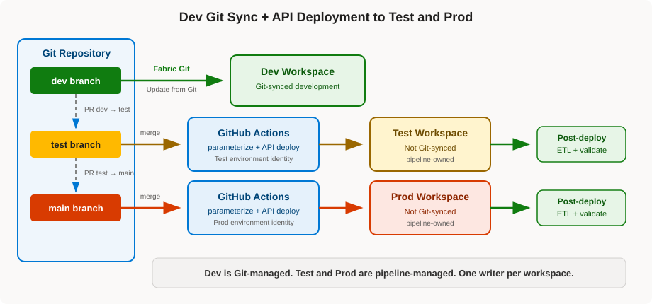

---
# Preview locally from the repository root:
# npx --yes @marp-team/marp-cli@4.5.1 presentations/fabric-sdlc-cd.md --preview --allow-local-files
marp: true
theme: default
paginate: true
size: 16:9
header: "Continuous Delivery in Microsoft Fabric"
footer: "michaeldeongreen/microsoft-fabric-sdlc-patterns"
style: |
  section {
    font-family: "Segoe UI", Arial, sans-serif;
    font-size: 27px;
    padding: 52px 64px;
    color: #201f1e;
    background: #ffffff;
  }
  h1 {
    color: #004578;
    font-size: 1.65em;
    margin-bottom: 0.45em;
  }
  h2 {
    color: #0078d4;
  }
  h3 {
    color: #004578;
    margin-bottom: 0.3em;
  }
  strong {
    color: #004578;
  }
  a {
    color: #0067b8;
  }
  blockquote {
    border-left: 8px solid #0078d4;
    background: #eff6fc;
    padding: 0.5em 0.8em;
    margin: 0.7em 0;
  }
  table {
    font-size: 0.72em;
    width: 100%;
  }
  th {
    background: #e5f1fb;
    color: #004578;
  }
  td,
  th {
    border-color: #d2d0ce;
  }
  code {
    background: #f3f2f1;
  }
  header, footer {
    color: #605e5c;
    font-size: 0.55em;
  }
  section.title {
    text-align: center;
    justify-content: center;
    background: linear-gradient(135deg, #ffffff 0%, #eff6fc 100%);
    border-top: 10px solid #0078d4;
    box-shadow: inset 0 -7px 0 #ffb900;
  }
  section.title h1 {
    font-size: 2.25em;
  }
  section.divider {
    text-align: center;
    justify-content: center;
    color: white;
    background: linear-gradient(135deg, #004578 0%, #0078d4 100%);
    box-shadow: inset 0 -7px 0 #ffb900;
  }
  section.divider h1,
  section.divider h2,
  section.divider strong {
    color: white;
  }
  section.compact {
    font-size: 23px;
  }
  section.dense {
    font-size: 20px;
  }
  section.diagram {
    font-size: 19px;
    padding: 40px 52px;
  }
  section.diagram h1 {
    max-width: 52%;
    margin: 0.2em 0;
  }
  section.diagram h2 {
    font-size: 1.35em;
    margin: 0.2em 0 0.45em;
  }
  section.diagram p,
  section.diagram ul {
    margin-top: 0.35em;
    margin-bottom: 0.35em;
  }
  section.customer-challenges {
    background: #faf9f8;
  }
  section.customer-challenges table {
    border-collapse: separate;
    border-spacing: 12px;
    font-size: 0.73em;
  }
  section.customer-challenges thead {
    display: none;
  }
  section.customer-challenges td {
    width: 50%;
    vertical-align: top;
    padding: 12px 14px;
    background: #ffffff;
    border: 1px solid #d2d0ce;
    border-top: 5px solid #0078d4;
    border-radius: 5px;
  }
  section.customer-challenges tbody tr:nth-child(2) td {
    border-top-color: #ffb900;
  }
  section.customer-challenges tbody tr:nth-child(3) td {
    border-top-color: #d83b01;
  }
  section.ownership table {
    font-size: 0.7em;
  }
  section.ownership th,
  section.ownership td {
    vertical-align: top;
    padding: 12px;
  }
  section.ownership th:nth-child(1) {
    background: #e5f1fb;
  }
  section.ownership th:nth-child(2) {
    background: #e8ebfa;
  }
  section.ownership th:nth-child(3) {
    background: #e7f5e7;
  }
  section.dependency-contract table {
    font-size: 0.67em;
  }
  section.dependency-contract td {
    vertical-align: top;
  }
---

<!-- _class: title -->
<!-- _paginate: false -->
<!-- _header: "" -->
<!-- _footer: "" -->

# Continuous Delivery in Microsoft Fabric

## Why it is difficult, the options available, and a working GitHub implementation

**Michael Green**<br/>
*[CSA / DevSquad / MCSA]*

October 2026

[Reference implementation](https://github.com/michaeldeongreen/microsoft-fabric-sdlc-patterns)

<!--
Introduce yourself and position the session as the CD follow-on to the earlier CI presentation.
Official Microsoft documentation is canonical; this repository is one opinionated GitHub implementation.
-->

---

# The Fabric delivery problem

A Fabric workspace is both a **development surface** and a **live environment**.

One solution can span:

- Notebooks and pipelines
- Lakehouses and data
- Semantic models and reports
- Variable Libraries and connections
- Ontologies and agents

> **How do we reproduce a working solution in Test and Prod without rebuilding it by hand or allowing every workspace to become a different truth?**

<!--
Do not define generic CD. Start with the Fabric-specific operating problem.
Direct browser editing is powerful, but it makes a disciplined promotion path important.
-->

---

<!-- _class: customer-challenges compact -->

# What customers are running into with Fabric CD

| | |
|---|---|
| **Uneven lifecycle support**<br>Git, Deployment Pipelines, `fabric-cicd`, and APIs support different item sets. | **Dependencies become deployment logic**<br>Foundational items must exist before target IDs and dependent definitions can resolve. |
| **Configuration is fragmented**<br>Runtime variables, metadata, connections, rules, and secrets have different owners and timing. | **Definitions are not the whole environment**<br>Data, credentials, permissions, schedules, and first-deploy bindings need separate plans. |
| **Multiple writers create drift**<br>Direct edits, Git sync, and API deployment should not compete for the same workspace. | **Delivery ownership is split**<br>Pipeline operators may not own—or deeply understand—Fabric workload behavior. |

<!--
This is the central customer-problem slide. Fabric CD is hard because the workspace is heterogeneous, not because YAML is difficult.
-->

---

<!-- _class: ownership compact -->

# The delivery ownership gap

| Fabric solution owners know | DevOps / DevSecOps know | The shared delivery contract must encode |
|---|---|---|
| Item definitions<br>Workload behavior<br>Dependencies<br>Runtime configuration<br>Data validation | Git and pipelines<br>Identities and secrets<br>Approvals and policy<br>Observability<br>Release operations | Supported item types<br>Dependency order<br>Parameterization<br>Environment ownership<br>Health checks and rollback |

> **DevOps should not need to become expert in every Fabric workload.** Fabric-specific knowledge should be encoded in source, configuration, deployment phases, validation, and runbooks.

<!--
Keep the audience broad. This is a common operating-model challenge, not a statement that DevOps is the only audience.
-->

---

<!-- _class: dependency-contract compact -->

# Dependencies are part of the deployment contract

| Portable / logical references | Physical references requiring replacement |
|---|---|
| Report → Semantic Model via [`definition.pbir`](../data/fabric/Patterns_Report.Report/definition.pbir)<br><br>Ontology → Lakehouse logical ID via its [data binding](../data/fabric/Patterns_Ontology.Ontology/EntityTypes/2525121373138/DataBindings/6e4524f9-ea6d-4535-ab49-a72f73fc08a0.json)<br><br>Data Agent → Ontology logical ID via [`datasource.json`](../data/fabric/Patterns_Data_Agent.DataAgent/Files/Config/draft/ontology-Patterns_Ontology/datasource.json) | Direct Lake Semantic Model → physical OneLake path in [`expressions.tmdl`](../data/fabric/Patterns_Semantic_Model.SemanticModel/definition/expressions.tmdl)<br><br>Notebook → physical default workspace/lakehouse IDs in [`notebook-content.py`](../data/fabric/Import_Patterns_Data.Notebook/notebook-content.py) |

```text
Phase 1:  Lakehouse ──▶ Variable Library / Notebooks / Semantic Model
          Ontology  ──▶ Data Agent

Phase 2:  Deploy dependent items after target IDs and logical items exist
```

<!--
Open the linked files if useful. The Data Agent directly references the Ontology—not the Lakehouse.
Lakehouse and Ontology are Phase 1 foundations for different dependency chains.
-->

---

<!-- _class: divider -->
<!-- _paginate: false -->
<!-- _header: "" -->
<!-- _footer: "" -->

# Three Fabric delivery options

## Each optimizes for a different operating model

---

<!-- _class: diagram -->

# Option 1

## Fabric Deployment Pipelines


**Strengths**

- Fabric-native comparison and history
- Lowest setup cost
- Full or selective deployment
- Deployment rules and autobinding

**Trade-offs**

- Git is not necessarily the direct source for Test and Prod
- Linear stage topology
- Rules do not cover every target-specific value
- API-based selective deployment requires dependency planning

**Best fit:** Fabric-native operations with minimal custom automation.

---

<!-- _class: diagram -->

# Option 2

## Git integration for every stage


**Strengths**

- Git directly represents every stage
- One branch/PR model for development and promotion
- No separate deployment library

**Trade-offs**

- Fabric Git sync becomes part of the production deployment path
- Every target workspace must be Git-connected and governed
- Some customers report platform-generated or semantically insignificant definition churn (“ghost commits”)
- Long-lived branches, drift, and competing writers increase operational complexity

**Best fit:** teams comfortable operating all stages through Git integration.

<!--
Frame “ghost commits” as a customer/field concern, not a universal official platform claim:
some customers report semantically insignificant or platform-generated definition churn in source control.
-->

---

<!-- _class: diagram -->

# Option 3

## Common hybrid pattern: Dev Git sync + APIs for Test and Prod



**Strengths**

- Dev can remain Git-synced for Fabric development
- Test and Prod deploy from stage branches through APIs
- Build-time parameterization
- CI/CD-platform approvals, secrets, and logs
- Deployment, ETL, and validation can be chained

**Trade-offs**

- Highest engineering ownership
- The team owns identity, diagnostics, and failure handling
- Tool/API support still varies
- Full-state deployment can be slower than a small diff

**Best fit:** teams needing repeatability and configuration control.

<!--
Option 3 can use a build environment for every stage. This repository uses a common hybrid variant:
Dev is Git-synced; Test and Prod are deployed through APIs.
-->

---

<!-- _class: compact -->

# Compare the operating models

| | Deployment Pipelines | Git per stage | Build environment / APIs |
|---|---|---|---|
| Test/Prod source | Prior workspace stage | Stage branch | Stage branch + deployment config |
| Native Fabric comparison | **Yes** | No | No |
| Build-time transformation | Limited rules | No | **Yes** |
| Test/Prod Git connection | No | **Yes** | No |
| Engineering effort | Low | Medium | High |
| Who operates the release | Fabric workspace/release operators | Fabric solution owners + repo maintainers | DevOps/DevSecOps + Fabric solution owners |
| Audit center | Fabric pipeline | Git history | Git + CI/CD runs |

**Choose based on source-of-truth, configuration, supported items, governance, and how much deployment code the team wants to own.**

> No option removes Fabric knowledge. Option 3 makes it explicit in definitions, parameterization, deployment phases, validation, and runbooks.

---

<!-- _class: compact -->

# Inside Option 3: `fabric-cicd` vs Bulk

| Concern | Standard `fabric-cicd` | `fabric-cicd` bulk requested | Direct Bulk API |
|---|---|---|---|
| Abstraction | Deployment library | Library optimization | REST API |
| Parameterization | Full `parameter.yml` | Same; dynamic values can force fallback | Caller preprocessing |
| Orphan cleanup | Built in | Built in | Caller responsibility |
| Long-running operations | Hidden | Hidden | Caller polls |
| Custom code | Low | Low | High |
| Result in this repo | Per-item | Per-item fallback | Two bulk imports |

**Repository recommendation:** standard `fabric-cicd`.

**Why Bulk still matters:** it is a valuable lower-level workspace import/export primitive when the solution is already portable or the team intentionally owns the orchestration.

<!--
The current repository code calls the beta-qualified direct endpoint, but official documentation is in transition.
Avoid a timeless Preview/GA claim; tell the audience to verify the current REST reference.
-->

---

<!-- _class: divider -->
<!-- _paginate: false -->
<!-- _header: "" -->
<!-- _footer: "" -->

# What this repository implements

## Dev through Git; Test and Prod through GitHub Actions

---

<!-- _class: diagram -->

# Dev uses Git sync; Test and Prod use APIs


| Branch | Workspace | Delivery |
|---|---|---|
| `dev` | Dev | Fabric Git integration |
| `test` | Test | GitHub Actions |
| `main` | Prod | GitHub Actions |

**One writer per workspace**

- Dev is Git-managed.
- Test and Prod are pipeline-managed.
- Successful deployment is followed by ETL and validation.

---

<!-- _class: compact -->

# Fabric knowledge is encoded in the delivery contract

| | Variable Libraries | `parameter.yml` |
|---|---|---|
| Applied | At runtime | Before upload |
| Handles | Values workloads can resolve dynamically | Physical IDs and metadata that cannot be deferred |
| Examples | Workspace/lakehouse values read by notebooks | Notebook META IDs and Direct Lake paths |

```text
Phase 1 foundations: Lakehouse + Ontology
          ↓ target IDs and logical items now exist
Phase 2 dependents: Variable Library + Notebooks + Semantic Model + Report + Data Agent
          ↓ orphan cleanup
Post-deploy: ETL + validation
```

**Also encoded:** explicit item scope, environment names, ETL notebook lookup, orphan reconciliation, and failure behavior.

> The pipeline does not need tribal Fabric knowledge when that knowledge is made explicit and testable in the repository.

---

<!-- _class: compact -->

# Three selectable deployment paths

| `DEPLOY_METHOD` | Result |
|---|---|
| unset or `fabric-cicd` | Recommended standard path |
| `fabric-cicd-bulk` | Requests library bulk; falls back here because of dynamic parameters |
| `bulk` | Direct Bulk Import implementation |
| anything else | All deployment workflows skip |

All successful paths converge on the same ETL workflow.

### Why direct Bulk requires more code

The caller must package definitions, substitute IDs, split phases when necessary, poll operations, activate the Variable Library value set, and interpret per-item results.

It still does not implement full `parameter.yml` compatibility or orphan deletion.

---

<!-- _class: divider -->
<!-- _paginate: false -->
<!-- _header: "" -->
<!-- _footer: "" -->

# Live walkthrough

## Follow one release from `main` to Prod

<!--
Switch from the deck to GitHub after the next flow slide.
-->

---

<!-- _class: compact -->

# From pull request to usable workspace

```text
PR: test → main
  ↓ branch rules + promotion-path check
merge creates push to main
  ↓ DEPLOY_METHOD selects one orchestrator
Prod GitHub Environment supplies identity + workspace
  ↓ reusable workflow deploys definitions
Phase 1 → Phase 2 → orphan cleanup
  ↓ successful deployment
Prod ETL runs and validates data readiness
```

### Files to follow

1. [`enforce-promotion-path.yml`](../.github/workflows/enforce-promotion-path.yml)
2. [`deploy-prod.yml`](../.github/workflows/deploy-prod.yml)
3. [`reusable-deploy-fabric-cicd.yml`](../.github/workflows/reusable-deploy-fabric-cicd.yml)
4. [`deploy_fabric_cicd.py`](../scripts/deploy_fabric_cicd.py)
5. [`etl-prod.yml`](../.github/workflows/etl-prod.yml)

---

<!-- _class: compact -->

# Governance appears at each step

| Step | Control |
|---|---|
| Promote to `main` | Branch rules, status checks, source-branch restriction |
| Select deployment | Repository `DEPLOY_METHOD` variable |
| Enter Prod | GitHub Environment secrets and optional reviewers |
| Authenticate | Environment-scoped service principal |
| Run workflow | Read-only `GITHUB_TOKEN`, pinned Actions |
| Prove outcome | Commit SHA, run logs, ETL result, Fabric audit |

### Production posture

- Separate deployment identity per environment where practical
- Contributor only on the target workspace
- Restrict Prod deployments to `main`
- Add Prod reviewers where deploy-time approval is required
- Evaluate GitHub OIDC instead of a stored client secret

<!--
Current demo posture on 2026-09-25:
- Branch rulesets are active, but required approvals are zero.
- Prod Environment protection and deployment branch policy are not configured.
- DEPLOY_METHOD currently selects fabric-cicd-bulk.
Be explicit about current versus recommended controls when showing Settings.
-->

---

<!-- _class: compact -->

# Deployment is not the end

[`etl-prod.yml`](../.github/workflows/etl-prod.yml) runs only after the selected deployment succeeds.

It:

- resolves `Import_Patterns_Data` by display name;
- starts the notebook through the Fabric REST API;
- polls until success, failure, or timeout;
- can be rerun manually without redeploying definitions.

```text
definitions deployed
  → target configuration applied
  → ETL / refresh completed
  → solution validated
  → environment usable
```

> A green deployment means the definitions arrived. A successful release means the environment can do its job.

---

<!-- _class: compact -->

# The audit thread is the commit SHA

| Question | Evidence |
|---|---|
| What changed and why? | Git diff, commit, pull request |
| Who reviewed and promoted it? | PR and branch-rule history |
| What revision deployed? | Actions run commit SHA |
| Who authorized deployment? | Environment review, when enabled |
| What did automation do? | Workflow and script logs |
| Did data preparation succeed? | ETL result |
| What happened inside Fabric? | Fabric and organizational audit sources |

GitHub Actions provides deployment evidence. It does not replace:

- Fabric workspace auditing;
- data-quality validation;
- organizational log-retention policy.

---

<!-- _class: divider -->
<!-- _paginate: false -->
<!-- _header: "" -->
<!-- _footer: "" -->

# Rollback

## Definitions are easier to reverse than data

---

# Roll definitions forward to a known-good state

```text
identify the bad change
  → create a git revert commit
  → review and promote it
  → run the same deployment path
  → validate the target
```

The revert preserves history and uses the same controls as any other release.

### Data recovery is separate

Git cannot reverse lakehouse mutations, refresh state, downstream side effects, or writes to external systems.

Plan for reprocessing, snapshots, retention, point-in-time capabilities, or workload-specific backout procedures.

**No separate rollback Action is needed for this demo.**

---

<!-- _class: title compact -->
<!-- _paginate: false -->
<!-- _header: "" -->
<!-- _footer: "" -->

# The difficult part is not uploading files

It is reproducing a working Fabric solution across item types whose definitions, dependencies, environment bindings, data, and automation support do not behave uniformly.

## Choose deliberately

- Fabric-native stages: **Deployment Pipelines**
- Git-connected stages: **Git per workspace**
- Build-time control: **Git + APIs**

## Then make the release easy to prove—and safe to repeat

**Questions?**

[Repository](https://github.com/michaeldeongreen/microsoft-fabric-sdlc-patterns)
