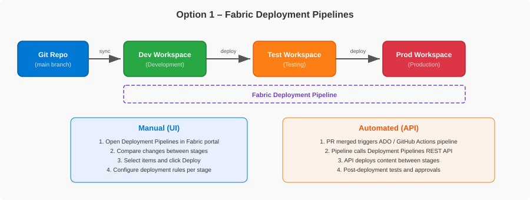
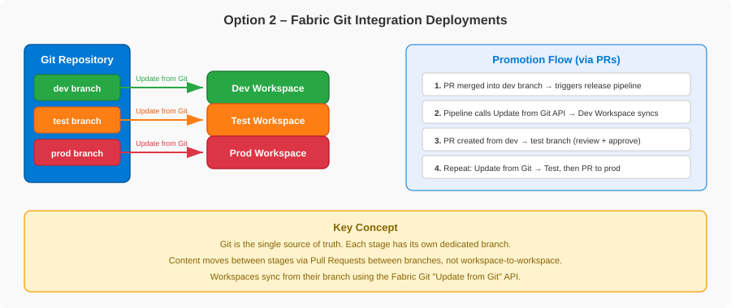
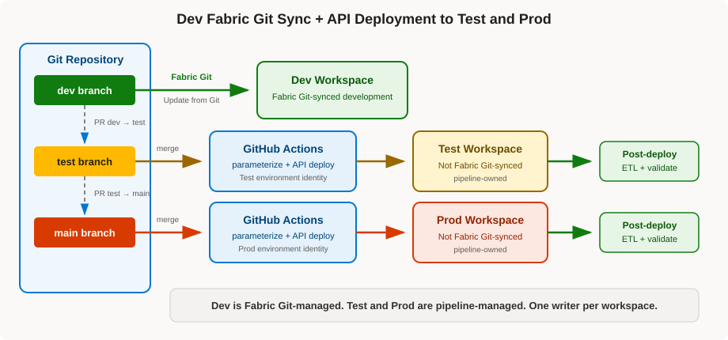

---
# Preview locally from the repository root:
# npx --yes @marp-team/marp-cli@4.5.1 presentations/fabric-sdlc-cd.md --preview --allow-local-files
marp: true
theme: default
paginate: true
size: 16:9
header: "Continuous Delivery in Microsoft Fabric"
footer: "[Michael D. Green - Fabric SDLC Patterns](https://github.com/michaeldeongreen/microsoft-fabric-sdlc-patterns)"
style: |
  section {
    font-family: "Segoe UI", Arial, sans-serif;
    font-size: 27px;
    padding: 52px 64px;
    color: #201f1e;
    background: #ffffff;
  }
  h1 {
    color: #004578;
    font-size: 1.65em;
    margin-bottom: 0.45em;
  }
  h2 {
    color: #0078d4;
  }
  h3 {
    color: #004578;
    margin-bottom: 0.3em;
  }
  strong {
    color: #004578;
  }
  a {
    color: #0067b8;
  }
  blockquote {
    border-left: 8px solid #0078d4;
    background: #eff6fc;
    padding: 0.5em 0.8em;
    margin: 0.7em 0;
  }
  table {
    font-size: 0.72em;
    width: 100%;
  }
  th {
    background: #e5f1fb;
    color: #004578;
  }
  td,
  th {
    border-color: #d2d0ce;
  }
  code {
    background: #f3f2f1;
  }
  header, footer {
    color: #605e5c;
    font-size: 0.55em;
  }
  footer a {
    color: inherit;
    text-decoration: none;
  }
  section.title {
    text-align: center;
    justify-content: center;
    background: linear-gradient(135deg, #ffffff 0%, #eff6fc 100%);
    border-top: 10px solid #0078d4;
    box-shadow: inset 0 -7px 0 #ffb900;
  }
  section.title h1 {
    font-size: 2.25em;
  }
  section.divider {
    text-align: center;
    justify-content: center;
    color: white;
    background: linear-gradient(135deg, #004578 0%, #0078d4 100%);
    box-shadow: inset 0 -7px 0 #ffb900;
  }
  section.divider h1,
  section.divider h2,
  section.divider strong {
    color: white;
  }
  section.compact {
    font-size: 23px;
  }
  section.dense {
    font-size: 20px;
  }
  section.diagram {
    font-size: 19px;
    padding: 40px 52px;
  }
  section.diagram h1 {
    max-width: 52%;
    margin: 0.2em 0;
  }
  section.diagram h2 {
    font-size: 1.35em;
    margin: 0.2em 0 0.45em;
  }
  section.diagram p,
  section.diagram ul {
    margin-top: 0.35em;
    margin-bottom: 0.35em;
  }
  section.customer-challenges {
    background: #faf9f8;
  }
  section.customer-challenges table {
    border-collapse: separate;
    border-spacing: 12px;
    font-size: 0.73em;
  }
  section.customer-challenges thead {
    display: none;
  }
  section.customer-challenges td {
    width: 50%;
    vertical-align: top;
    padding: 12px 14px;
    background: #ffffff;
    border: 1px solid #d2d0ce;
    border-top: 5px solid #0078d4;
    border-radius: 5px;
  }
  section.customer-challenges tbody tr:nth-child(2) td {
    border-top-color: #ffb900;
  }
  section.customer-challenges tbody tr:nth-child(3) td {
    border-top-color: #d83b01;
  }
  section.ownership table {
    font-size: 0.7em;
  }
  section.ownership th,
  section.ownership td {
    vertical-align: top;
    padding: 12px;
  }
  section.ownership th:nth-child(1) {
    background: #e5f1fb;
  }
  section.ownership th:nth-child(2) {
    background: #e8ebfa;
  }
  section.ownership th:nth-child(3) {
    background: #e7f5e7;
  }
  section.dependency-contract table {
    font-size: 0.67em;
  }
  section.dependency-contract td {
    vertical-align: top;
  }
---

<!-- _class: title -->
<!-- _paginate: false -->
<!-- _header: "" -->
<!-- _footer: "" -->

# Continuous Delivery in Microsoft Fabric

## Why it is difficult, the options available, and a working GitHub implementation

**Michael Green**<br/>
*[CSA / DevSquad / MCSA]*

October 2026

[Reference implementation](https://github.com/michaeldeongreen/microsoft-fabric-sdlc-patterns)

<!--
Introduce yourself and position the session as the CD follow-on to the earlier CI presentation.
Official Microsoft documentation is canonical; this repository is one opinionated GitHub implementation.
-->

---

# The Fabric delivery problem

A Fabric workspace is both a **development surface** and a **live environment**.

One solution can span:

- Notebooks and pipelines
- Lakehouses and data
- Semantic models and reports
- Variable Libraries and connections
- Ontologies and agents

> **How do we reproduce a working solution in Test and Prod without rebuilding it by hand or allowing every workspace to become a different truth?**

<!--
Do not define generic CD. Start with the Fabric-specific operating problem.
Direct browser editing is powerful, but it makes a disciplined promotion path important.
-->

---

<!-- _class: customer-challenges dense -->

# Why Fabric CI/CD is hard

**For customers and partners:** Data & AI delivery spans infrastructure, platform items, data and state, bindings, identities, and operations—not just code. That coupling makes platform choice consequential: switching later is usually a migration program, not a tool swap.

| | |
|---|---|
| **Uneven lifecycle support**<br>Git, Deployment Pipelines, `fabric-cicd`, and APIs support different item sets. | **Dependencies become deployment logic**<br>Foundational items must exist before target IDs and dependent definitions can resolve. |
| **Configuration is fragmented**<br>Runtime variables, metadata, connections, rules, and secrets have different owners and timing. | **Definitions are not the whole environment**<br>Data, credentials, permissions, schedules, and first-deploy bindings need separate plans. |
| **Multiple writers create drift**<br>Direct edits, Fabric Git sync, and API deployment should not compete for the same workspace. | **Security and governance span systems**<br>Fabric roles and tenant settings must align with Entra identity, GitHub controls, approvals, audit, and enterprise data governance. |

<!--
This is the central customer-problem slide. Fabric CD is hard because the workspace is heterogeneous, not because YAML is difficult.
The challenge is not simply whether Fabric is secure. It must fit the customer's existing enterprise control model without creating a parallel process.
Use “vendor lock-in” carefully: every Data & AI platform creates coupling through data gravity, proprietary metadata, security/governance configuration, operational skills, and ecosystem integration.
The point is not that teams cannot move; it is that migration is a strategic program rather than a deployment-tool change.
-->

---

<!-- _class: dense -->

# Before choosing CI/CD tooling, define the delivery surface

**Start with the solution—not the deployment tool.**

| Question | Decide |
|---|---|
| **What is part of the solution?** | Inventory the Fabric items and the surrounding configuration or state required to run. |
| **What can each mechanism move?** | Classify items as Fabric Git-tracked, supported by another deployment/API path, or manual. |
| **How portable are the references?** | Distinguish runtime values, logical IDs, and physical IDs that require replacement. |
| **What must be provisioned?** | Map capacities, workspaces, private links, shortcuts/connections, roles, and tenant settings; select Bicep, Terraform, or APIs by coverage. |
| **What moves beyond definitions?** | Plan for data, credentials, permissions, connections, schedules, bindings, and target settings. |
| **Who owns the target and outcome?** | Establish one writer, post-deploy ETL or refresh, validation, and release evidence. |

> **Supported does not mean complete:** item definitions are only one part of a usable environment.

<!--
This checklist distills the README Key Concepts: Item Tracking Categories and Variable Libraries: Dynamic vs Static Metadata.
Supported-item lists evolve, so link to the official lists rather than freezing a detailed matrix in the deck.
Bicep/ARM primarily covers the Azure control plane, including Fabric capacity. The Microsoft Fabric Terraform provider has broader Fabric-plane coverage, but support evolves.
Shortcuts, connections, and private networking may cross content, workspace, Fabric admin, and Azure networking surfaces; verify current provider/API coverage before selecting the IaC path.
-->

---

<!-- _class: dependency-contract compact -->

# One challenge in depth: dependencies become deployment logic

From the broader CD problems, dependencies show why copying definitions is not enough. References determine deployment order and parameterization.

| Portable / logical references | Physical references requiring replacement |
|---|---|
| Report → Semantic Model via [`definition.pbir`](../data/fabric/Patterns_Report.Report/definition.pbir)<br><br>Ontology → Lakehouse logical ID via its [data binding](../data/fabric/Patterns_Ontology.Ontology/EntityTypes/2525121373138/DataBindings/6e4524f9-ea6d-4535-ab49-a72f73fc08a0.json)<br><br>Data Agent → Ontology logical ID via [`datasource.json`](../data/fabric/Patterns_Data_Agent.DataAgent/Files/Config/draft/ontology-Patterns_Ontology/datasource.json) | Direct Lake Semantic Model → physical OneLake path in [`expressions.tmdl`](../data/fabric/Patterns_Semantic_Model.SemanticModel/definition/expressions.tmdl)<br><br>Notebook → physical default workspace/lakehouse IDs in [`notebook-content.py`](../data/fabric/Import_Patterns_Data.Notebook/notebook-content.py) |

```text
Phase 1:  Lakehouse ──▶ Variable Library / Notebooks / Semantic Model
          Ontology  ──▶ Data Agent

Phase 2:  Deploy dependent items after target IDs and logical items exist
```

<!--
Open the linked files if useful. The Data Agent directly references the Ontology—not the Lakehouse.
Lakehouse and Ontology are Phase 1 foundations for different dependency chains.
This is one concrete example of the broader challenges on the earlier slide, not a new topic.
-->

---

<!-- _class: divider -->
<!-- _paginate: false -->
<!-- _header: "" -->
<!-- _footer: "" -->

# Three Fabric delivery options

## Each optimizes for a different operating model

---

<!-- _class: diagram -->

# Option 1

## Fabric Deployment Pipelines



**Strengths**

- Portal UX, REST API automation, comparison, and history
- Lowest setup cost
- Full or selective deployment
- Deployment rules and autobinding

**Trade-offs**

- Git is not necessarily the direct source for Test and Prod
- Linear stage topology
- Rules do not cover every target-specific value
- API-based selective deployment requires dependency planning

**Best fit:** Fabric-native operations with minimal custom automation.

<!--
Deployment Pipelines are available through the Fabric portal and REST APIs. The APIs can create/manage pipelines, assign workspaces to stages, deploy stage content, and inspect operations.
Treat the APIs as the automation surface of this option—not as a separate fourth delivery option.
-->

---

<!-- _class: diagram -->

# Option 2

## Fabric Git integration for every stage



**Strengths**

- Fabric Git directly represents every stage
- One branch/PR model for development and promotion
- No separate deployment library

**Trade-offs**

- Fabric Git sync becomes part of the production deployment path
- Every target workspace must be Fabric Git-connected and governed
- Some customers report platform-generated or semantically insignificant definition churn (“ghost commits”)
- Long-lived branches, drift, and competing writers increase operational complexity

**Best fit:** teams comfortable operating all stages through Fabric Git integration.

<!--
Frame “ghost commits” as a customer/field concern, not a universal official platform claim:
some customers report semantically insignificant or platform-generated definition churn in source control.
-->

---

<!-- _class: diagram -->

# Option 3

## Common hybrid pattern: Dev Fabric Git sync + APIs for Test and Prod



**Strengths**

- Dev can remain Fabric Git-synced for development
- Test and Prod deploy from stage branches through APIs
- Build-time parameterization
- CI/CD-platform approvals, secrets, and logs
- Deployment, ETL, and validation can be chained

**Trade-offs**

- Highest engineering ownership
- The team owns identity, diagnostics, and failure handling
- Tool/API support still varies
- Full-state deployment can be slower than a small diff

**Best fit:** teams needing repeatability and configuration control.

<!--
Option 3 can use a build environment for every stage. This repository uses a common hybrid variant:
Dev is Fabric Git-synced; Test and Prod are deployed through APIs.
-->

---

<!-- _class: dense -->

# Compare the operating models

| | Deployment Pipelines | Fabric Git per stage | Build environment / APIs |
|---|---|---|---|
| Test/Prod source | Prior workspace stage | Stage branch | Stage branch + deployment config |
| Built-in comparison | Adjacent Fabric stages | Workspace ↔ connected branch | None |
| Build-time transformation | Limited rules | No | **Yes** |
| Test/Prod Fabric Git connection | No | **Yes** | No |
| Engineering effort | Low | Medium | High |
| Who operates the release | Fabric workspace/release operators | Fabric solution owners + repo maintainers | DevOps/DevSecOps + Fabric solution owners |
| Deployment evidence | Fabric deployment history; Git if used | Git history + workspace Fabric Git status | Git history + CI/CD run logs |

**Choose based on source-of-truth, configuration, supported items, governance, and how much deployment code the team wants to own.**

> Automation does not eliminate Fabric expertise—it changes where that knowledge is encoded and who maintains it.

<!--
Deployment Pipelines: Fabric rules, bindings, and operator knowledge.
Fabric Git: definitions, branches, and workspace Git state.
Build/APIs: parameterization, deployment phases, validation, and runbooks.
Built-in comparison is not the same across columns: Deployment Pipelines compares adjacent stages, while Fabric Git compares a workspace with its connected branch.
Git history can support every Git-backed option; the evidence row highlights the additional proof that a revision reached its target.
-->

---

<!-- _class: dense -->

# Inside Option 3: `fabric-cicd` vs Bulk APIs

| Concern | Standard `fabric-cicd` | `fabric-cicd` bulk publish | Direct Bulk APIs |
|---|---|---|---|
| Transport | Ordered per-item API calls | Bulk Import when compatible; **per-item fallback here (v1.3.0)** | One or more caller-managed Bulk Import calls |
| Environment binding / parameterization | Full `parameter.yml` feature set | Same `parameter.yml`; this repo's dynamic values trigger the v1.3.0 fallback | None built in; caller rewrites definitions and configures after import |
| Dependency handling | Library order + caller phases | Bulk API graph when bulk runs; standard order after fallback | Bulk API resolves logical IDs in one request; caller preprocesses physical target IDs |
| Orphan cleanup / deletion | `unpublish_all_orphan_items()` | Same separate cleanup; Bulk Import is publish-only | Separate Delete Item calls |
| Repository behavior | Two caller phases, ordered per item | Two-phase per-item fallback here (v1.3.0) | Two Bulk calls here: foundations, then rewritten dependents |

**Repository recommendation:** standard `fabric-cicd`.

**Binding ≠ deletion:** binding fixes target references; orphan cleanup removes source-absent items.

<!--
The repository installs published fabric-cicd 1.3.0. In that version, contains_param_vars is true when parameter.yml contains dynamic $items/$workspace values, and bulk publish falls back to standard per-item calls.
The unversioned latest documentation already describes dependency batches for supported dynamic values. Re-check this result after upgrading; do not present the 1.3.0 fallback as permanent behavior.
The Repository behavior row is specific to this implementation. Its direct Bulk script uses two calls because bulk-parameter.yml needs the target Lakehouse ID before rewriting dependent definitions. The service itself handles logical-ID dependencies in one bulk request.
-->

---

<!-- _class: divider -->
<!-- _paginate: false -->
<!-- _header: "" -->
<!-- _footer: "" -->

# What this repository implements

## Dev through Fabric Git; Test and Prod through GitHub Actions

---

<!-- _class: diagram -->

# Dev uses Fabric Git sync; Test and Prod use APIs


| Branch | Workspace | Delivery |
|---|---|---|
| `dev` | Dev | Fabric Git integration |
| `test` | Test | GitHub Actions |
| `main` | Prod | GitHub Actions |

**One writer per workspace**

- Dev is Fabric Git-managed.
- Test and Prod are pipeline-managed.
- Successful deployment is followed by ETL and validation.

---

<!-- _class: compact -->

# Fabric knowledge is encoded in the delivery contract

| | Variable Libraries | `parameter.yml` |
|---|---|---|
| Applied | At runtime | Before upload |
| Handles | Values workloads can resolve dynamically | Physical IDs and metadata that cannot be deferred |
| Examples | Workspace/lakehouse values read by notebooks | Notebook META IDs and Direct Lake paths |

```text
Phase 1 foundations: Lakehouse + Ontology
          ↓ target IDs and logical items now exist
Phase 2 dependents: Variable Library + Notebooks + Semantic Model + Report + Data Agent
          ↓ orphan cleanup
Post-deploy: ETL + validation
```

**Also encoded:** explicit item scope, environment names, ETL notebook lookup, orphan reconciliation, and failure behavior.

> The pipeline does not need tribal Fabric knowledge when that knowledge is made explicit and testable in the repository.

---

<!-- _class: compact -->

# Three selectable deployment paths

| `DEPLOY_METHOD` | Result |
|---|---|
| unset or `fabric-cicd` | Recommended standard path |
| `fabric-cicd-bulk` | Requests library bulk; falls back here because of dynamic parameters |
| `bulk` | Direct Bulk Import implementation |
| anything else | All deployment workflows skip |

All successful paths converge on the same ETL workflow.

### Why direct Bulk requires more code

The caller must package definitions, substitute IDs, split phases when necessary, poll operations, activate the Variable Library value set, and interpret per-item results.

It still does not implement full `parameter.yml` compatibility or orphan deletion.

---

<!-- _class: divider -->
<!-- _paginate: false -->
<!-- _header: "" -->
<!-- _footer: "" -->

# Live walkthrough

## Follow one release from `main` to Prod

<!--
Switch from the deck to GitHub after the next flow slide.
-->

---

<!-- _class: dense -->

# From pull request to usable workspace

```text
PR: test → main
  ↓ branch rules + promotion-path check + unit tests
merge creates push to main
  ↓ DEPLOY_METHOD selects one orchestrator
Prod GitHub Environment supplies identity + workspace
  ↓ reusable workflow checks out the revision + authenticates
deploy script + parameter.yml → Fabric APIs
Phase 1 → Phase 2 → orphan cleanup
  ↓ successful deployment
Prod ETL runs and validates data readiness
```

### Files to follow

1. [`enforce-promotion-path.yml`](../.github/workflows/enforce-promotion-path.yml) — permits only `test → main`
2. [`run-tests.yml`](../.github/workflows/run-tests.yml) — installs dependencies and runs pytest for every PR
3. [`deploy-prod.yml`](../.github/workflows/deploy-prod.yml) — selects the deploy method and Prod environment
4. [`reusable-deploy-fabric-cicd.yml`](../.github/workflows/reusable-deploy-fabric-cicd.yml) — authenticates and runs the standard deployment
5. [`deploy_fabric_cicd.py`](../scripts/deploy_fabric_cicd.py) — controls phases and orphan cleanup
   - [`parameter.yml`](../data/fabric/parameter.yml) — rewrites target workspace/item IDs before upload
6. [`etl-prod.yml`](../.github/workflows/etl-prod.yml) — starts ETL only after deployment succeeds

---

<!-- _class: compact -->

# Governance appears at each step

| Step | Control |
|---|---|
| Promote to `main` | Branch rules, status checks, source-branch restriction |
| Select deployment | Repository `DEPLOY_METHOD` variable |
| Enter Prod | GitHub Environment secrets and optional reviewers |
| Authenticate | Environment-scoped service principal |
| Run workflow | Read-only `GITHUB_TOKEN`, pinned Actions |
| Prove outcome | Commit SHA, run logs, ETL result, Fabric audit |

### Production posture

- Separate deployment identity per environment where practical
- Contributor only on the target workspace
- Restrict Prod deployments to `main`
- Add Prod reviewers where deploy-time approval is required
- Evaluate GitHub OIDC instead of a stored client secret

<!--
Current demo posture on 2026-09-25:
- Branch rulesets are active, but required approvals are zero.
- Prod Environment protection and deployment branch policy are not configured.
- DEPLOY_METHOD currently selects fabric-cicd-bulk.
Be explicit about current versus recommended controls when showing Settings.
-->

---

<!-- _class: dense -->

# Deployment is not the end

[`etl-prod.yml`](../.github/workflows/etl-prod.yml) runs only after the selected deployment succeeds.

It:

- resolves `Import_Patterns_Data` by display name;
- starts the notebook through the Fabric REST API;
- polls until success, failure, or timeout;
- can be rerun manually without redeploying definitions.

```text
definitions deployed
  → target configuration applied
  → ETL / refresh completed
  → solution validated
  → environment usable
```

> A green deployment means the definitions arrived. A successful release means the environment can do its job.

---

<!-- _class: compact -->

# The audit thread is the commit SHA

| Question | Evidence |
|---|---|
| What changed and why? | Git diff, commit, pull request |
| Who reviewed and promoted it? | PR and branch-rule history |
| What revision deployed? | Actions run commit SHA |
| Who authorized deployment? | Environment review, when enabled |
| What did automation do? | Workflow and script logs |
| Did data preparation succeed? | ETL result |
| What happened inside Fabric? | Fabric and organizational audit sources |

GitHub Actions provides deployment evidence. It does not replace:

- Fabric workspace auditing;
- data-quality validation;
- organizational log-retention policy.

---

<!-- _class: divider -->
<!-- _paginate: false -->
<!-- _header: "" -->
<!-- _footer: "" -->

# Rollback

## Definitions are easier to reverse than data

---

# Roll definitions forward to a known-good state

```text
identify the bad change
  → create a git revert commit
  → review and promote it
  → run the same deployment path
  → validate the target
```

The revert preserves history and uses the same controls as any other release.

### Data recovery is separate

Git cannot reverse lakehouse mutations, refresh state, downstream side effects, or writes to external systems.

Plan for reprocessing, snapshots, retention, point-in-time capabilities, or workload-specific backout procedures.

---

<!-- _class: title compact -->
<!-- _paginate: false -->
<!-- _header: "" -->
<!-- _footer: "" -->

# The difficult part is not uploading files

It is reproducing a working Fabric solution across item types whose definitions, dependencies, environment bindings, data, and automation support do not behave uniformly.

## Choose deliberately

- Fabric-native stages: **Deployment Pipelines**
- Fabric Git-connected stages: **Fabric Git per workspace**
- Build-time control: **Git + APIs**

## Then make the release easy to prove—and safe to repeat

**Questions?**

[Repository](https://github.com/michaeldeongreen/microsoft-fabric-sdlc-patterns)

---

<!-- _class: dense -->

# Appendix — best practices and references

### Practices to carry forward

- Establish one source of truth and one deployment writer per workspace.
- Prefer full, repeatable deployments; use selective deployment only with dependency awareness.
- Separate item delivery, environment binding, identity and permissions, and data validation.
- Use environment-scoped identities, approval gates, and the commit SHA as the release thread.

**New from the Fabric product group:** [CI/CD resource hub](https://learn.microsoft.com/en-us/fabric/cicd/cicd-overview) · [resource announcement](https://community.fabric.microsoft.com/blog/fbc_fabricupdatesblogs/new-cicd-resources-for-microsoft-fabric-from-concepts-to-end-to-end-automation/5358502)

| Official guidance | This repository |
|---|---|
| [Plan CI/CD for Fabric solutions](https://learn.microsoft.com/en-us/fabric/fundamentals/understand-best-practices-fabric-cicd)<br>[Choose a Fabric CI/CD workflow](https://learn.microsoft.com/en-us/fabric/cicd/manage-deployment)<br>[End-to-end automation tutorial](https://learn.microsoft.com/en-us/fabric/cicd/tutorial-end-to-end-automation) | [Release options](../fabric-cicd-release-options.md)<br>[Hybrid implementation guide](../fabric-hybrid-cicd-guide.md)<br>[Governance considerations](../fabric-cicd-governance-considerations.md) |
| [`fabric-cicd` parameterization](https://microsoft.github.io/fabric-cicd/1.3.0/how_to/parameterization/)<br>[Optional and selective features](https://microsoft.github.io/fabric-cicd/1.3.0/how_to/optional_feature/)<br>[Code reference](https://microsoft.github.io/fabric-cicd/1.3.0/reference/code_reference/) | [Direct Bulk API implementation](../fabric-bulk-cicd-guide.md)<br>[Development process](../fabric-development-process.md)<br>[Reference implementation](https://github.com/michaeldeongreen/microsoft-fabric-sdlc-patterns) |
