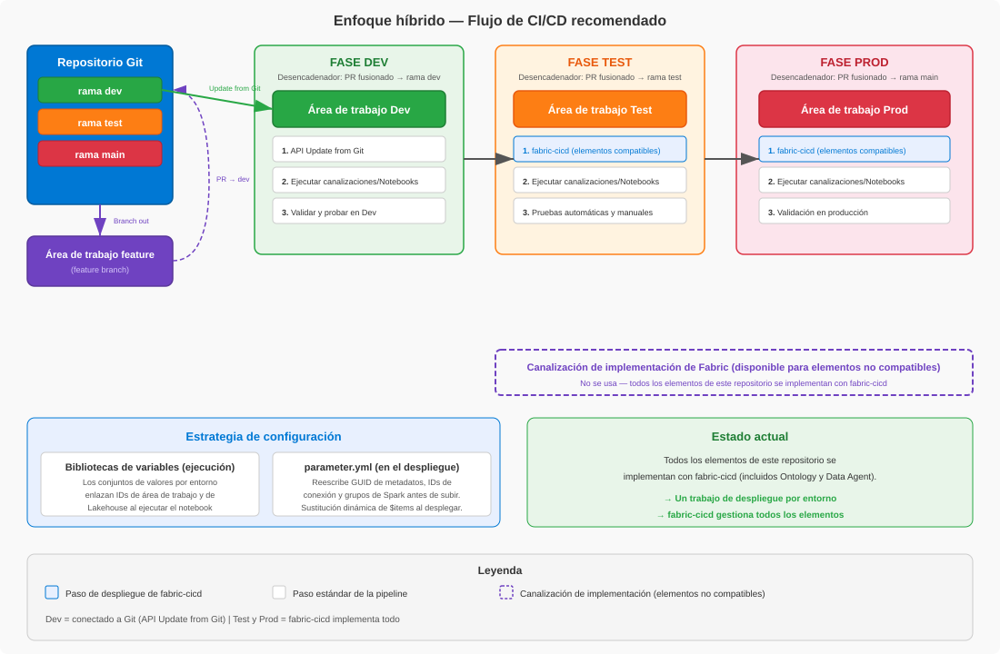

[English](../../README.md) | **Español**

<!-- source: README.md @ d8e27be | translated: 2026-09-22 | revisado: 2026-09-23 -->

> 📄 **La versión en inglés de este documento es la autoritativa.** En caso de discrepancia, [el original en inglés](../../README.md) tiene precedencia.

# Patrones de SDLC para Microsoft Fabric

Implementación de referencia y acelerador de soluciones para el flujo de trabajo del desarrollador y el *pipeline* de CI/CD en Microsoft Fabric. Muestra cómo elegir una estrategia de publicación, implementar despliegues, trabajar día a día en *feature branches* y gobernar el *pipeline* para desarrollo, pruebas y producción con GitHub Actions y la biblioteca de Python [fabric-cicd](https://microsoft.github.io/fabric-cicd). Tanto el flujo de trabajo del desarrollador como el *pipeline* de despliegue están completamente implementados de principio a fin, de modo que el repositorio funciona como una referencia completa y no como ejemplos aislados.

*Basado en la experiencia de campo con clientes y partners de Microsoft Fabric. Las opiniones aquí expresadas son propias y no representan la guía oficial de Microsoft.*

---

## ¿A quién está dirigido?

A los equipos de ingeniería y de plataforma responsables de llevar las cargas de trabajo de Microsoft Fabric desde la laptop de un desarrollador hasta producción de forma segura y repetible, abarcando el flujo de trabajo del desarrollador, el propio *pipeline* de despliegue y la gobernanza que se superpone a ambos.

Los arquitectos y responsables de decisión que estén evaluando Fabric encontrarán útiles [Opciones de publicación de CI/CD](../../fabric-cicd-release-options.md) *(solo en inglés)* y [Consideraciones de gobernanza](../../fabric-cicd-governance-considerations.md) *(solo en inglés)* para entender el modelo operativo antes de comprometerse.

---

## Arquitectura

```
Feature branch (feature/*)
  │
  │  PR → rama dev
  ▼
Repositorio Git (rama dev)
  │
  │  Merge del PR → rama test (el origen debe ser dev)
  ▼
┌──────────────────────────────────────────────┐
│  deploy-test.yml                             │
│    └─ fabric-cicd: publish_all_items()       │
│                    ↓ si tiene éxito           │
│  etl-test.yml                                │
│    └─ API REST de Fabric: ejecuta Notebook   │
└──────────────────────────────────────────────┘
  │
  │  Merge del PR → rama main (el origen debe ser test)
  ▼
┌──────────────────────────────────────────────┐
│  deploy-prod.yml                             │
│    └─ fabric-cicd: publish_all_items()       │
│                    ↓ si tiene éxito           │
│  etl-prod.yml                                │
│    └─ API REST de Fabric: ejecuta Notebook   │
└──────────────────────────────────────────────┘
```

La protección de ramas (PR obligatorio, restricciones de rama de origen, comprobaciones de estado) se aplica mediante los *rulesets* de ramas de GitHub y el flujo de trabajo [enforce-promotion-path.yml](../../.github/workflows/enforce-promotion-path.yml); consulta las [Consideraciones de gobernanza](../../fabric-cicd-governance-considerations.md) *(solo en inglés)*.



> Este repositorio demuestra fabric-cicd (la biblioteca de Python GA recomendada por defecto) junto con un conjunto paralelo de flujos de trabajo basados en las API de importación y exportación masiva (*Bulk Import / Export*, en versión preliminar) para su evaluación y comparación. La selección se controla con la variable de repositorio `DEPLOY_METHOD`; véase [Inicio rápido](#inicio-rápido) para todos los métodos y cómo alternar entre ellos, y [Opciones de publicación de CI/CD](../../fabric-cicd-release-options.md#tooling-within-option-3-fabric-cicd-vs-bulk-apis) *(solo en inglés)* para la comparación completa.

---

## Documentación

Los documentos siguientes todavía no están traducidos. Los enlaces apuntan al original en inglés.

| Documento | Descripción |
|---|---|
| [Opciones de publicación de CI/CD](../../fabric-cicd-release-options.md) *(solo en inglés)* | Evalúa todas las opciones de publicación de CI/CD para Fabric (*Pipelines* de despliegue, basadas en Git, basadas en compilación, híbrida) y recomienda el enfoque híbrido. Incluye una [comparación entre fabric-cicd y las nuevas API de importación y exportación masiva](../../fabric-cicd-release-options.md#tooling-within-option-3-fabric-cicd-vs-bulk-apis) (versión preliminar) dentro de la opción 3. **Punto de partida recomendado** para decidir una estrategia. |
| [Guía de implementación híbrida de CI/CD](../../fabric-hybrid-cicd-guide.md) *(solo en inglés)* | Análisis detallado de la implementación recomendada con fabric-cicd: estructura de los flujos de trabajo, estrategia de configuración, requisitos previos, pasos de configuración y problemas habituales. |
| [Guía de implementación de CI/CD masivo](../../fabric-bulk-cicd-guide.md) *(solo en inglés)* | Guía de implementación de la ruta alternativa de despliegue con la API de importación masiva (versión preliminar). Cubre las soluciones alternativas que salvan las carencias (sustitución, activación de conjuntos de valores), la decisión de los dos despliegues, los patrones de extensión y las limitaciones que no se resuelven. |
| [Proceso de desarrollo](../../fabric-development-process.md) *(solo en inglés)* | Cómo trabajan los desarrolladores día a día: flujo de trabajo de Branch Out, el script de cambio de workspace y la comprobación de preparación del PR. |
| [Consideraciones de gobernanza de CI/CD](../../fabric-cicd-governance-considerations.md) *(solo en inglés)* | Consideraciones sobre identidades, RBAC, protección de ramas y puertas de aprobación para el *pipeline* de CI/CD. Incluye referencias a controles adyacentes que se gestionan fuera del *pipeline* (temas de seguridad y cumplimiento). |

---

## Conceptos clave

Antes de elegir un enfoque de CI/CD o un flujo de trabajo de desarrollo, conviene entender estas dos realidades sobre los elementos de Fabric.

### Categorías de seguimiento de elementos

No todos los elementos de Fabric se pueden gestionar igual. Desde el punto de vista de la administración del ciclo de vida, se dividen en tres categorías:

| Categoría | Descripción | Ejemplos |
|---|---|---|
| **Con seguimiento en Git** | Elementos compatibles con la [integración de Git de Fabric](https://learn.microsoft.com/en-us/fabric/cicd/git-integration/intro-to-git-integration#supported-items). Sus definiciones se serializan en archivos dentro del repositorio, lo que permite control de versiones, ramificación y flujos de revisión de código. | *Notebooks*, *Semantic Models*, *Lakehouses*, *Reports*, *Variable Libraries*, *Data Pipelines*, *Environments* |
| **Solo *Pipelines* de despliegue** | Elementos no compatibles con la integración de Git ni con fabric-cicd, pero sí con los [*Pipelines* de despliegue de Fabric](https://learn.microsoft.com/en-us/fabric/cicd/deployment-pipelines/intro-to-deployment-pipelines#supported-items). Se pueden promover de un workspace a otro, pero no se pueden versionar en Git. | Véanse las listas oficiales de elementos compatibles: esta categoría cambia a medida que Microsoft añade capacidades |
| **Manuales** | Elementos que no admiten ni la integración de Git ni los *Pipelines* de despliegue. Deben crearse y configurarse manualmente en cada workspace. | Varía a medida que Microsoft amplía la compatibilidad; conviene consultar siempre las listas oficiales de elementos compatibles |

> **Importante:** ambas listas de elementos compatibles evolucionan a medida que Microsoft añade capacidades. Debe verificarse siempre la documentación oficial antes de dar por hecho que un elemento pertenece a una categoría concreta.

Esta categorización afecta directamente a la estrategia de CI/CD. La [Guía de implementación híbrida de CI/CD](../../fabric-hybrid-cicd-guide.md) *(solo en inglés)* describe cómo abordar la diferencia entre los elementos con seguimiento en Git y los que solo admiten *Pipelines* de despliegue, cuando el workspace incluye tipos no compatibles. Actualmente, todos los elementos de este repositorio se despliegan mediante fabric-cicd.

### *Variable Libraries*: metadatos dinámicos frente a estáticos

Algunos elementos de Fabric resuelven los valores específicos de cada entorno **en tiempo de ejecución** mediante [*Variable Libraries*](https://learn.microsoft.com/en-us/fabric/cicd/variable-library/variable-library-cicd), mientras que otros tienen los IDs específicos del entorno **definidos directamente en el propio elemento**.

| Tipo | Cómo funciona | Ejemplos |
|---|---|---|
| **Dinámico (*Variable Library*)** | El elemento lee los IDs de la *Variable Library* en tiempo de ejecución. Cambiar el conjunto de valores activo alterna automáticamente el contexto del entorno, sin modificar archivos. | *Notebooks* que usan `notebookutils.variableLibrary.getLibrary()` |
| **Estático (definido directamente)** | La definición del elemento contiene GUID literales de workspace o de *Lakehouse* que deben reescribirse en cada entorno, ya sea en el momento del despliegue (mediante `parameter.yml`) o mediante script (`workspace_swap.py`). | URL de Direct Lake del *Semantic Model* (`expressions.tmdl`), bloques META de dependencias del *Notebook* (`default_lakehouse`, `default_lakehouse_workspace_id`) |

Al diseñar los procesos de desarrollo y de CI/CD conviene identificar qué elementos del workspace son dinámicos y cuáles estáticos. Los estáticos necesitan parametrización en el momento del despliegue (`parameter.yml` para CI/CD) o reescritura mediante script (`workspace_swap.py` para *feature branches*). El documento [Proceso de desarrollo](../../fabric-development-process.md) *(solo en inglés)* explica cómo este repositorio gestiona ambos casos.

---

## Inicio rápido

### Requisitos previos

1. **Fabric Capacity** — Una *Fabric Capacity* o una capacidad de Power BI Premium para todos los workspaces
2. **Tres workspaces de Fabric** — Dev (conectado a Git), Test y Prod
3. **Service principal** — Con el rol de colaborador en los workspaces de Test y Prod
4. **Entornos de GitHub** — `Test` y `Prod` con secretos de ámbito de entorno
5. **Configuración de administración de Fabric** — Acceso de service principals a las API de Fabric habilitado en el portal de administración de Fabric, en la configuración de desarrollador (véase la [configuración de inquilino para desarrolladores](https://learn.microsoft.com/en-us/fabric/admin/service-admin-portal-developer))

### Configuración

1. Cree un service principal y añádalo como colaborador en los workspaces de Test y Prod
2. Cree los entornos de GitHub (`Test`, `Prod`) con los secretos `AZURE_TENANT_ID`, `AZURE_CLIENT_ID`, `AZURE_CLIENT_SECRET` y `FABRIC_WORKSPACE_ID` *(esta demostración usa un secreto de cliente por simplicidad; para producción conviene evaluar la [federación OIDC de GitHub](../../fabric-cicd-governance-considerations.md#identity-model--pick-the-right-identity-for-the-job) para eliminar el secreto almacenado)*
3. Conecte el workspace de Dev a la rama `dev` mediante la integración de Git de Fabric (carpeta: `data/fabric/`)
4. Cree las ramas `dev`, `test` y `main`
5. Desarrolle en `dev`, fusione en `test` (activa el despliegue en Test) y fusione en `main` (activa el despliegue en Prod)

### Selección del método de despliegue

Este repositorio incluye tres métodos de despliegue. La variable de repositorio `DEPLOY_METHOD` (Settings → Secrets and variables → Actions → Variables) determina cuál se ejecuta:

| Valor de `DEPLOY_METHOD` | Comportamiento |
|---|---|
| `fabric-cicd` *(o sin definir)* | Se ejecutan los flujos de trabajo de fabric-cicd existentes: la ruta predeterminada y recomendada |
| `fabric-cicd-bulk` | Los flujos de trabajo de fabric-cicd se ejecutan con la publicación masiva habilitada. En este repositorio siempre recurre a la publicación estándar elemento por elemento, porque `parameter.yml` usa las variables `$items` y `$workspace`; se incluye para demostrar el modo masivo experimental de la biblioteca |
| `bulk` | Se ejecutan en su lugar los flujos de trabajo de la API de importación masiva (versión preliminar) |
| cualquier otro valor | Se omiten todos los flujos de trabajo de despliegue (valor seguro por defecto) |

Sea cual sea el método que se ejecute, el flujo de trabajo de ETL se encadena después mediante `workflow_run`. Véase [Opciones de publicación de CI/CD](../../fabric-cicd-release-options.md#tooling-within-option-3-fabric-cicd-vs-bulk-apis) *(solo en inglés)* para las ventajas e inconvenientes entre fabric-cicd y las API masivas.

Las instrucciones detalladas de configuración están en la [Guía de implementación](../../fabric-hybrid-cicd-guide.md#prerequisites--setup) *(solo en inglés)*. Los *rulesets* de protección de ramas, las aprobaciones en el momento del despliegue y la ruta de promoción por rama de origen que aplica este repositorio se describen en las [Consideraciones de gobernanza](../../fabric-cicd-governance-considerations.md) *(solo en inglés)*.

---

## Referencias

- [Biblioteca de Python fabric-cicd](https://microsoft.github.io/fabric-cicd) — Documentación, primeros pasos y tipos de elemento compatibles *(solo en inglés)*
- [Integración de Git de Fabric](https://learn.microsoft.com/en-us/fabric/cicd/git-integration/intro-to-git-integration) — Documentación oficial
- [Flujos de trabajo reutilizables de GitHub Actions](https://docs.github.com/en/actions/sharing-automations/reusing-workflows) — `workflow_call`, entradas y secretos

---

## Sobre esta traducción

Este documento es una traducción de [README.md](../../README.md). La versión en inglés es la fuente autorizada y puede estar más actualizada.

**Revisión lingüística:** hablantes nativos del equipo. La terminología de este repositorio refleja sus correcciones: véase [`GLOSARIO.md`](GLOSARIO.md), donde las entradas marcadas 👤 Revisión prevalecen sobre la terminología oficial de Microsoft.

La terminología sigue [`GLOSARIO.md`](GLOSARIO.md) y [`GUIA-DE-ESTILO.md`](GUIA-DE-ESTILO.md). Para revisar esta traducción, véase [`REVISION.md`](REVISION.md).

**Los enlaces a documentación externa apuntan a la versión en inglés.** Los motivos:

- La documentación en inglés es la **versión de referencia** de Microsoft y de GitHub: es la primera en publicarse y en actualizarse.
- La terminología de este repositorio se ha fijado con revisión nativa (véase [`GLOSARIO.md`](GLOSARIO.md)) y **no siempre coincide** con la de las versiones traducidas, lo que puede generar confusión al saltar de un documento a otro.
- Quien trabaja con Fabric suele tener el portal y las herramientas **en inglés**, de modo que los términos de la documentación en inglés coinciden con lo que ve en pantalla.

Si prefieres leer la documentación de Microsoft en español, basta con cambiar `/en-us/` por `/es-es/` en la URL.

Los errores pueden comunicarse abriendo una incidencia e indicando el idioma. Si el error existe también en el original en inglés, **debe corregirse primero allí**: véase [`TRANSLATION.md`](../../TRANSLATION.md).
