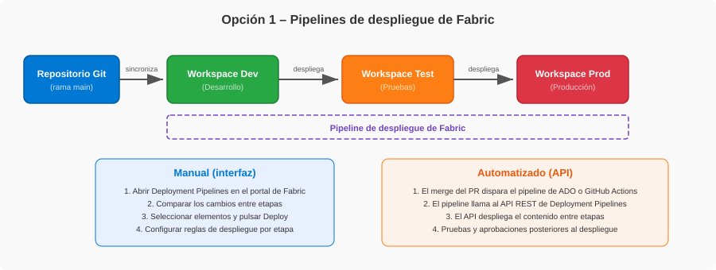
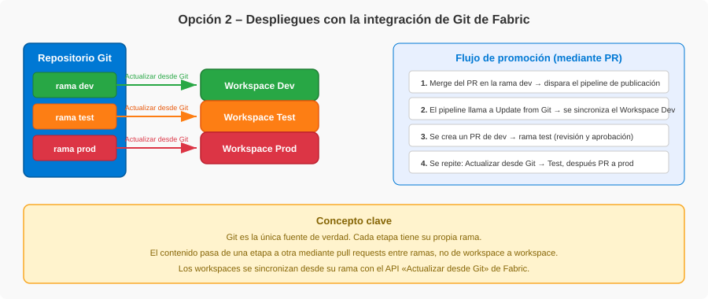
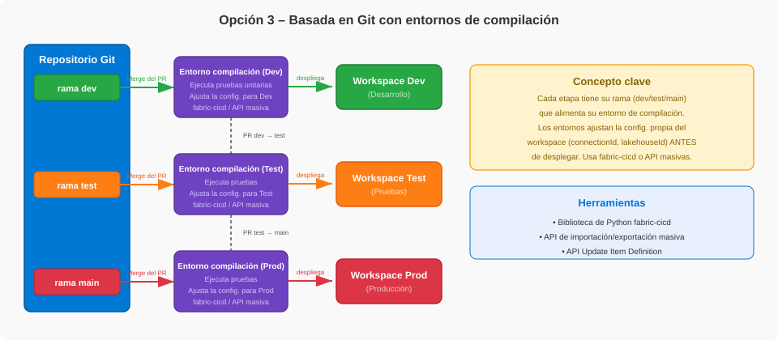
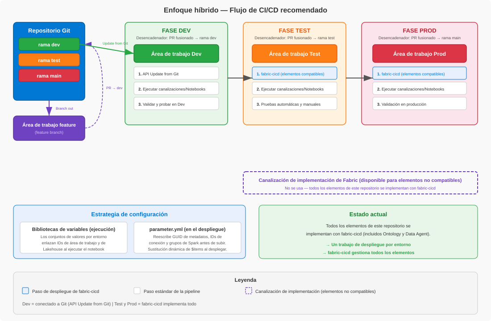

[English](../../fabric-cicd-release-options.md) | **Español**

<!-- source: fabric-cicd-release-options.md @ d5c92c3 | translated: 2026-09-28 -->

> 📄 **La versión en inglés de este documento es la autoritativa.** En caso de discrepancia, [el original en inglés](../../fabric-cicd-release-options.md) tiene precedencia.

# Prácticas recomendadas de CI/CD en Fabric

## Índice

- [Introducción: por qué CI/CD en Fabric](#introducción-por-qué-cicd-en-fabric)
- [La integración de Git en Fabric](#la-integración-de-git-en-fabric)
- [Proceso de desarrollo](#proceso-de-desarrollo)
- [Opciones de publicación](#opciones-de-publicación)
  - [Opción 1 – Pipelines de despliegue de Fabric](#opción-1--pipelines-de-despliegue-de-fabric)
  - [Opción 2 – Despliegues con la integración de Git de Fabric](#opción-2--despliegues-con-la-integración-de-git-de-fabric)
  - [Opción 3 – Basada en Git con entornos de compilación](#opción-3--basada-en-git-con-entornos-de-compilación)
- [Infraestructura y aprovisionamiento de recursos](#infraestructura-y-aprovisionamiento-de-recursos)
- [Resumen comparativo](#resumen-comparativo)
- [Mi recomendación](#mi-recomendación)
- [Prácticas recomendadas](#prácticas-recomendadas)
- [Referencias](#referencias)
- [Agradecimientos](#agradecimientos)

---

## Introducción: por qué CI/CD en Fabric

Los workspaces de Microsoft Fabric contienen elementos —*Notebooks*, *pipelines*, *Lakehouses*, *Semantic Models* y más— que deben pasar de forma fiable entre los entornos de desarrollo, pruebas y producción. Más allá de los elementos, también hay que ingerir y transformar **datos** en cada etapa para validar que todo funciona de principio a fin. CI/CD en Fabric aporta los mecanismos para versionar esos elementos, seguir los cambios a lo largo del tiempo y automatizar su despliegue y sus flujos de datos en todas las etapas.

---

## La integración de Git en Fabric

### Cómo funciona

- **Integración a nivel de workspace:** la integración de Git opera sobre el workspace. Se conecta un workspace de Fabric a un repositorio Git y se sincronizan todos los elementos compatibles en un solo proceso.
- **Proveedores de Git compatibles:** Azure DevOps (nube), GitHub (nube) y GitHub Enterprise (nube).
- **Sincronización bidireccional:** los cambios hechos en el workspace de Fabric se **confirman** en la rama de Git. Los cambios hechos en el repositorio se **traen** al workspace mediante una actualización. Solo puede sincronizarse una dirección a la vez.
- **Conectar un workspace:** quien administra el workspace lo conecta a un repositorio, una rama y una carpeta concretos. Una vez conectado, cualquier persona con permisos puede confirmar y actualizar.
- **Definiciones de elementos como archivos:** los elementos de Fabric se serializan en definiciones basadas en archivos dentro del repositorio (JSON, Python, etc.). La estructura de carpetas del workspace se conserva en Git.
- **Los elementos no compatibles se ignoran:** si el workspace contiene elementos que la integración de Git no admite, permanecen en el workspace pero no se sincronizan. No se eliminan.
- **Branch Out:** se puede crear una rama y un workspace nuevos a partir de un workspace conectado, lo que permite trabajar de forma aislada.
- **Hacen falta opciones de administración de inquilino:** la sincronización con Git, la sincronización con GitHub y la creación de workspaces deben estar habilitadas en el portal de administración de Fabric.
- **Se necesita Fabric Capacity:** hace falta una *Fabric Capacity* o una capacidad de Power BI Premium para usar la integración de Git.

### Elementos no compatibles

La integración de Git solo funciona con un conjunto concreto de elementos de Fabric. **Cualquier elemento que no esté en la lista de compatibles se ignora**: permanece en el workspace, pero no se sincroniza, ni se confirma, ni se elimina.

Para la lista completa de elementos compatibles, véase la [documentación oficial](https://learn.microsoft.com/en-us/fabric/cicd/git-integration/intro-to-git-integration#supported-items) enlazada en la sección de referencias.

> **Importante:** la integración de Git no admite todos los tipos de elemento de Fabric. Conviene consultar siempre la [lista oficial de elementos compatibles](https://learn.microsoft.com/en-us/fabric/cicd/git-integration/intro-to-git-integration#supported-items) antes de dar por hecho que un elemento tiene seguimiento.

---

## Proceso de desarrollo

### Entornos aislados

El proceso de desarrollo es el mismo sea cual sea la opción de despliegue elegida. Conviene trabajar siempre de forma aislada, nunca directamente en el workspace compartido del equipo.

En Fabric, el enfoque recomendado para la mayoría de los desarrolladores es **hacer *Branch Out* a un workspace aparte**:

1. El **workspace de Dev** compartido está conectado a una rama compartida (por ejemplo, `main`) del repositorio Git.
2. Se usa la función **Branch out** de la interfaz de Fabric para crear una *feature branch* y un workspace aislado nuevos a partir del workspace de Dev.
3. Los cambios se hacen en el **workspace de feature**, sincronizado con la *feature branch* correspondiente.
4. Cuando los cambios están listos, se **confirman** en la *feature branch*.
5. Se crea un ***pull request*** (PR) en el proveedor de Git (Azure DevOps o GitHub) para fusionar la *feature branch* de vuelta en la rama `main`.
6. El PR pasa por el **proceso de revisión y aprobación** del equipo.
7. Una vez aprobado y fusionado, se solicita al workspace de Dev que se **actualice** con el nuevo *commit*. Cómo ocurre esa actualización depende de la opción de publicación elegida (se trata en las secciones siguientes).

Como alternativa, quien trabaje con elementos disponibles en herramientas cliente (por ejemplo, Power BI Desktop o VS Code) puede **clonar el repositorio en local**, hacer cambios, confirmarlos, subirlos y crear un PR, sin necesidad de un workspace de Fabric aparte.

> **Idea clave:** el workspace de Fabric es un entorno compartido y en vivo. Cualquier cambio hecho directamente en él afecta a todo el mundo. Conviene trabajar siempre en un workspace de feature aislado o en local, y llevar los cambios mediante PR.

---

## Opciones de publicación

### Opción 1 – Pipelines de despliegue de Fabric

Con esta opción, Git se conecta únicamente al workspace de **Dev**. A partir de ahí, los despliegues se hacen **de workspace a workspace** (Dev → Test → Prod) con la función integrada de *Deployment Pipelines* de Fabric.

**Cómo funciona:**

- Se crea un *pipeline* de despliegue en Fabric con etapas (por ejemplo, Dev, Test y Prod), cada una asignada a un workspace.
- El contenido se promueve de una etapa a la siguiente. Los elementos emparejados en la etapa de destino se sobrescriben; los nuevos se crean.
- Se pueden configurar **reglas de despliegue** por etapa para intercambiar configuraciones (por ejemplo, conexiones de base de datos o parámetros) durante el despliegue.
- El *pipeline* admite de 2 a 10 etapas, despliegue completo o selectivo, y seguimiento del historial de despliegues.

---

**Manual (interfaz):**

1. Abrir **Deployment Pipelines** en el portal de Fabric.
2. Comparar los cambios entre etapas para ver qué se ha modificado.
3. Seleccionar los elementos que desplegar y pulsar **Deploy**.
4. Opcionalmente, configurar **reglas de despliegue** para ajustar la configuración propia de cada etapa (por ejemplo, cadenas de conexión u orígenes de datos).

---

**Automatizado (API):**

1. Se fusiona un PR, lo que dispara un *pipeline* de **Azure DevOps** o **GitHub Actions**.
2. El *pipeline* llama al **API REST de Deployment Pipelines** para promover contenido entre etapas.
3. Las operaciones posteriores al despliegue (pruebas, ingesta de datos, aprobaciones) se orquestan dentro del *pipeline* de CI/CD.
4. El mismo API permite gestionar por programación el historial de despliegues, el despliegue selectivo y las reglas de despliegue.

> Véase el [acelerador de fabric-toolbox](https://github.com/microsoft/fabric-toolbox/tree/main/accelerators/CICD/Deploy-using-Fabric-deployment-pipelines) para una implementación de referencia con ADO y GitHub Actions.

---

**API utilizadas (automatizado):**

| Paso | Trigger | Origen | Destino | API REST de Fabric |
|---|---|---|---|---|
| Sincronizar Dev | Merge del PR → rama `main` | Git: rama `main` | Fabric: workspace de Dev | [Update from Git](https://learn.microsoft.com/en-us/rest/api/fabric/core/git/update-from-git) |
| Promover a Test | Promoción manual o automatizada | Fabric: workspace de Dev | Fabric: workspace de Test | [Deploy Stage Content](https://learn.microsoft.com/en-us/rest/api/fabric/core/deployment-pipelines/deploy-stage-content) |
| Promover a Prod | Promoción manual o automatizada | Fabric: workspace de Test | Fabric: workspace de Prod | [Deploy Stage Content](https://learn.microsoft.com/en-us/rest/api/fabric/core/deployment-pipelines/deploy-stage-content) |

---

**Cuándo considerar esta opción:**

- Se prefiere usar el **control de código fuente solo para desarrollo** y desplegar los cambios directamente entre etapas.
- Las reglas de despliegue, el enlace automático y las API disponibles bastan para gestionar las diferencias de configuración entre etapas.
- Se quieren funciones nativas de Fabric como la **comparación visual de cambios** y el **historial de despliegues**.
- Nota: los *pipelines* de despliegue tienen una **estructura lineal** y requieren permisos concretos para crearlos y gestionarlos.

---

**Consideraciones y contrapartidas:**

- **El API no conoce los elementos relacionados:** el API REST de Deployment Pipelines no tiene el concepto de «elementos relacionados» que sí tiene la interfaz. Hay que desplegar todo el contenido o especificar explícitamente cada elemento y sus dependencias.
- **Solo estructura lineal:** los *pipelines* de despliegue imponen una ruta de promoción lineal (por ejemplo, Dev → Test → Prod). No se pueden saltar etapas ni desplegar de forma no lineal.
- **Git conectado solo a Dev:** Git no es la única fuente de verdad de todas las etapas. Como solo está conectado a Dev, los workspaces de Test y Prod se convierten de hecho en la fuente de verdad de sus etapas. Si el workspace de Dev se pierde o se corrompe, las etapas posteriores no se pueden recuperar solo desde Git.
- **Gestión de configuración limitada:** las reglas de despliegue admiten solo un subconjunto de propiedades de elemento (por ejemplo, conexiones a orígenes de datos y parámetros). Los cambios de configuración complejos propios de cada workspace pueden requerir llamadas adicionales al API tras el despliegue.
- **Sobrecarga de permisos:** crear y gestionar *pipelines* de despliegue exige permisos de administrador de workspace en todas las etapas asignadas, además de una *Fabric Capacity* para cada workspace.

### Opción 2 – Despliegues con la integración de Git de Fabric

Con esta opción, todos los despliegues parten del repositorio Git y usan la integración de Git de Fabric para sincronizar el contenido en cada workspace. Cada etapa de la publicación tiene su propia rama (por ejemplo, `dev`, `test` y `prod`), y cada rama está conectada a su workspace de Fabric mediante la integración de Git. El contenido pasa de una etapa a otra mediante *pull requests* entre ramas, no de workspace a workspace.

**Cómo funciona:**

- El repositorio Git es la **única fuente de verdad** de todas las etapas.
- Cada etapa (Dev, Test y Prod) tiene una rama principal propia que alimenta su workspace.
- El workspace se sincroniza desde su rama con el API **Update from Git**, el mismo mecanismo que pulsar «Update all» en el panel de control de código fuente de Fabric.
- No hace falta entorno de compilación: los archivos se suben directamente del repositorio al workspace.
- Tras el despliegue se pueden llamar a otras API de Fabric para cambios de configuración o ingesta de datos.

---

**Flujo de promoción:**

1. Se fusiona un PR en la rama `dev` → se dispara un *pipeline* de publicación.
2. El *pipeline* llama al **API Update from Git de Fabric** para sincronizar el workspace de Dev con el último *commit*.
3. Se crea un PR de `dev` → `test` (a menudo mediante una rama de publicación que selecciona contenido con *cherry-pick*). El PR pasa por el proceso de revisión y aprobación del equipo.
4. Una vez fusionado, se dispara otro *pipeline* que llama a Update from Git en el workspace de Test.
5. Se crea un PR de `test` → `prod` siguiendo el mismo proceso de revisión y aprobación.
6. Una vez fusionado, el workspace de Prod se actualiza con el mismo API.

---

**API utilizadas:**

| Paso | Trigger | Origen | Destino | API REST de Fabric |
|---|---|---|---|---|
| Sincronizar Dev | Merge del PR → rama `dev` | Git: rama `dev` | Fabric: workspace de Dev | [Update from Git](https://learn.microsoft.com/en-us/rest/api/fabric/core/git/update-from-git) |
| Sincronizar Test | Merge del PR `dev` → rama `test` | Git: rama `test` | Fabric: workspace de Test | [Update from Git](https://learn.microsoft.com/en-us/rest/api/fabric/core/git/update-from-git) |
| Sincronizar Prod | Merge del PR `test` → rama `prod` | Git: rama `prod` | Fabric: workspace de Prod | [Update from Git](https://learn.microsoft.com/en-us/rest/api/fabric/core/git/update-from-git) |

---

**Qué la diferencia de la opción 1:**

- **No intervienen los *pipelines* de despliegue:** no existe ningún recurso de *Deployment Pipeline* de Fabric. La promoción ocurre íntegramente mediante PR de Git y el API Update from Git.
- **Git es la fuente de verdad de todas las etapas:** si se pierde un workspace, puede reconstruirse por completo desde su rama.
- **La estrategia de ramas importa:** este enfoque encaja con **Gitflow**, donde varias ramas de larga vida se corresponden con entornos.

---

**Cuándo considerar esta opción:**

- Se quiere que Git sea la **única fuente de verdad** y el origen de todos los despliegues.
- El equipo sigue **Gitflow** como estrategia de ramas, con varias ramas principales.
- Los archivos pueden subirse directamente al workspace sin necesidad de un entorno de compilación que los modifique antes.
- Se busca recuperabilidad total: cada etapa puede reconstruirse desde su rama de Git.

---

**Consideraciones y contrapartidas:**

- **Varias ramas de larga vida:** exige mantener y sincronizar ramas propias por etapa (dev, test, prod), lo que añade complejidad de fusión.
- **Sin comparación visual de cambios:** a diferencia de los *pipelines* de despliegue, no hay interfaz nativa de Fabric para comparar contenido entre etapas. Hay que apoyarse en las diferencias de Git en la herramienta de PR.
- **Sin reglas de despliegue:** los cambios de configuración entre etapas deben gestionarse con API de Fabric tras el despliegue, o mediante parametrización en las definiciones de los elementos, ya que no hay reglas de *Deployment Pipeline*.
- **Exige disciplina con los PR:** el proceso de promoción depende por completo de la calidad de los PR. Un PR incompleto o mal revisado afecta directamente al workspace de la etapa de destino.
- **Complejidad del *cherry-pick*:** mover un subconjunto de cambios entre etapas suele requerir ramas de publicación con *commits* seleccionados, en lugar de una fusión completa.
- **Dependencia de la integración de Git en los entornos superiores:** el workspace de cada etapa (incluidos Test y Prod) se sincroniza mediante la integración de Git de Fabric. A algunos clientes y partners no les resulta cómodo poner ese mecanismo en la ruta de despliegue a producción. Entre los comportamientos conocidos están los «*ghost commits*» —cambios sin significado semántico que el motor AS, la normalización de saltos de línea o la serialización del servicio reintroducen al confirmar— y que el panel de control de código fuente muestre cambios sin confirmar que nadie hizo. Véanse las [limitaciones de sincronización y confirmación](https://learn.microsoft.com/en-us/fabric/cicd/git-integration/git-integration-process#sync-and-commit-limitations).

### Opción 3 – Basada en Git con entornos de compilación

Con esta opción, todos los despliegues parten del **repositorio Git**, con una rama propia por etapa (por ejemplo, `dev`, `test` y `main`). Cada etapa tiene su propio ***pipeline* de compilación y publicación**, que levanta un entorno de compilación para ejecutar pruebas y **ajustar la configuración propia del workspace** antes de desplegar en el workspace de destino.

**Cómo funciona:**

- El repositorio Git es la **única fuente de verdad** de todas las etapas. Cada etapa (Dev, Test y Prod) tiene su propia rama principal (por ejemplo, `dev`, `test` y `main`).
- Cuando se fusiona un PR en la rama de una etapa, se dispara el *pipeline* de compilación de esa etapa.
- El entorno de compilación ejecuta **pruebas unitarias** y aplica los **cambios de configuración propios del entorno** antes de desplegar en el workspace de destino. Con **fabric-cicd**, esto se gestiona de forma declarativa con un archivo `parameter.yml`, sin scripts propios. El archivo define reglas de búsqueda y sustitución, sustituciones de clave por JSONPath, asignaciones de grupos de Spark y enlaces de *Semantic Model* por entorno.
- El contenido modificado se sube después al workspace con una de las dos implementaciones principales: la biblioteca de Python fabric-cicd (GA, recomendada) o las API de importación y exportación masiva (versión preliminar). Véase [Herramientas dentro de la opción 3](#herramientas-dentro-de-la-opción-3-fabric-cicd-frente-a-las-api-masivas) para la comparación.
- **fabric-cicd hace un despliegue completo en cada ejecución:** no calcula diferencias entre *commits*. Cada elemento dentro del ámbito se publica en cada ejecución.
- Tras validar el despliegue en Dev, el contenido se promueve creando un PR `dev` → `test`, que dispara el *pipeline* de Test. El mismo patrón promueve a Prod mediante un PR `test` → `main`.

---

**Flujo de promoción:**

1. Se fusiona un PR en la rama `dev` → se dispara un ***pipeline* de compilación** para la etapa de Dev.
2. El entorno de compilación ejecuta las pruebas unitarias y después un ***pipeline* de publicación** aplica la configuración propia de Dev (mediante `parameter.yml` en fabric-cicd) y sube el contenido al workspace de Dev.
3. Tras el despliegue se hace la ingesta de datos y las pruebas. Se crea un PR de `dev` → `test`. Tras revisarlo y fusionarlo, el *pipeline* de compilación y publicación de Test hace lo mismo con la configuración propia de Test.
4. Cuando pasan las pruebas automáticas y manuales, se crea un PR de `test` → `main`. Tras revisarlo y fusionarlo, el *pipeline* de Prod se ejecuta con la configuración de Prod y despliega en el workspace de Prod.

---

**API utilizadas:**

| Paso | Trigger | Origen | Destino | API REST de Fabric |
|---|---|---|---|---|
| Desplegar en Dev | Merge del PR → rama `dev` | Git: rama `dev` → entorno de compilación | Fabric: workspace de Dev | [fabric-cicd](https://microsoft.github.io/fabric-cicd) envuelve [Create Item](https://learn.microsoft.com/en-us/rest/api/fabric/core/items/create-item) y [Update Item Definition](https://learn.microsoft.com/en-us/rest/api/fabric/core/items/update-item-definition) |
| Desplegar en Test | Merge del PR `dev` → rama `test` | Git: rama `test` → entorno de compilación | Fabric: workspace de Test | Igual |
| Desplegar en Prod | Merge del PR `test` → rama `main` | Git: rama `main` → entorno de compilación | Fabric: workspace de Prod | Igual |

> Alternativa: la [API Bulk Import Item Definitions](https://learn.microsoft.com/en-us/rest/api/fabric/core/items/bulk-import-item-definitions) (versión preliminar) puede usarse directamente en lugar de fabric-cicd. Véase [Herramientas dentro de la opción 3](#herramientas-dentro-de-la-opción-3-fabric-cicd-frente-a-las-api-masivas) para las contrapartidas.

---

**Qué la diferencia de la opción 2:**

- **Entorno de compilación con parametrización:** la opción 2 despliega los archivos tal cual desde cada rama mediante la integración de Git de Fabric. La opción 3 transforma las definiciones de los elementos en un entorno de compilación antes de desplegar (por ejemplo, reescribiendo cadenas de conexión o IDs de *Lakehouse*). Con fabric-cicd, esto se hace de forma declarativa con `parameter.yml`.
- **No hace falta la integración de Git en Test ni en Prod:** la opción 2 exige que todos los workspaces estén conectados a su rama mediante la integración de Git de Fabric. La opción 3 despliega por API REST desde el entorno de compilación y no requiere que los workspaces de Test y Prod estén conectados a Git, lo que resulta útil para los equipos a los que no les convence poner la integración de Git de Fabric en la ruta de despliegue a producción.
- **API distintas:** la opción 2 usa el API Update from Git (integración de Git de Fabric). La opción 3 usa fabric-cicd o las API de importación y exportación masiva (versión preliminar); véase [Herramientas dentro de la opción 3](#herramientas-dentro-de-la-opción-3-fabric-cicd-frente-a-las-api-masivas).

---

**Herramientas:**

Hoy la opción 3 tiene dos implementaciones viables. Ambas despliegan desde un entorno de compilación, con cada etapa disparada por la fusión de un PR en su rama; la elección entre ellas determina cuánto hay que construir por cuenta propia.

- **[fabric-cicd](https://microsoft.github.io/fabric-cicd)** *(GA, recomendada hoy)*: biblioteca de Python diseñada para workspaces de Fabric que admite automatizaciones de CI/CD con enfoque *code-first*. Usa un archivo `parameter.yml` declarativo para la configuración propia de cada entorno. Admite:
  - `find_replace`: búsqueda y sustitución genérica de cadenas (admite expresiones regulares y filtros por tipo, nombre o ruta del elemento)
  - `key_value_replace`: sustitución de claves por JSONPath en archivos JSON y YAML (por ejemplo, IDs de conexión en *pipelines*)
  - `spark_pool`: intercambia la configuración de grupos de Spark por entorno
  - `semantic_model_binding`: enlaza automáticamente los *Semantic Models* a conexiones de origen de datos por entorno
  - Sustitución dinámica: `$items.<type>.<name>.$id` resuelve en tiempo de ejecución el ID del elemento desplegado; `$workspace.$id` para el ID del workspace
  - Variables `$ENV:`: toma valores de las variables de entorno del *pipeline* de CI/CD
  - Archivos de plantilla: divide archivos de parámetros grandes en plantillas menores mediante `extend`
  - Véase el [tutorial de fabric-cicd con Azure DevOps](https://learn.microsoft.com/en-us/fabric/cicd/tutorial-fabric-cicd-azure-devops) para un ejemplo completo.
- **[API de importación y exportación masiva](https://learn.microsoft.com/en-us/rest/api/fabric/core/items/bulk-import-item-definitions)** *(versión preliminar)*: API REST nativas de Fabric que mueven la carga útil de un workspace entero en una sola llamada, con resolución de dependencias incorporada. Véase el [tutorial de importación masiva](https://learn.microsoft.com/en-us/fabric/cicd/tutorial-bulkapi-cicd) y la [subsección comparativa](#herramientas-dentro-de-la-opción-3-fabric-cicd-frente-a-las-api-masivas) para las contrapartidas frente a fabric-cicd.
- **[API Update Item Definition](https://learn.microsoft.com/en-us/rest/api/fabric/core/items/update-item-definition)**: pieza de más bajo nivel para actualizar la definición de un solo elemento. Tanto fabric-cicd como las API masivas acaban envolviéndola junto con otras API de elementos; solo se usaría directamente cuando ninguna de las opciones de más alto nivel encaje.

---

#### Herramientas dentro de la opción 3: fabric-cicd frente a las API masivas

Ambas implementaciones están dentro de la opción 3: una rama por etapa, un entorno de compilación por etapa y despliegue desde Git. La decisión entre ellas se reduce a si se prefiere una biblioteca que resuelva por uno los problemas habituales de CI/CD, o una superficie de API de más bajo nivel que haya que envolver.

| Dimensión | fabric-cicd | API de importación y exportación masiva |
|---|---|---|
| **Madurez** | GA | Versión preliminar (requiere el parámetro de consulta `?beta=true`) |
| **Configuración por entorno** | `parameter.yml` (`find_replace` y `key_value_replace` declarativos, resolución de `$items`) | Ninguna a nivel de API: quien llama debe preprocesar los archivos o apoyarse por completo en las *Variable Libraries* y los IDs lógicos. *Este repositorio muestra una forma de salvar esa carencia desde el código del cliente (véase la nota bajo la tabla).* |
| **Limpieza de huérfanos** | `unpublish_all_orphan_items()` incorporado | Ninguna: el API solo admite crear y actualizar; las eliminaciones corresponden a quien llama |
| **Orden de dependencias** | Quien llama las divide en fases manualmente (por ejemplo, primero *Lakehouse* y *Ontology*, después el resto) | El servicio lo resuelve automáticamente en una sola llamada |
| **Operaciones de larga duración** | La biblioteca las oculta | Cuando la llamada devuelve `202 Accepted`, quien llama sondea `/operations/{id}` y después `/operations/{id}/result` de forma explícita. El caso síncrono `200 OK` devuelve el cuerpo del resultado directamente, sin sondeo. |
| **Forma de las llamadas** | Muchas llamadas REST por elemento | Un solo POST con la carga útil del workspace entero |
| **Compatibilidad con service principals** | Por elemento: un tipo no compatible hace fallar solo ese elemento | Por solicitud: los service principals solo se admiten cuando *todos* los elementos de la carga útil los admiten |

> **Nota sobre las carencias en este repositorio.** Las carencias de la API de importación masiva son propias del API: Microsoft no ha añadido esas capacidades. Este repositorio implementa dos de ellas en el código del cliente para que la demostración funcione de principio a fin:
>
> - **Sustitución:** `data/fabric/bulk-parameter.yml` y `scripts/deploy_bulk.py` aplican búsqueda y sustitución y la resolución de `$items.<Type>.<Name>.$id` entre dos POST (primero las dependencias y después el resto).
> - **Activación del conjunto de valores de VariableLibrary:** una llamada `PATCH /v1/workspaces/{ws}/variableLibraries/{id}` posterior al despliegue establece el conjunto de valores activo de cada entorno.
>
> Son soluciones alternativas, no correcciones de la plataforma. La limpieza de huérfanos, el resto de funciones de fabric-cicd (`key_value_replace`, `spark_pool`, `semantic_model_binding`) y la compatibilidad con service principals por elemento siguen sin implementarse en la ruta masiva de este repositorio. Quien elija la ruta masiva en su propio proyecto asumirá ese mismo trabajo. Véase la [Guía de implementación de CI/CD masivo](fabric-bulk-cicd-guide.md) para el recorrido completo.

**Cuándo elegir fabric-cicd:**

- Se quiere que la configuración propia de cada entorno se gestione de forma declarativa
- Se necesita la limpieza de huérfanos como parte del despliegue
- Se quiere una dependencia GA y estable en versionado semántico en la ruta de despliegue a producción
- El workspace mezcla tipos de elemento con compatibilidad desigual con service principals

**Cuándo considerar las API masivas:**

- El repositorio se apoya por completo en IDs lógicos y conjuntos de valores de *Variable Library*, de modo que no hace falta la sustitución estilo `parameter.yml`
- Se quiere un despliegue atómico único en lugar de llamadas por fases
- Se mueven muchos elementos y se busca reducir el número de peticiones
- Se necesita una exportación a nivel de workspace (por ejemplo, para instantáneas de recuperación ante desastres) que ofrece la API de exportación masiva

Recomendación de hoy: fabric-cicd. Las API masivas siguen en versión preliminar y no tienen parametrización ni limpieza de huérfanos a nivel de API: quien llama debe implementar la sustitución, la activación del conjunto de valores y cualquier lógica de eliminación. fabric-cicd ya ofrece esas capacidades y las mantiene Microsoft. La ruta masiva de este repositorio demuestra que salvar esa distancia es viable y lo que cuesta (unas 600 líneas de Python más un archivo de configuración), pero elegir la ruta masiva significa hacerse cargo de ese código. Conviene reevaluarlo cuando (a) las API salgan de la versión preliminar y (b) Microsoft añada parametrización y limpieza de huérfanos a nivel de API, o cuando la forma del repositorio no necesite esas capacidades desde el principio.

> Este repositorio demuestra ambas. Los flujos de trabajo de fabric-cicd son la ruta recomendada; los de las API masivas se incluyen junto a ellos para su evaluación. La variable de repositorio `DEPLOY_METHOD` selecciona el método de despliegue, incluida una opción `fabric-cicd-bulk` que habilita la publicación masiva experimental de la propia fabric-cicd, que aquí recurre a la publicación estándar por elemento porque `parameter.yml` usa las variables `$items` y `$workspace`. Véase el [inicio rápido del README](README.md#inicio-rápido) para saber cómo cambiarlo.

---

**Cuándo considerar esta opción:**

- Se quiere Git como **única fuente de verdad** y origen de todos los despliegues.
- El equipo usa una rama de Git por etapa (por ejemplo, `dev`, `test` y `main`) con promoción entre ramas mediante PR.
- Hace falta un entorno de compilación para **ajustar atributos propios del workspace** (por ejemplo, `connectionId` o `lakehouseId`) antes del despliegue.
- Hace falta un *pipeline* de publicación que recupere el contenido de los elementos desde Git y llame a las API de elementos de Fabric para crearlos, actualizarlos o eliminarlos. Con **fabric-cicd**, buena parte de esto se gestiona de forma declarativa con `parameter.yml`.

---

**Consideraciones y contrapartidas:**

- **La más compleja de montar:** exige construir y mantener *pipelines* de compilación y publicación para cada etapa. Supone más esfuerzo de ingeniería inicial que las opciones 1 o 2, aunque el `parameter.yml` declarativo de fabric-cicd reduce mucho el código propio necesario.
- **Mantenimiento del archivo de parámetros:** `parameter.yml` debe mantenerse sincronizado con las definiciones de los elementos. Si cambian los IDs de *Lakehouse*, los de conexión o los nombres de los elementos, hay que actualizarlo.
- **Despliegue completo en cada ejecución:** fabric-cicd no calcula diferencias. Cada elemento dentro del ámbito se publica en cada ejecución, lo que puede alargar el despliegue en workspaces grandes.
- **Sin interfaz nativa de Fabric:** igual que en la opción 2, no hay comparación visual ni historial de despliegues en Fabric. Toda la visibilidad está en la herramienta de CI/CD.
- **Sobrecarga del entorno de compilación:** cada despliegue levanta un entorno de compilación, lo que añade tiempo y coste de cómputo al *pipeline*.
- **Varias ramas de larga vida:** igual que en la opción 2, exige mantener y sincronizar ramas propias por etapa (por ejemplo, `dev`, `test` y `main`). Un *commit* defectuoso en la rama de una etapa puede propagarse a esa etapa en el siguiente despliegue.

---

## Infraestructura y aprovisionamiento de recursos

### Bicep y Terraform

Bicep y Terraform operan en una **capa distinta** de la de las opciones de publicación anteriores. Son herramientas de **infraestructura como código (IaC)** para aprovisionar y gestionar los *contenedores y recursos* sobre los que se ejecuta Fabric, no para desplegar contenido entre entornos.

> **Distinción clave:** Bicep y Terraform aprovisionan la **infraestructura** (capacidades, workspaces, asignaciones de rol). fabric-cicd, los *pipelines* de despliegue y las API de Git gestionan el **despliegue de contenido** (*Notebooks*, *pipelines* y *Semantic Models* moviéndose de Dev → Test → Prod).

---

**Bicep y plantillas ARM:**

- Pueden aprovisionar **solo capacidades de Fabric** (`Microsoft.Fabric/capacities`), el recurso de Azure que respalda Fabric.
- Permiten establecer la SKU, la región y las personas administradoras de la capacidad.
- **No gestionan** workspaces, elementos, *pipelines* de despliegue, conexiones de Git ni ningún recurso a nivel de Fabric.
- Existe un [Azure Verified Module (AVM)](https://aka.ms/avm) para el recurso `Microsoft.Fabric/capacities`.

---

**Terraform (proveedor microsoft/fabric):**

- El [proveedor oficial de Terraform para Microsoft Fabric](https://registry.terraform.io/providers/microsoft/fabric/latest/docs) (v1.9.1) es bastante más amplio que Bicep.
- **Recursos de infraestructura:** capacidades de Fabric, workspaces, asignaciones de rol de workspace, dominios, asignaciones de dominio, puertas de enlace, asignaciones de rol de puerta de enlace, conexiones y configuración de inquilino.
- **Recursos de configuración de CI/CD:** *pipelines* de despliegue, etapas, asignaciones de rol y conexiones de Git de workspace.
- **También puede crear elementos individuales:** *Notebooks*, *Lakehouses*, *Data Pipelines*, *Variable Libraries*, entornos, *Semantic Models*, *Reports*, *Ontologies* y más.

---

**¿Puede Terraform desplegar contenido entre entornos?**

Técnicamente, el proveedor de Terraform puede *crear* elementos como *Notebooks* en un workspace de destino. Sin embargo, **no está pensado para la promoción de contenido en CI/CD**:

- **Sin parametrización:** no hay equivalente a `parameter.yml`. No hay `find_replace`, ni sustitución dinámica con `$items`, ni enlace de *Semantic Models*. Los intercambios de configuración por entorno deben gestionarse a mano en los archivos `.tf`.
- **Conflictos por desviación de estado:** Terraform hace seguimiento del estado de los recursos. Si alguien edita un *Notebook* en la interfaz de Fabric (que es el flujo normal), Terraform detecta la desviación e intenta revertirla en el siguiente `apply`.
- **No es promoción:** Terraform gestiona el estado de los recursos de forma independiente por workspace. No existe el concepto de «promover» contenido de una etapa a otra.
- **fabric-cicd se creó para esto:** Microsoft construyó fabric-cicd específicamente para desplegar contenido de Fabric. Terraform está pensado para aprovisionar infraestructura.

---

**Recomendación para el cliente:**

- Usar **Bicep** para aprovisionar **capacidades** de Fabric dentro de los *pipelines* de IaC de Azure existentes.
- Para la **configuración de workspaces**, la **creación de *pipelines* de despliegue**, las **asignaciones de rol** y las **conexiones de Git**, usar el proveedor de Terraform para Fabric, las API REST de Fabric o la configuración manual en el portal, según la preferencia de IaC del equipo.
- Usar **fabric-cicd** y los ***pipelines* de despliegue** para el despliegue de contenido (como se describe en las secciones de opciones de publicación y recomendación).

---

## Resumen comparativo

| | **Opción 1 – Pipelines de despliegue** | **Opción 2 – Integración de Git de Fabric** | **Opción 3 – Basada en Git + entorno de compilación** |
|---|---|---|---|
| **Fuente de verdad** | Git (solo Dev) + workspaces | Git (todas las etapas) | Git (todas las etapas) |
| **Estrategia de ramas** | Cualquiera (Git solo para Dev) | Gitflow (una rama por etapa) | Una rama por etapa con entornos de compilación |
| **Mecanismo de despliegue** | *Pipelines* de despliegue de Fabric (interfaz o API) | API Update from Git | fabric-cicd (recomendado) o API de importación y exportación masiva (versión preliminar): véase [Herramientas dentro de la opción 3](#herramientas-dentro-de-la-opción-3-fabric-cicd-frente-a-las-api-masivas) |
| **Gestión de configuración** | Reglas de despliegue y enlace automático | Llamadas al API tras el despliegue o parametrización | `parameter.yml` declarativo (fabric-cicd) o scripts propios antes de desplegar |
| **Comparación visual** | Sí (interfaz nativa de Fabric) | No (solo diferencias de Git) | No (solo diferencias de Git) |
| **Historial de despliegues** | Sí (integrado en Fabric) | No | No |
| **Recuperabilidad por etapa** | Dev desde Git; Test y Prod solo desde el último despliegue | Todas las etapas recuperables desde sus ramas de Git | Todas las etapas recuperables desde su rama más `parameter.yml` |
| **Complejidad de configuración** | Baja | Media | Alta |
| **¿Hace falta *pipeline* de CI/CD?** | Opcional (puede usarse la interfaz manualmente) | Sí | Sí |
| **Conocimiento de elementos relacionados** | Interfaz: sí / API: no | No aplica | Sí: la sustitución dinámica `$items` de fabric-cicd resuelve los IDs en el despliegue |
| **Limitación principal** | Estructura lineal; el API no resuelve dependencias | Complejidad de fusión multirrama; sin reglas de despliegue | Despliegue completo en cada ejecución (sin diferencias); mantenimiento del archivo de parámetros |
| **Idóneo para** | Equipos que quieren herramientas nativas de Fabric con poca configuración | Equipos que quieren Git como fuente de verdad completa con Gitflow | Equipos que necesitan transformar la configuración por etapa en la compilación |

---

## Mi recomendación

### Enfoque híbrido: fabric-cicd + pipelines de despliegue

Recomiendo un **enfoque híbrido** que use **fabric-cicd** para todos los elementos compatibles y los ***pipelines* de despliegue de Fabric** para los elementos que fabric-cicd no admita. Así Git es la única fuente de verdad para la mayoría de los elementos, con una vía limpia para prescindir del componente de *pipelines* de despliegue a medida que los elementos vayan siendo compatibles.

> Nota sobre las herramientas dentro de esta recomendación. Aquí «fabric-cicd» se refiere específicamente a la biblioteca de Python GA. Microsoft también ha publicado las [API de importación y exportación masiva](https://learn.microsoft.com/en-us/rest/api/fabric/core/items/bulk-import-item-definitions) (versión preliminar) como implementación alternativa de la opción 3. Merece la pena seguirlas, pero todavía no se recomiendan para CI/CD en producción; véase [Herramientas dentro de la opción 3](#herramientas-dentro-de-la-opción-3-fabric-cicd-frente-a-las-api-masivas) para la comparación y el razonamiento.

---

### Ramas de Git y workspaces

- **Tres ramas:** `dev`, `test` y `main` (producción)
- **Tres workspaces:** Dev, Test y Prod
- El **workspace de Dev** está conectado a la rama `dev` mediante la integración de Git de Fabric: es el workspace de desarrollo compartido
- Los **workspaces de Test y Prod** NO están conectados a Git: reciben los despliegues mediante fabric-cicd y los *pipelines* de despliegue
- Se crea un ***pipeline* de despliegue de Fabric** con etapas Dev → Test → Prod (solo para los elementos que fabric-cicd no admita, si los hay)

---

### Flujo de desarrollo

1. Se usa **Branch out** en la interfaz de Fabric para crear un **workspace de feature** y una *feature branch* a partir del workspace de Dev.
2. Los cambios se hacen en ese workspace y esa rama aislados.
3. Al terminar, se **confirman** los cambios y se crea un **PR** para fusionarlos de vuelta en la rama `dev`.
4. El PR pasa por revisión y aprobación, y después se fusiona en `dev`.

---

### Flujo de despliegue

#### Etapa Dev (Trigger: merge del PR → rama `dev`)

1. El **API Update from Git** sincroniza el workspace de Dev con el último *commit* de la rama `dev`.
2. Se ejecutan los ***Data Pipelines*** y *Notebooks* de los trabajos de ETL que haga falta.
3. Los **elementos no compatibles con fabric-cicd** (si los hay) se **crean y actualizan manualmente** solo en el workspace de Dev. Esos elementos no están en Git ni tienen historial de versiones: existen únicamente en el workspace y pasan de una etapa a otra mediante los *pipelines* de despliegue.
4. Se valida y se prueba en el workspace de Dev.

#### Etapa Test (Trigger: merge del PR → rama `test`)

1. **fabric-cicd** despliega todos los elementos compatibles en el workspace de Test mediante `publish_all_items()`. Usa un enfoque en dos fases (primero *Lakehouse* y *Ontology*, después el resto) para satisfacer la resolución de dependencias.
2. Se ejecutan los ***Data Pipelines*** y *Notebooks* de los trabajos de ETL.
3. Se realizan las pruebas automáticas y manuales.

> **Nota:** si el workspace incluye tipos de elemento que fabric-cicd aún no admite, esto puede ampliarse a un patrón «sándwich» de varios trabajos: (1) desplegar los elementos compatibles que no dependan de los no compatibles, (2) promover los no compatibles mediante el [API REST de Deployment Pipelines](https://learn.microsoft.com/en-us/rest/api/fabric/core/deployment-pipelines/deploy-stage-content) y (3) desplegar los elementos compatibles que dependan de los no compatibles.

#### Etapa Prod (Trigger: merge del PR → rama `main`)

El mismo patrón que en Test:

1. **fabric-cicd** despliega todos los elementos compatibles en el workspace de Prod.
2. Se ejecutan los ***Data Pipelines*** y *Notebooks* de los trabajos de ETL.
3. Validación en producción.

---

### Estrategia de configuración

Dos mecanismos complementarios gestionan la configuración propia de cada entorno:

| | **Variable Libraries (en ejecución)** | **`parameter.yml` (en el despliegue)** |
|---|---|---|
| **Cuándo actúa** | Al ejecutarse el *Notebook* | Antes de subir los elementos al workspace |
| **De qué se ocupa** | IDs de workspace, nombres e IDs de *Lakehouse* y otros valores resueltos en ejecución con `notebookutils.variableLibrary.getLibrary()` | GUID de metadatos incrustados en los bloques META de los *Notebooks*, IDs de conexión en el JSON de los *pipelines*, configuración de grupos de Spark y enlaces de *Semantic Model* |
| **Cómo funciona** | Los conjuntos de valores se enlazan automáticamente por workspace: los *Notebooks* resuelven solos los valores del entorno en el que se ejecutan | `find_replace`, `key_value_replace` y la sustitución dinámica `$items` de fabric-cicd reescriben las definiciones antes de subirlas |

**Conviene usar las *Variable Libraries* como mecanismo principal** de enlace automático. Ofrecen una resolución limpia en tiempo de ejecución, sin reescrituras en el despliegue. Se recurre a `parameter.yml` para los metadatos del despliegue que las *Variable Libraries* no alcanzan (por ejemplo, los GUID de `default_lakehouse` en los metadatos de un *Notebook* o los IDs de conexión en el JSON de un *Data Pipeline*).

---

### Por qué este enfoque

- **Git como fuente de verdad** para todos los elementos compatibles, con historial de versiones completo y recuperabilidad.
- **El `parameter.yml` de fabric-cicd** gestiona la configuración por entorno de forma declarativa, sin scripts propios.
- **Los *pipelines* de despliegue** cubren la carencia de los elementos que fabric-cicd no admite, con poca sobrecarga.
- **Las *Variable Libraries*** ofrecen un enlace automático limpio en ejecución, lo que reduce la superficie de parametrización en el despliegue.
- **Mirando al futuro:** a medida que fabric-cicd admita nuevos tipos de elemento, el flujo sigue siendo un despliegue de un solo trabajo.

---

### Estado futuro

Cuando todos los tipos de elemento sean compatibles con fabric-cicd:

- **Se elimina el *pipeline* de despliegue por completo.**
- **fabric-cicd gestiona todos los elementos de principio a fin**, sin patrón sándwich.
- El flujo se simplifica a: merge del PR → fabric-cicd despliega → se ejecuta el ETL → se valida.

> **Nota:** este repositorio ya ha llegado a ese estado: todos los elementos se despliegan con fabric-cicd en un único trabajo.

---

### Correcciones urgentes y reversiones

#### Flujo de corrección urgente (elementos compatibles, con fabric-cicd)

1. Crear una **rama de corrección urgente** a partir de `main` (por ejemplo, `hotfix/2026-04-16`).
2. Reproducir y corregir de forma aislada: hacer *Branch Out* a un workspace temporal o usar herramientas cliente, y confirmar los cambios en la rama de corrección.
3. **PR y fusión en `main`** tras la revisión.
4. CI/CD dispara **fabric-cicd** para desplegar los elementos modificados en el workspace de Prod.
5. Validar y ejecutar los ***Data Pipelines*** y *Notebooks* que haga falta (ingesta posterior al despliegue).
6. Llevar la corrección a las ramas `dev` y `test` mediante *cherry-pick* o fusión, para mantenerlas coherentes.

> **Consejo:** así el alcance de la corrección se mantiene acotado y auditable, y se aprovecha el historial de Git para reversiones posteriores.

#### Flujo de corrección urgente (elementos no compatibles, con pipelines de despliegue)

- Si el workspace incluye **elementos que fabric-cicd no admite**, hay que promoverlos con los *pipelines* de despliegue desde la etapa anterior (por ejemplo, Test → Prod).
- Puede automatizarse con el API [Deploy Stage Content](https://learn.microsoft.com/en-us/rest/api/fabric/core/deployment-pipelines/deploy-stage-content); el despliegue selectivo exige enumerar los elementos explícitamente (el API no tiene «seleccionar relacionados»).

> **Nota:** los *pipelines* de despliegue aportan la vía de gobernanza, pero no dan historial de versiones basado en Git. Conviene mantener una versión buena conocida en la etapa anterior para poder volver a desplegarla hacia delante si hace falta.

#### Guía de reversión

**Elementos compatibles (fabric-cicd):**

1. Identificar el último *commit* correcto conocido.
2. Usar `git revert` (o `git reset`) para convertirlo en el *commit* actual de la rama de destino.
3. Volver a desplegar con **fabric-cicd** en los workspaces afectados.

**Elementos no compatibles (pipelines de despliegue):**

1. Volver a desplegar hacia delante la versión de la etapa anterior (por ejemplo, reejecutar Dev → Test o Test → Prod con el último estado correcto conocido).
2. Si está automatizado por API, ejecutar la misma llamada a [Deploy Stage Content](https://learn.microsoft.com/en-us/rest/api/fabric/core/deployment-pipelines/deploy-stage-content) enumerando los elementos concretos.

**Consideraciones sobre los datos:**

- Git no versiona los datos. Hay que planificar y ejecutar el ETL tras la reversión para restaurar el estado (datos de prueba o reprocesamiento). La ingesta posterior al despliegue forma parte de cada etapa de publicación.

#### Lista de verificación (producción)

- **Pruebas de humo:** los informes clave se abren y se actualizan; los *pipelines* y *Notebooks* se ejecutan correctamente.
- **Conexiones y configuración** apuntan a los destinos de Prod (*Variable Libraries* y parámetros del despliegue aplicados correctamente).
- **El historial de despliegues y el emparejamiento** son correctos en el *pipeline* (para los elementos promovidos con *pipelines* de despliegue).

---

## Prácticas recomendadas

- Usar service principals para la automatización
- Usar Terraform o Bicep para aprovisionar la infraestructura del entorno de CI/CD de Fabric *(nota: el cliente usa Bicep hoy; Bicep cubre las capacidades de Fabric, y para una gestión más amplia de recursos, como workspaces y pipelines de despliegue, conviene complementarlo con el proveedor de Terraform para Fabric o con las API REST)*
- Usar *Variable Libraries* para parametrizar los ajustes que cambian entre entornos
- Abstraer la lógica de los trabajos de ETL en elementos del workspace, como *Notebooks* y *pipelines*
- Escribir scripts de automatización para ejecutar los trabajos de ETL como parte esencial del ciclo de vida de CI/CD
- Construir un proceso de desarrollo basado en workspaces de feature y *pull requests*
- Desarrollar flujos de trabajo que automaticen la sincronización de los elementos del workspace desde las ramas de Git
- Desarrollar flujos de trabajo que automaticen el despliegue continuo con la biblioteca fabric-cicd

---

## Referencias

*Todos los enlaces de esta sección apuntan a documentación en inglés.*

- [¿Qué es la integración de Git de Microsoft Fabric?](https://learn.microsoft.com/en-us/fabric/cicd/git-integration/intro-to-git-integration)
- [Primeros pasos con la integración de Git](https://learn.microsoft.com/en-us/fabric/cicd/git-integration/git-get-started)
- [Gestionar ramas de Git en workspaces de Microsoft Fabric](https://learn.microsoft.com/en-us/fabric/cicd/git-integration/manage-branches)
- [Elegir la mejor opción de flujo de CI/CD para Fabric](https://learn.microsoft.com/en-us/fabric/cicd/manage-deployment)
- [Introducción a los pipelines de despliegue](https://learn.microsoft.com/en-us/fabric/cicd/deployment-pipelines/intro-to-deployment-pipelines)
- [Primeros pasos con los pipelines de despliegue](https://learn.microsoft.com/en-us/fabric/cicd/deployment-pipelines/get-started-with-deployment-pipelines)
- [Automatizar un pipeline de despliegue con las API de Fabric](https://learn.microsoft.com/en-us/fabric/cicd/deployment-pipelines/pipeline-automation-fabric)
- [fabric-toolbox: despliegue con pipelines de despliegue de Fabric (ADO/GitHub)](https://github.com/microsoft/fabric-toolbox/tree/main/accelerators/CICD/Deploy-using-Fabric-deployment-pipelines)
- [API de Git de Fabric – Update from Git](https://learn.microsoft.com/en-us/rest/api/fabric/core/git/update-from-git)
- [Automatizar la integración de Git con API y Azure DevOps](https://learn.microsoft.com/en-us/fabric/cicd/git-integration/git-automation)
- [Biblioteca de Python fabric-cicd](https://microsoft.github.io/fabric-cicd)
- [Parametrización de fabric-cicd (parameter.yml)](https://microsoft.github.io/fabric-cicd/latest/how_to/parameterization/)
- [Tipos de elemento compatibles con fabric-cicd](https://microsoft.github.io/fabric-cicd/latest/#supported-item-types)
- [Tutorial: fabric-cicd y Azure DevOps](https://learn.microsoft.com/en-us/fabric/cicd/tutorial-fabric-cicd-azure-devops)
- [Tutorial: CI/CD en Fabric con la API Bulk Import Item Definitions](https://learn.microsoft.com/en-us/fabric/cicd/tutorial-bulkapi-cicd)
- [API Bulk Import Item Definitions](https://learn.microsoft.com/en-us/rest/api/fabric/core/items/bulk-import-item-definitions)
- [Bicep: Microsoft.Fabric/capacities](https://learn.microsoft.com/en-us/azure/templates/microsoft.fabric/capacities)
- [Proveedor de Terraform para Microsoft Fabric](https://registry.terraform.io/providers/microsoft/fabric/latest/docs)
- [Proveedor de Terraform para Fabric – Recurso Workspace](https://registry.terraform.io/providers/microsoft/fabric/latest/docs/resources/workspace)
- [Prácticas recomendadas para la gestión del ciclo de vida en Fabric](https://learn.microsoft.com/en-us/fabric/cicd/best-practices-cicd)
- [FabricDevCamp: fabric-cicd-best-practices](https://github.com/FabricDevCamp/fabric-cicd-best-practices)

---

## Agradecimientos

Gracias a **Ted Pattison** por sus excelentes presentaciones sobre CI/CD en Fabric y al **equipo de Microsoft Fabric CAT** por el CAT AI Agent; ambos fueron recursos valiosos para elaborar este contenido.

---

## Sobre esta traducción

Este documento es una traducción de [fabric-cicd-release-options.md](../../fabric-cicd-release-options.md). La versión en inglés es la fuente autorizada y puede estar más actualizada.

La terminología sigue [`GLOSARIO.md`](GLOSARIO.md) y [`GUIA-DE-ESTILO.md`](GUIA-DE-ESTILO.md). Para revisar esta traducción, véase [`REVISION.md`](REVISION.md).

**Los enlaces a documentación externa apuntan a la versión en inglés.** Los motivos están en el apartado «Sobre esta traducción» del [README en español](README.md).

Los errores pueden comunicarse abriendo una incidencia e indicando el idioma. Si el error existe también en el original en inglés, **debe corregirse primero allí**: véase [`TRANSLATION.md`](../../TRANSLATION.md).
