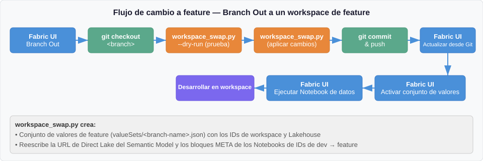
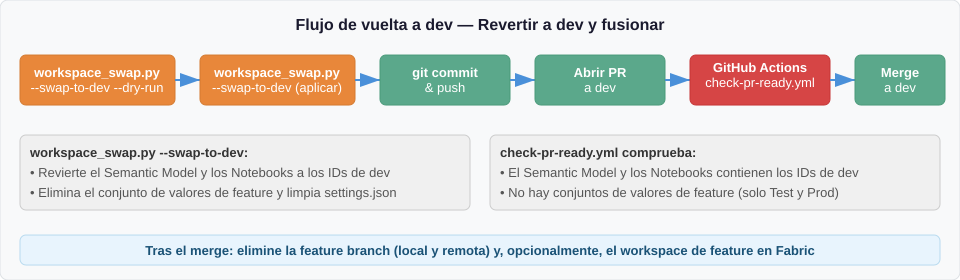

[English](../../fabric-development-process.md) | **Español**

<!-- source: fabric-development-process.md @ c4ee255 | translated: 2026-09-23 -->

> 📄 **La versión en inglés de este documento es la autoritativa.** En caso de discrepancia, [el original en inglés](../../fabric-development-process.md) tiene precedencia.

# Proceso de desarrollo

Este documento describe los dos enfoques principales para el desarrollo en *feature branches* en Microsoft Fabric con integración de Git, las ventajas e inconvenientes de cada uno, y cómo este repositorio aplica el patrón **Branch Out**.

## Comparación de escenarios

### Escenario A: workspaces de feature efímeros (sin sincronización con Git)

En este escenario, `dev` es el único workspace conectado a Git. Los workspaces de feature se crean de forma independiente y **no** están sincronizados con Git. El código se despliega en ellos mediante [fabric-cicd](https://microsoft.github.io/fabric-cicd/latest/).

**Cómo funciona:**

1. Se crea una *feature branch* en Git a partir de `dev`.
2. Se crea un workspace de Fabric independiente para esa *feature* (sin conexión a Git).
3. Un *pipeline* de CI/CD usa `fabric-cicd` para desplegar los elementos de la *feature branch* en el workspace.
4. `fabric-cicd` se encarga de sustituir los metadatos (IDs de workspace y de *Lakehouse*) mediante `parameter.yml` en el momento del despliegue.
5. El desarrollo se hace en la interfaz de Fabric y después se hace *commit* de los cambios en la *feature branch*.
6. Se abre un *pull request* (PR) para fusionar la *feature branch* en `dev`.

**A favor:** se puede usar `fabric-cicd` para actualizar los metadatos, porque el workspace de destino no está sincronizado con Git. Los workspaces desplegados solo se actualizan mediante despliegues por script, que es el [flujo recomendado por fabric-cicd](https://microsoft.github.io/fabric-cicd/latest/how_to/getting_started/#git-flow):

> *"Deployed branches are not connected to workspaces via GIT Sync. Feature branches are connected to workspaces via GIT Sync. Deployed workspaces are only updated through script-based deployments."*
> — [fabric-cicd Getting Started: GIT Flow](https://microsoft.github.io/fabric-cicd/latest/how_to/getting_started/#git-flow)
>
> Traducción: «Las ramas desplegadas no están conectadas a workspaces mediante Git Sync. Las *feature branches* sí están conectadas a workspaces mediante Git Sync. Los workspaces desplegados solo se actualizan mediante despliegues por script.»

**En contra:** todo el desarrollo ocurre en la interfaz de Fabric. Sincronizar los cambios de vuelta a la *feature branch* es un proceso manual y propenso a errores, sobre todo con los elementos que no se pueden seguir por completo en Git.

---

### Escenario B: Branch Out (workspaces de feature sincronizados con Git)

En este escenario se usa la función [Branch Out](https://learn.microsoft.com/en-us/fabric/cicd/git-integration/manage-branches#scenario-2---branch-out-to-another-workspace) de Fabric. El workspace de feature **sí** está sincronizado con la *feature branch*.

**Cómo funciona:**

1. Desde el panel de control de código fuente de la interfaz de Fabric se selecciona **Branch out to another workspace**.
2. Fabric crea una rama y un workspace nuevos, y sincroniza todos los elementos automáticamente.
3. El workspace queda conectado a la *feature branch* mediante Git Sync.
4. El desarrollo se hace en el workspace y se hace *commit* de los cambios directamente en la *feature branch*.
5. Se abre un PR para fusionar la *feature branch* en `dev`.

**A favor:** Fabric traslada automáticamente todos los elementos compatibles al workspace de feature. El desarrollo y el control de código fuente quedan estrechamente integrados.

**En contra:** **no** se puede usar `fabric-cicd` para desplegar en un workspace sincronizado con Git. `fabric-cicd` envía los cambios directamente por las API de Fabric, lo que provoca **desviación del workspace** (*workspace drift*): el estado del workspace deja de coincidir con lo que Git espera. En la siguiente sincronización, Git Sync puede sobrescribir los cambios de `fabric-cicd` o provocar conflictos, desestabilizando el workspace.

Está documentado de forma explícita:

> *"Deployed branches are not connected to workspaces via GIT Sync ... Deployed workspaces are only updated through script-based deployments, such as through the fabric-cicd library."*
> — [fabric-cicd Getting Started: GIT Flow](https://microsoft.github.io/fabric-cicd/latest/how_to/getting_started/#git-flow)
>
> Traducción: «Las ramas desplegadas no están conectadas a workspaces mediante Git Sync… Los workspaces desplegados solo se actualizan mediante despliegues por script, como los de la biblioteca fabric-cicd.»

Lo contrario también es cierto: **los workspaces sincronizados con Git no deben ser destino de despliegues de `fabric-cicd`.**

Además, al hacer *Branch Out* solo están disponibles en el workspace nuevo los [elementos compatibles con Git](https://learn.microsoft.com/en-us/fabric/cicd/git-integration/intro-to-git-integration#supported-items), y algunas opciones de configuración del workspace no se copian:

> *"When branching out, a new branch is created and the settings from the original branch aren't copied. Adjust any settings or definitions to ensure that the new meets your organization's policies."*
> — [Basic concepts in Git integration: Branching out limitations](https://learn.microsoft.com/en-us/fabric/cicd/git-integration/git-integration-process#branching-out-limitations)
>
> Traducción: «Al hacer *branch out* se crea una rama nueva y no se copia la configuración de la rama original. Conviene ajustar las opciones o definiciones necesarias para cumplir las políticas de la organización.»

---

## Cómo aplica este repositorio el patrón Branch Out

Este repositorio usa el **escenario B (Branch Out)** para el desarrollo de *features*. Dado que `fabric-cicd` no puede usarse en workspaces sincronizados con Git, un script de Python se encarga de actualizar los metadatos que normalmente actualizaría `fabric-cicd` en el momento del despliegue.

### El problema

Al hacer *Branch Out* desde `dev`, todos los elementos de Fabric se copian al workspace de feature. Sin embargo, varios elementos contienen **IDs de workspace y de *Lakehouse* de dev definidos directamente en el elemento**:

- ***Semantic Model*** (`expressions.tmdl`) — la URL de conexión de Direct Lake contiene los GUID del workspace y del *Lakehouse* de dev.
- ***Notebooks*** (`notebook-content.py`) — los bloques META de dependencias referencian los GUID del workspace y del *Lakehouse* de dev.
- ***Variable Library*** (`variables.json`) — el conjunto de valores predeterminado contiene los IDs de dev (es lo esperado y no se modifica).

Sin intervención, el *Semantic Model* del workspace de feature apunta al *Lakehouse* de dev, y los *Notebooks* con dependencias definidas directamente se conectan a dev.

### La solución: `workspace_swap.py`

El script `scripts/workspace_swap.py` gestiona el ciclo de vida completo del entorno de una *feature branch*.

#### Paso a paso: cambiar al workspace de feature



1. **Branch out** desde el panel de control de código fuente de la interfaz de Fabric.
2. **Clonar o actualizar** la *feature branch* en local:
   ```
   git fetch origin
   git checkout <feature-branch-name>
   ```
3. **Configurar `.env`** (una sola vez por persona): copie `.env.sample` a `.env` en la raíz del repositorio y pegue los GUID de su workspace y su *Lakehouse* de feature. El archivo `.env` está en `.gitignore`.
4. **Ejecutar el script de cambio a feature** (conviene previsualizar antes con `--dry-run`):
   ```
   python scripts/workspace_swap.py --dry-run
   python scripts/workspace_swap.py
   ```
   El script hace lo siguiente de forma automática:
   - Detecta el nombre de la rama actual (no necesita argumentos).
   - Lee los IDs de dev de `variables.json` (el conjunto de valores predeterminado).
   - Lee los IDs del workspace y el *Lakehouse* de feature desde `.env`. Si `.env` no existe o tiene claves vacías o ausentes, el script termina con un error que remite a `.env.sample`; no hay alternativa interactiva.
   - Muestra el cambio previsto y solicita `Type YES (uppercase) to apply, anything else to abort.` Hay que escribir `YES` (distingue mayúsculas) para continuar; la ejecución solo es de prueba si además se pasa `--dry-run`.
   - Crea un conjunto de valores para la *feature branch* (por ejemplo, `valueSets/<branch-name>.json`).
   - Añade el conjunto de valores a `settings.json`.
   - Reescribe la conexión de Direct Lake del *Semantic Model* en `expressions.tmdl`.
   - Reescribe los bloques META de dependencias en todos los archivos `notebook-content.py`.
   - Limpia los IDs de feature obsoletos de un cambio anterior si `.env` se modificó desde la última ejecución (pasada de recuperación).
   - Valida que no queden IDs de dev en los archivos críticos.
5. **Hacer *commit* y *push*** de los cambios en la *feature branch*:
   ```
   git add -A
   git commit -m "Swap to feature workspace for <branch-name>"
   git push
   ```
6. **Sincronizar** el workspace de feature desde la interfaz de Fabric (Actualización desde Git).
7. **Activar el conjunto de valores de feature** en la interfaz de Fabric: abra la *Variable Library* → seleccione el conjunto de valores de feature → actívelo.
8. **Ejecutar el *Notebook* de importación de datos** para cargar el *Lakehouse* de feature.

#### Paso a paso: volver a dev antes del PR



Antes de fusionar de vuelta en `dev`, hay que revertir todos los cambios específicos de la *feature* para restaurar los IDs de dev:

1. **Ejecutar el script de vuelta a dev** (conviene previsualizar antes con `--dry-run`):
   ```
   python scripts/workspace_swap.py --swap-to-dev --dry-run
   python scripts/workspace_swap.py --swap-to-dev
   ```
   El script hace lo siguiente de forma automática:
   - Lee los IDs de feature del conjunto de valores de la rama.
   - Revierte la conexión del *Semantic Model* a los IDs de dev.
   - Revierte los bloques META de los *Notebooks* a los IDs de dev.
   - Elimina el archivo del conjunto de valores de feature.
   - Quita la entrada de feature de `settings.json`.
   - Valida que no queden IDs de feature en los archivos críticos.
2. **Hacer *commit* y *push***:
   ```
   git add -A
   git commit -m "Swap to dev for merge"
   git push
   ```
3. **Abrir un PR** hacia `dev`.

#### Validación del PR

Un flujo de trabajo de GitHub Actions (`.github/workflows/check-pr-ready.yml`) se ejecuta en cada PR dirigido a `dev`. Comprueba que:

- El *Semantic Model* contiene los IDs de workspace y de *Lakehouse* de dev.
- Los *Notebooks* con dependencias de *Lakehouse* contienen los IDs de dev.
- No existe ningún archivo de conjunto de valores de *feature branch* (solo se admiten `Test.json` y `Prod.json`).

Si alguna comprobación falla, el PR queda bloqueado hasta que se ejecute `workspace_swap.py --swap-to-dev`.

#### Ejecutar el script desde GitHub Copilot Chat

El repositorio incluye comandos de barra en `.github/prompts/` que envuelven la CLI. En Copilot Chat (modo agente) se puede escribir:

- `/swap-to-feature` — cambia los IDs del repositorio al workspace de feature
- `/swap-to-feature-dryrun` — previsualiza el cambio sin escribir archivos
- `/swap-to-dev` — devuelve los IDs a dev (conviene ejecutarlo antes de abrir un PR)
- `/swap-to-dev-dryrun` — previsualiza la reversión sin escribir archivos
- `/check-pr-ready` — ejecuta en local la comprobación de preparación equivalente a la de CI

Copilot ejecuta el script en el terminal integrado de VS Code y muestra la salida. El comando `/swap-to-feature` traslada la confirmación `YES` a la interfaz del chat: se pulsa `YES` o `NO` en el chat y Copilot envía la respuesta al script, de modo que el terminal nunca se queda bloqueado. Resulta útil cuando ya se está trabajando en Copilot Chat y se prefiere no cambiar al terminal.

Nota: Copilot no puede ejecutar el script automáticamente al cambiar de rama. Sigue siendo necesario invocar un comando de barra o ejecutarlo manualmente después de descargar una *feature branch*.

### Configuración local de `.env`

`workspace_swap.py` lee los GUID del workspace y del *Lakehouse* de feature desde un archivo `.env` en la raíz del repositorio. Este archivo está en `.gitignore`: cada persona mantiene el suyo.

1. Copie `.env.sample` a `.env`.
2. Abra el workspace de feature en Fabric y localice:
   - **ID del workspace:** configuración del workspace → Acerca de → ID del workspace.
   - **ID del *Lakehouse*:** abra el *Lakehouse* y copie el GUID de la URL (el segmento posterior a `/lakehouses/`).
3. Pegue ambos valores en `.env`.
4. Ejecute `python scripts/workspace_swap.py` (o `/swap-to-feature` en Copilot Chat).

Si `.env` no existe, tiene valores vacíos o le falta alguna de las dos claves, el script termina con un error claro que remite a `.env.sample`. No hay alternativa interactiva: `.env` es la única fuente de verdad para el cambio a feature.

Para el cambio a feature, el script lee siempre `.env` (el archivo del conjunto de valores existente no lo sobrescribe). El conjunto de valores en disco lo lee el cambio a dev (para saber qué IDs de feature hay que revertir) y la pasada de recuperación (para detectar IDs obsoletos aplicados anteriormente que haya que reescribir). Antes de cualquier reescritura, el script muestra el cambio previsto de dev a feature y espera a que se escriba literalmente `YES` para confirmar.

El script **no** descubre los IDs automáticamente a través de la API REST de Fabric, y es intencionado. Una implementación anterior localizaba los workspaces por nombre para mostrar, lo que podía elegir en silencio el workspace equivocado (por ejemplo, el propio workspace de dev) y hacer que el cambio se abortara sin escribir ningún conjunto de valores. La configuración explícita mediante `.env` evita esa clase de error.

### Alcance de la reescritura de metadatos

El script usa un **registro de tipos de elemento** para gestionar qué tipos de elemento de Fabric participan en la gestión del entorno de rama. Cada tipo registrado declara sus patrones de archivo, si necesita reescritura de IDs y qué IDs hay que validar. Añadir un tipo nuevo requiere una sola entrada en el registro, sin ningún otro cambio de código.

No todos los tipos de elemento necesitan reescritura. Los elementos de Fabric se dividen en dos categorías según cómo referencian los recursos específicos de cada entorno:

- **IDs reales** (por ejemplo, *Semantic Models* y *Notebooks*): contienen GUID reales de workspace y de *Lakehouse* que cambian en cada workspace. Hay que reescribirlos al cambiar al workspace de feature y revertirlos antes del PR.
- **IDs lógicos** (por ejemplo, *Ontology* y *Data Agent*): referencian otros elementos mediante el `logicalId` de `.platform`, que Fabric resuelve en tiempo de ejecución dentro del workspace actual. Son portables entre workspaces creados con *Branch Out* y no necesitan reescritura.

### Referencia de tipos de elemento

| Tipo de elemento | Archivos | Tipo de ID | ¿Lo reescribe `workspace_swap.py`? | ¿Lo gestiona `parameter.yml`? | Notas |
|-----------|-------|---------|--------------------------|-------------------------|-------|
| **SemanticModel** | `*.SemanticModel/definition/expressions.tmdl` | IDs reales de workspace y *Lakehouse* | Sí | Sí | La URL de conexión de Direct Lake contiene GUID reales |
| **Notebook** | `*.Notebook/notebook-content.py` | IDs reales de workspace y *Lakehouse* | Sí (solo si existe `default_lakehouse`) | Sí | Los bloques META de dependencias referencian GUID reales |
| **Ontology** | `*.Ontology/**/DataBindings/*.json`, `*.Ontology/**/Contextualizations/*.json` | `logicalId` de *Lakehouse* (`b36b3bda-...`) y `workspaceId` a cero | No: los `logicalId` son portables | Sí: el `logicalId` se sustituye por `$items.Lakehouse...` para CI/CD | Usa el `logicalId` de `.platform`, que Fabric resuelve en tiempo de ejecución |
| **DataAgent** | `*.DataAgent/**/datasource.json` | `logicalId` de *Ontology* (`58a6c8ed-...`) y `workspaceId` a cero | No: los `logicalId` son portables | No: referencia a *Ontology* por `logicalId` | Referencia cruzada por `logicalId`, sin IDs específicos del entorno |
| **VariableLibrary** | `valueSets/*.json`, `settings.json` | ID del *Lakehouse* de dev en el conjunto de valores predeterminado | Gestionado (crea y elimina conjuntos de valores) | Sí: se sustituye el ID del *Lakehouse* del conjunto de valores predeterminado | Los archivos de conjunto de valores se crean y eliminan, no se reescriben |

### Archivos implicados

| Archivo | Función |
|------|------|
| `scripts/workspace_swap.py` | Cambia los IDs de workspace entre dev y feature en los archivos versionados; comprobación de preparación para CI |
| `tests/test_workspace_swap.py` | Pruebas unitarias del script de entorno de rama |
| `data/fabric/Patterns_Variables.VariableLibrary/variables.json` | Conjunto de valores predeterminado (dev): referencia de solo lectura para los IDs de dev |
| `data/fabric/Patterns_Variables.VariableLibrary/valueSets/` | Conjuntos de valores por entorno (Test, Prod, *feature branches*) |
| `data/fabric/Patterns_Variables.VariableLibrary/settings.json` | Orden de los conjuntos de valores |
| `data/fabric/Patterns_Semantic_Model.SemanticModel/definition/expressions.tmdl` | Conexión de Direct Lake: la reescribe el script |
| `data/fabric/Import_Patterns_Data.Notebook/notebook-content.py` | *Notebook* con dependencia de *Lakehouse* definida directamente: la reescribe el script |
| `data/fabric/Patterns_Ontology.Ontology/EntityTypes/*/DataBindings/*.json` | Enlaces de datos de *Ontology*: el script los valida, no los reescribe |
| `data/fabric/Patterns_Ontology.Ontology/RelationshipTypes/*/Contextualizations/*.json` | Contextualizaciones de *Ontology*: el script las valida, no las reescribe |
| `data/fabric/Patterns_Data_Agent.DataAgent/Files/Config/draft/ontology-*/datasource.json` | Origen de datos de *Data Agent*: registrado pero no analizado (no tiene IDs de dev) |
| `.github/workflows/check-pr-ready.yml` | Comprobación de PR que impide que los IDs de feature lleguen a dev |
| `.github/workflows/run-tests.yml` | Ejecuta las pruebas unitarias en los PR cuando cambian los scripts o las pruebas |
| `data/fabric/parameter.yml` | Parametrización en el despliegue para fabric-cicd (se usa en CI/CD, no en `workspace_swap.py`) |

## Referencias

- [fabric-cicd: Getting Started — GIT Flow](https://microsoft.github.io/fabric-cicd/latest/how_to/getting_started/#git-flow) *(solo en inglés)*
- [Microsoft Fabric: Manage branches — Branch out to another workspace](https://learn.microsoft.com/en-us/fabric/cicd/git-integration/manage-branches#scenario-2---branch-out-to-another-workspace) *(solo en inglés)*
- [Microsoft Fabric: Basic concepts in Git integration — Branching out limitations](https://learn.microsoft.com/en-us/fabric/cicd/git-integration/git-integration-process#branching-out-limitations) *(solo en inglés)*
- [Microsoft Fabric: Git integration best practices](https://learn.microsoft.com/en-us/fabric/cicd/best-practices-cicd) *(solo en inglés)*

---

## Sobre esta traducción

Este documento es una traducción de [fabric-development-process.md](../../fabric-development-process.md). La versión en inglés es la fuente autorizada y puede estar más actualizada.

La terminología sigue [`GLOSARIO.md`](GLOSARIO.md) y [`GUIA-DE-ESTILO.md`](GUIA-DE-ESTILO.md). Para revisar esta traducción, véase [`REVISION.md`](REVISION.md).

**Los enlaces a documentación externa apuntan a la versión en inglés**, y las citas textuales se reproducen en su idioma original con su traducción debajo. Los motivos están en el apartado «Sobre esta traducción» del [README en español](README.md).

Los errores pueden comunicarse abriendo una incidencia e indicando el idioma. Si el error existe también en el original en inglés, **debe corregirse primero allí**: véase [`TRANSLATION.md`](../../TRANSLATION.md).
