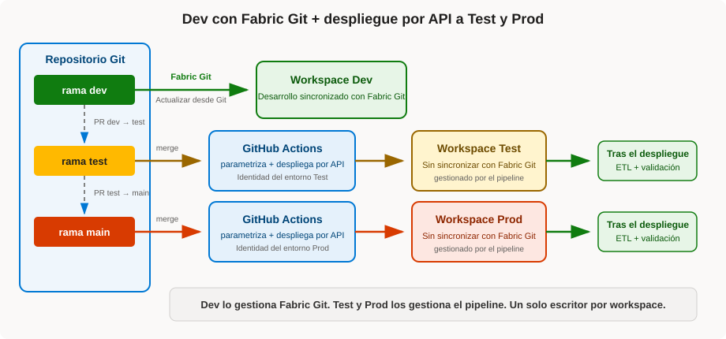

---
# Vista previa en local desde la raíz del repositorio:
# npx --yes @marp-team/marp-cli@4.5.1 translations/es/presentations/fabric-sdlc-cd.md --preview --allow-local-files
marp: true
theme: default
paginate: true
size: 16:9
header: "Entrega continua en Microsoft Fabric"
footer: "[Michael D. Green - Fabric SDLC Patterns](https://github.com/michaeldeongreen/microsoft-fabric-sdlc-patterns)"
style: |
  section {
    font-family: "Segoe UI", Arial, sans-serif;
    font-size: 27px;
    padding: 52px 64px;
    color: #201f1e;
    background: #ffffff;
  }
  h1 {
    color: #004578;
    font-size: 1.65em;
    margin-bottom: 0.45em;
  }
  h2 {
    color: #0078d4;
  }
  h3 {
    color: #004578;
    margin-bottom: 0.3em;
  }
  strong {
    color: #004578;
  }
  a {
    color: #0067b8;
  }
  blockquote {
    border-left: 8px solid #0078d4;
    background: #eff6fc;
    padding: 0.5em 0.8em;
    margin: 0.7em 0;
  }
  table {
    font-size: 0.72em;
    width: 100%;
  }
  th {
    background: #e5f1fb;
    color: #004578;
  }
  td,
  th {
    border-color: #d2d0ce;
  }
  code {
    background: #f3f2f1;
  }
  header, footer {
    color: #605e5c;
    font-size: 0.55em;
  }
  footer a {
    color: inherit;
    text-decoration: none;
  }
  section.title {
    text-align: center;
    justify-content: center;
    background: linear-gradient(135deg, #ffffff 0%, #eff6fc 100%);
    border-top: 10px solid #0078d4;
    box-shadow: inset 0 -7px 0 #ffb900;
  }
  section.title h1 {
    font-size: 2.25em;
  }
  section.divider {
    text-align: center;
    justify-content: center;
    color: white;
    background: linear-gradient(135deg, #004578 0%, #0078d4 100%);
    box-shadow: inset 0 -7px 0 #ffb900;
  }
  section.divider h1,
  section.divider h2,
  section.divider strong {
    color: white;
  }
  section.compact {
    font-size: 23px;
  }
  section.dense {
    font-size: 20px;
  }
  section.diagram {
    font-size: 19px;
    padding: 40px 52px;
  }
  section.diagram h1 {
    max-width: 52%;
    margin: 0.2em 0;
  }
  section.diagram h2 {
    font-size: 1.35em;
    margin: 0.2em 0 0.45em;
  }
  section.diagram p,
  section.diagram ul {
    margin-top: 0.35em;
    margin-bottom: 0.35em;
  }
  section.customer-challenges {
    background: #faf9f8;
  }
  section.customer-challenges table {
    border-collapse: separate;
    border-spacing: 12px;
    font-size: 0.73em;
  }
  section.customer-challenges thead {
    display: none;
  }
  section.customer-challenges td {
    width: 50%;
    vertical-align: top;
    padding: 12px 14px;
    background: #ffffff;
    border: 1px solid #d2d0ce;
    border-top: 5px solid #0078d4;
    border-radius: 5px;
  }
  section.customer-challenges tbody tr:nth-child(2) td {
    border-top-color: #ffb900;
  }
  section.customer-challenges tbody tr:nth-child(3) td {
    border-top-color: #d83b01;
  }
  section.ownership table {
    font-size: 0.7em;
  }
  section.ownership th,
  section.ownership td {
    vertical-align: top;
    padding: 12px;
  }
  section.ownership th:nth-child(1) {
    background: #e5f1fb;
  }
  section.ownership th:nth-child(2) {
    background: #e8ebfa;
  }
  section.ownership th:nth-child(3) {
    background: #e7f5e7;
  }
  section.dependency-contract table {
    font-size: 0.67em;
  }
  section.dependency-contract td {
    vertical-align: top;
  }
---

<!-- _class: title -->
<!-- _paginate: false -->
<!-- _header: "" -->
<!-- _footer: "" -->

# Entrega continua en Microsoft Fabric

## Por qué es difícil, qué opciones hay y una implementación real en GitHub

**Michael Green**<br/>
*[CSA / DevSquad / MCSA]*

Octubre de 2026

[Implementación de referencia](https://github.com/michaeldeongreen/microsoft-fabric-sdlc-patterns)

<!--
Preséntate y sitúa la sesión como la continuación sobre CD de la presentación anterior sobre CI.
La documentación oficial de Microsoft es la canónica; este repositorio es una implementación opinada en GitHub.
-->

---

# El problema de la entrega en Fabric

Un workspace de Fabric es a la vez una **superficie de desarrollo** y un **entorno en vivo**.

Una sola solución puede abarcar:

- *Notebooks* y *pipelines*
- *Lakehouses* y datos
- *Semantic Models* e informes
- *Variable Libraries* y conexiones
- *Ontologies* y agentes

> **¿Cómo reproducimos una solución que funciona en Test y Prod sin reconstruirla a mano ni dejar que cada workspace acabe siendo una verdad distinta?**

<!--
No definas CD de forma genérica. Empieza por el problema operativo concreto de Fabric.
Editar directamente en el navegador es potente, pero por eso mismo hace falta una ruta de promoción disciplinada.
-->

---

<!-- _class: customer-challenges dense -->

# Por qué CI/CD en Fabric es difícil

**Para clientes y partners:** la entrega de datos e IA abarca infraestructura, elementos de plataforma, datos y estado, enlaces, identidades y operaciones, no solo código. Ese acoplamiento hace que la elección de plataforma tenga consecuencias: cambiar más adelante suele ser un programa de migración, no un cambio de herramienta.

| | |
|---|---|
| **Compatibilidad desigual del ciclo de vida**<br>Git, los *pipelines* de despliegue, `fabric-cicd` y las API admiten conjuntos de elementos distintos. | **Las dependencias se convierten en lógica de despliegue**<br>Los elementos fundacionales deben existir antes de que se resuelvan los IDs de destino y las definiciones dependientes. |
| **La configuración está fragmentada**<br>Variables en ejecución, metadatos, conexiones, reglas y secretos tienen responsables y momentos distintos. | **Las definiciones no son todo el entorno**<br>Datos, credenciales, permisos, programaciones y enlaces del primer despliegue necesitan planes aparte. |
| **Varios escritores generan desviación**<br>Las ediciones directas, la sincronización con Fabric Git y el despliegue por API no deberían competir por el mismo workspace. | **La seguridad y la gobernanza abarcan varios sistemas**<br>Los roles de Fabric y la configuración de inquilino deben encajar con la identidad de Entra, los controles de GitHub, las aprobaciones, la auditoría y la gobernanza de datos corporativa. |

<!--
Esta es la diapositiva central del problema del cliente. La CD en Fabric es difícil porque el workspace es heterogéneo, no porque el YAML sea complicado.
El reto no es solo si Fabric es seguro: tiene que encajar en el modelo de control corporativo existente sin crear un proceso paralelo.
Usa «dependencia del proveedor» con cuidado: toda plataforma de datos e IA genera acoplamiento por gravedad de los datos, metadatos propietarios, configuración de seguridad y gobernanza, capacidades operativas e integración del ecosistema.
La idea no es que no se pueda cambiar, sino que migrar es un programa estratégico, no un cambio de herramienta de despliegue.
-->

---

<!-- _class: dense -->

# Antes de elegir herramientas de CI/CD, define la superficie de entrega

**Empieza por la solución, no por la herramienta de despliegue.**

| Pregunta | Qué decidir |
|---|---|
| **¿Qué forma parte de la solución?** | Inventariar los elementos de Fabric y la configuración o el estado necesarios para que funcione. |
| **¿Qué puede mover cada mecanismo?** | Clasificar los elementos: con seguimiento en Fabric Git, compatibles con otra ruta de despliegue o API, o manuales. |
| **¿Cómo de portables son las referencias?** | Distinguir entre valores de ejecución, IDs lógicos e IDs físicos que hay que sustituir. |
| **¿Qué hay que aprovisionar?** | Mapear capacidades, workspaces, vínculos privados, accesos directos y conexiones, roles y configuración de inquilino; elegir Bicep, Terraform o API según la cobertura. |
| **¿Qué se mueve más allá de las definiciones?** | Planificar datos, credenciales, permisos, conexiones, programaciones, enlaces y configuración del destino. |
| **¿Quién es responsable del destino y del resultado?** | Establecer un único escritor, el ETL o la actualización posterior al despliegue, la validación y las evidencias de la publicación. |

> **Compatible no significa completo:** las definiciones de los elementos son solo una parte de un entorno utilizable.

<!--
Esta lista resume los conceptos clave del README: categorías de seguimiento de elementos y metadatos dinámicos frente a estáticos en las Variable Libraries.
Las listas de elementos compatibles evolucionan, así que conviene enlazar a las oficiales en lugar de congelar una matriz detallada en la presentación.
Bicep y ARM cubren sobre todo el plano de control de Azure, incluida la Fabric Capacity. El proveedor de Terraform para Fabric tiene más cobertura del plano de Fabric, pero también evoluciona.
Los accesos directos, las conexiones y la red privada pueden cruzar las superficies de contenido, workspace, administración de Fabric y red de Azure; conviene verificar la cobertura actual del proveedor o del API antes de elegir la ruta de IaC.
-->

---

<!-- _class: dependency-contract compact -->

# Un reto en detalle: las dependencias se convierten en lógica de despliegue

Dentro de los problemas generales de CD, las dependencias muestran por qué copiar definiciones no basta. Las referencias determinan el orden de despliegue y la parametrización.

| Referencias portables o lógicas | Referencias físicas que hay que sustituir |
|---|---|
| *Report* → *Semantic Model* mediante [`definition.pbir`](../../../data/fabric/Patterns_Report.Report/definition.pbir)<br><br>*Ontology* → ID lógico del *Lakehouse* mediante su [enlace de datos](../../../data/fabric/Patterns_Ontology.Ontology/EntityTypes/2525121373138/DataBindings/6e4524f9-ea6d-4535-ab49-a72f73fc08a0.json)<br><br>*Data Agent* → ID lógico de la *Ontology* mediante [`datasource.json`](../../../data/fabric/Patterns_Data_Agent.DataAgent/Files/Config/draft/ontology-Patterns_Ontology/datasource.json) | *Semantic Model* Direct Lake → ruta física de OneLake en [`expressions.tmdl`](../../../data/fabric/Patterns_Semantic_Model.SemanticModel/definition/expressions.tmdl)<br><br>*Notebook* → IDs físicos de workspace y *Lakehouse* predeterminados en [`notebook-content.py`](../../../data/fabric/Import_Patterns_Data.Notebook/notebook-content.py) |

```text
Phase 1:  Lakehouse ──▶ Variable Library / Notebooks / Semantic Model
          Ontology  ──▶ Data Agent

Phase 2:  Deploy dependent items after target IDs and logical items exist
```

<!--
Abre los archivos enlazados si resulta útil. El Data Agent referencia directamente la Ontology, no el Lakehouse.
El Lakehouse y la Ontology son fundaciones de la fase 1 para cadenas de dependencia distintas.
Este es un ejemplo concreto de los retos generales de la diapositiva anterior, no un tema nuevo.
-->

---

<!-- _class: divider -->
<!-- _paginate: false -->
<!-- _header: "" -->
<!-- _footer: "" -->

# Tres opciones de entrega en Fabric

## Cada una optimiza un modelo operativo distinto

---

<!-- _class: diagram -->

# Opción 1

## Pipelines de despliegue de Fabric


**Puntos fuertes**

- Interfaz del portal, automatización por API REST, comparación e historial
- El menor coste de configuración
- Despliegue completo o selectivo
- Reglas de despliegue y enlace automático

**Contrapartidas**

- Git no es necesariamente el origen directo de Test y Prod
- Topología de etapas lineal
- Las reglas no cubren todos los valores propios del destino
- El despliegue selectivo por API exige planificar las dependencias

**Encaje ideal:** operaciones nativas de Fabric con poca automatización propia.

<!--
Los pipelines de despliegue están disponibles desde el portal de Fabric y desde las API REST. Las API pueden crear y gestionar pipelines, asignar workspaces a etapas, desplegar el contenido de una etapa e inspeccionar operaciones.
Conviene tratar las API como la superficie de automatización de esta opción, no como una cuarta opción de entrega.
-->

---

<!-- _class: diagram -->

# Opción 2

## Integración de Git de Fabric en todas las etapas


**Puntos fuertes**

- Fabric Git representa directamente todas las etapas
- Un único modelo de ramas y PR para desarrollo y promoción
- Sin biblioteca de despliegue aparte

**Contrapartidas**

- La sincronización con Fabric Git pasa a formar parte de la ruta de despliegue a producción
- Todos los workspaces de destino deben estar conectados a Fabric Git y gobernados
- Algunos clientes reportan cambios de definición generados por la plataforma o sin significado semántico («*ghost commits*»)
- Las ramas de larga vida, la desviación y los escritores en competencia aumentan la complejidad operativa

**Encaje ideal:** equipos cómodos operando todas las etapas con la integración de Git de Fabric.

<!--
Plantea los «ghost commits» como una preocupación de clientes y del campo, no como una afirmación oficial universal de la plataforma:
algunos clientes reportan cambios de definición sin significado semántico o generados por la plataforma en el control de código fuente.
-->

---

<!-- _class: diagram -->

# Opción 3

## Patrón híbrido habitual: Dev con Fabric Git y API para Test y Prod



**Puntos fuertes**

- Dev puede seguir sincronizado con Fabric Git para desarrollar
- Test y Prod se despliegan desde ramas de etapa mediante API
- Parametrización en el momento de la compilación
- Aprobaciones, secretos y registros de la plataforma de CI/CD
- El despliegue, el ETL y la validación pueden encadenarse

**Contrapartidas**

- La mayor responsabilidad de ingeniería
- El equipo se hace cargo de la identidad, el diagnóstico y la gestión de fallos
- La compatibilidad de herramientas y API sigue variando
- Desplegar el estado completo puede ser más lento que una diferencia pequeña

**Encaje ideal:** equipos que necesitan repetibilidad y control de la configuración.

<!--
La opción 3 puede usar un entorno de compilación en todas las etapas. Este repositorio usa una variante híbrida habitual:
Dev está sincronizado con Fabric Git; Test y Prod se despliegan por API.
-->

---

<!-- _class: dense -->

# Comparar los modelos operativos

| | Pipelines de despliegue | Fabric Git por etapa | Entorno de compilación / API |
|---|---|---|---|
| Origen de Test y Prod | Etapa anterior del workspace | Rama de la etapa | Rama de la etapa + configuración de despliegue |
| Comparación integrada | Etapas de Fabric adyacentes | Workspace ↔ rama conectada | Ninguna |
| Transformación en compilación | Reglas limitadas | No | **Sí** |
| Conexión de Fabric Git en Test y Prod | No | **Sí** | No |
| Esfuerzo de ingeniería | Bajo | Medio | Alto |
| Quién opera la publicación | Personas operadoras del workspace y la publicación | Responsables de la solución + de mantener el repositorio | DevOps/DevSecOps + responsables de la solución |
| Evidencia del despliegue | Historial de despliegues de Fabric; Git si se usa | Historial de Git + estado de Fabric Git del workspace | Historial de Git + registros de ejecución de CI/CD |

**Elige según la fuente de verdad, la configuración, los elementos compatibles, la gobernanza y cuánto código de despliegue quiera mantener el equipo.**

> La automatización no elimina la necesidad de conocer Fabric: cambia dónde se codifica ese conocimiento y quién lo mantiene.

<!--
Pipelines de despliegue: reglas de Fabric, enlaces y conocimiento operativo.
Fabric Git: definiciones, ramas y estado de Git del workspace.
Compilación y API: parametrización, fases del despliegue, validación y procedimientos.
La comparación integrada no es igual en todas las columnas: los pipelines de despliegue comparan etapas adyacentes, mientras que Fabric Git compara un workspace con su rama conectada.
El historial de Git sirve para cualquier opción respaldada por Git; la fila de evidencias destaca la prueba adicional de que una revisión llegó a su destino.
-->

---

<!-- _class: dense -->

# Dentro de la opción 3: `fabric-cicd` frente a las API masivas

| Aspecto | `fabric-cicd` estándar | `fabric-cicd` con publicación masiva | API masivas directas |
|---|---|---|---|
| Transporte | Llamadas al API ordenadas por elemento | Bulk Import cuando es compatible; **aquí recurre a por elemento (v1.3.0)** | Una o varias llamadas a Bulk Import gestionadas por quien llama |
| Enlace de entorno y parametrización | Todas las funciones de `parameter.yml` | El mismo `parameter.yml`; los valores dinámicos de este repositorio activan el repliegue de la v1.3.0 | Ninguna incorporada; quien llama reescribe las definiciones y configura después de importar |
| Gestión de dependencias | Orden de la biblioteca + fases de quien llama | Grafo del API masiva cuando se ejecuta; orden estándar tras el repliegue | El API masiva resuelve los IDs lógicos en una sola petición; quien llama preprocesa los IDs físicos de destino |
| Limpieza y eliminación de huérfanos | `unpublish_all_orphan_items()` | La misma limpieza aparte; Bulk Import solo publica | Llamadas Delete Item aparte |
| Comportamiento del repositorio | Dos fases de quien llama, ordenadas por elemento | Repliegue en dos fases por elemento (v1.3.0) | Dos llamadas masivas: fundaciones y después dependientes reescritos |

**Recomendación del repositorio:** `fabric-cicd` estándar.

**Enlazar ≠ eliminar:** el enlace corrige las referencias del destino; la limpieza de huérfanos quita los elementos que ya no están en el origen.

<!--
El repositorio instala la versión publicada de fabric-cicd 1.3.0. En esa versión, contains_param_vars es verdadero cuando parameter.yml contiene valores dinámicos $items o $workspace, y la publicación masiva recurre a las llamadas estándar por elemento.
La documentación más reciente sin versión ya describe lotes de dependencias para los valores dinámicos compatibles. Conviene volver a comprobarlo tras actualizar; no presentes el repliegue de la 1.3.0 como un comportamiento permanente.
La fila de comportamiento del repositorio es específica de esta implementación. Su script masivo directo usa dos llamadas porque bulk-parameter.yml necesita el ID del Lakehouse de destino antes de reescribir las definiciones dependientes. El servicio en sí resuelve las dependencias por ID lógico en una sola petición masiva.
-->

---

<!-- _class: divider -->
<!-- _paginate: false -->
<!-- _header: "" -->
<!-- _footer: "" -->

# Qué implementa este repositorio

## Dev con Fabric Git; Test y Prod con GitHub Actions

---

<!-- _class: diagram -->

# Dev usa Fabric Git; Test y Prod usan API


| Rama | Workspace | Entrega |
|---|---|---|
| `dev` | Dev | Integración de Git de Fabric |
| `test` | Test | GitHub Actions |
| `main` | Prod | GitHub Actions |

**Un solo escritor por workspace**

- Dev lo gestiona Fabric Git.
- Test y Prod los gestiona el *pipeline*.
- Tras un despliegue correcto vienen el ETL y la validación.

---

<!-- _class: dense -->

# El conocimiento de Fabric queda codificado en el contrato de entrega

| | Variable Libraries | `parameter.yml` |
|---|---|---|
| Se aplica | En tiempo de ejecución | Antes de subir |
| Se ocupa de | Valores que las cargas de trabajo pueden resolver de forma dinámica | IDs físicos y metadatos que no se pueden diferir |
| Ejemplos | Valores de workspace y *Lakehouse* que leen los *Notebooks* | IDs de los bloques META de los *Notebooks* y rutas de Direct Lake |

```text
Phase 1 foundations: Lakehouse + Ontology
          ↓ target IDs and logical items now exist
Phase 2 dependents: Variable Library + Notebooks + Semantic Model + Report + Data Agent
          ↓ orphan cleanup
Post-deploy: ETL + validation
```

**También queda codificado:** el ámbito explícito de elementos, los nombres de entorno, la búsqueda del *Notebook* de ETL, la reconciliación de huérfanos y el comportamiento ante fallos.

> El *pipeline* no necesita conocimiento tribal de Fabric cuando ese conocimiento se hace explícito y verificable en el repositorio.

---

<!-- _class: compact -->

# Tres rutas de despliegue seleccionables

| `DEPLOY_METHOD` | Resultado |
|---|---|
| sin definir o `fabric-cicd` | La ruta estándar recomendada |
| `fabric-cicd-bulk` | Solicita la publicación masiva de la biblioteca; aquí repliega por los parámetros dinámicos |
| `bulk` | Implementación directa con Bulk Import |
| cualquier otro valor | Se omiten todos los flujos de despliegue |

Todas las rutas correctas convergen en el mismo flujo de trabajo de ETL.

### Por qué la ruta masiva directa exige más código

Quien llama debe empaquetar las definiciones, sustituir los IDs, dividir en fases cuando haga falta, sondear las operaciones, activar el conjunto de valores de la *Variable Library* e interpretar los resultados por elemento.

Y aun así no implementa la compatibilidad completa con `parameter.yml` ni la eliminación de huérfanos.

---

<!-- _class: divider -->
<!-- _paginate: false -->
<!-- _header: "" -->
<!-- _footer: "" -->

# Recorrido en vivo

## Seguir una publicación desde `main` hasta Prod

<!--
Cambia de la presentación a GitHub después de la siguiente diapositiva de flujo.
-->

---

<!-- _class: dense -->

# Del pull request a un workspace utilizable

```text
PR: test → main
  ↓ branch rules + promotion-path check + unit tests
merge creates push to main
  ↓ DEPLOY_METHOD selects one orchestrator
Prod GitHub Environment supplies identity + workspace
  ↓ reusable workflow checks out the revision + authenticates
deploy script + parameter.yml → Fabric APIs
Phase 1 → Phase 2 → orphan cleanup
  ↓ successful deployment
Prod ETL runs and validates data readiness
```

### Archivos que seguir

1. [`enforce-promotion-path.yml`](../../../.github/workflows/enforce-promotion-path.yml): solo permite `test → main`
2. [`run-tests.yml`](../../../.github/workflows/run-tests.yml): instala las dependencias y ejecuta pytest en cada PR
3. [`deploy-prod.yml`](../../../.github/workflows/deploy-prod.yml): selecciona el método de despliegue y el entorno de Prod
4. [`reusable-deploy-fabric-cicd.yml`](../../../.github/workflows/reusable-deploy-fabric-cicd.yml): autentica y ejecuta el despliegue estándar
5. [`deploy_fabric_cicd.py`](../../../scripts/deploy_fabric_cicd.py): controla las fases y la limpieza de huérfanos
   - [`parameter.yml`](../../../data/fabric/parameter.yml): reescribe los IDs de workspace y elementos de destino antes de subir
6. [`etl-prod.yml`](../../../.github/workflows/etl-prod.yml): inicia el ETL solo si el despliegue termina con éxito

---

<!-- _class: compact -->

# La gobernanza aparece en cada paso

| Paso | Control |
|---|---|
| Promover a `main` | Reglas de rama, comprobaciones de estado, restricción de rama de origen |
| Seleccionar el despliegue | Variable de repositorio `DEPLOY_METHOD` |
| Entrar en Prod | Secretos del entorno de GitHub y revisores opcionales |
| Autenticar | Service principal de ámbito de entorno |
| Ejecutar el flujo | `GITHUB_TOKEN` de solo lectura, acciones fijadas |
| Demostrar el resultado | SHA de *commit*, registros de ejecución, resultado del ETL, auditoría de Fabric |

### Postura en producción

- Una identidad de despliegue por entorno siempre que sea viable
- Rol de colaborador únicamente en el workspace de destino
- Restringir los despliegues a Prod a la rama `main`
- Añadir revisores de Prod donde se requiera aprobación previa al despliegue
- Evaluar OIDC de GitHub en lugar de un secreto de cliente almacenado

<!--
Postura actual de la demostración a 25-09-2026:
- Los rulesets de rama están activos, pero las aprobaciones obligatorias son cero.
- La protección del entorno de Prod y la política de rama de despliegue no están configuradas.
- DEPLOY_METHOD selecciona actualmente fabric-cicd-bulk.
Sé explícito sobre la diferencia entre los controles actuales y los recomendados al mostrar Settings.
-->

---

<!-- _class: dense -->

# El despliegue no es el final

[`etl-prod.yml`](../../../.github/workflows/etl-prod.yml) se ejecuta solo después de que el despliegue seleccionado termine con éxito.

Lo que hace:

- resuelve `Import_Patterns_Data` por su nombre para mostrar;
- inicia el *Notebook* mediante el API REST de Fabric;
- sondea hasta que hay éxito, fallo o tiempo de espera agotado;
- se puede volver a ejecutar a mano sin redesplegar las definiciones.

```text
definitions deployed
  → target configuration applied
  → ETL / refresh completed
  → solution validated
  → environment usable
```

> Un despliegue en verde significa que las definiciones llegaron. Una publicación correcta significa que el entorno puede hacer su trabajo.

---

<!-- _class: compact -->

# El hilo de auditoría es el SHA del commit

| Pregunta | Evidencia |
|---|---|
| ¿Qué cambió y por qué? | Diferencia de Git, *commit*, *pull request* |
| ¿Quién lo revisó y promovió? | Historial del PR y de las reglas de rama |
| ¿Qué revisión se desplegó? | SHA de *commit* de la ejecución de Actions |
| ¿Quién autorizó el despliegue? | Revisión del entorno, cuando está habilitada |
| ¿Qué hizo la automatización? | Registros del flujo de trabajo y del script |
| ¿La preparación de datos funcionó? | Resultado del ETL |
| ¿Qué ocurrió dentro de Fabric? | Fuentes de auditoría de Fabric y de la organización |

GitHub Actions aporta evidencia del despliegue. No sustituye:

- la auditoría del workspace de Fabric;
- la validación de la calidad de los datos;
- la política de retención de registros de la organización.

---

<!-- _class: divider -->
<!-- _paginate: false -->
<!-- _header: "" -->
<!-- _footer: "" -->

# Reversión

## Las definiciones son más fáciles de revertir que los datos

---

# Llevar las definiciones a un estado correcto conocido

```text
identify the bad change
  → create a git revert commit
  → review and promote it
  → run the same deployment path
  → validate the target
```

La reversión conserva el historial y usa los mismos controles que cualquier otra publicación.

### La recuperación de datos va aparte

Git no puede deshacer las modificaciones de un *Lakehouse*, el estado de una actualización, los efectos colaterales aguas abajo ni las escrituras en sistemas externos.

Hay que planificar el reprocesamiento, las instantáneas, la retención, las capacidades de restauración a un momento dado o los procedimientos de marcha atrás propios de cada carga de trabajo.

---

<!-- _class: title compact -->
<!-- _paginate: false -->
<!-- _header: "" -->
<!-- _footer: "" -->

# Lo difícil no es subir archivos

Es reproducir una solución de Fabric que funcione, entre tipos de elemento cuyas definiciones, dependencias, enlaces de entorno, datos y soporte de automatización no se comportan de forma uniforme.

## Elige de forma deliberada

- Etapas nativas de Fabric: **pipelines de despliegue**
- Etapas conectadas a Fabric Git: **Fabric Git por workspace**
- Control en la compilación: **Git + API**

## Y después haz que la publicación sea fácil de demostrar y segura de repetir

**¿Preguntas?**

[Repositorio](https://github.com/michaeldeongreen/microsoft-fabric-sdlc-patterns)

---

<!-- _class: dense -->

# Apéndice: prácticas recomendadas y referencias

### Prácticas que conviene llevarse

- Establecer una única fuente de verdad y un único escritor de despliegue por workspace.
- Preferir despliegues completos y repetibles; usar el despliegue selectivo solo con conciencia de las dependencias.
- Separar la entrega de elementos, el enlace de entorno, la identidad y los permisos, y la validación de datos.
- Usar identidades de ámbito de entorno, puertas de aprobación y el SHA del *commit* como hilo de la publicación.

**Novedad del grupo de producto de Fabric:** [centro de recursos de CI/CD](https://learn.microsoft.com/en-us/fabric/cicd/cicd-overview) · [anuncio de los recursos](https://community.fabric.microsoft.com/blog/fbc_fabricupdatesblogs/new-cicd-resources-for-microsoft-fabric-from-concepts-to-end-to-end-automation/5358502)

| Guía oficial | Este repositorio |
|---|---|
| [Planificar CI/CD para soluciones de Fabric](https://learn.microsoft.com/en-us/fabric/fundamentals/understand-best-practices-fabric-cicd)<br>[Elegir un flujo de CI/CD para Fabric](https://learn.microsoft.com/en-us/fabric/cicd/manage-deployment)<br>[Tutorial de automatización de principio a fin](https://learn.microsoft.com/en-us/fabric/cicd/tutorial-end-to-end-automation) | [Opciones de publicación](../fabric-cicd-release-options.md)<br>[Guía de implementación híbrida](../fabric-hybrid-cicd-guide.md)<br>[Consideraciones de gobernanza](../fabric-cicd-governance-considerations.md) |
| [Parametrización de `fabric-cicd`](https://microsoft.github.io/fabric-cicd/1.3.0/how_to/parameterization/)<br>[Funciones opcionales y selectivas](https://microsoft.github.io/fabric-cicd/1.3.0/how_to/optional_feature/)<br>[Referencia de código](https://microsoft.github.io/fabric-cicd/1.3.0/reference/code_reference/) | [Implementación directa con la API masiva](../fabric-bulk-cicd-guide.md)<br>[Proceso de desarrollo](../fabric-development-process.md)<br>[Implementación de referencia](https://github.com/michaeldeongreen/microsoft-fabric-sdlc-patterns) |
