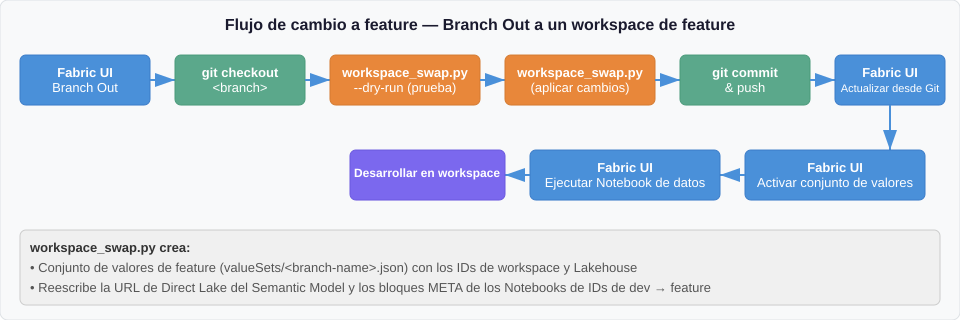
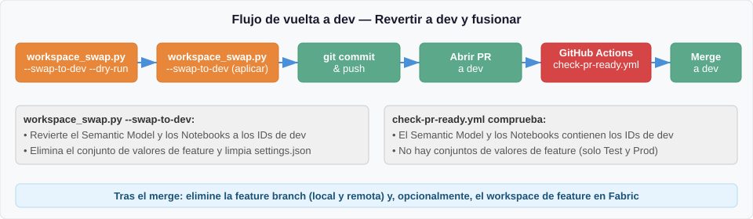

[English](../../../presentations/fabric-sdlc-cicd-presentation.md) | **Español**

<!-- source: presentations/fabric-sdlc-cicd-presentation.md @ d5c92c3 | translated: 2026-09-28 -->

> 📄 **La versión en inglés de este documento es la autoritativa.** En caso de discrepancia, [el original en inglés](../../../presentations/fabric-sdlc-cicd-presentation.md) tiene precedencia.

# Microsoft Fabric — SDLC y CI/CD

<div align="center">

**[▶ Empezar el recorrido](#1-por-qué-cicd-en-fabric)**  ·  **[Ir a la agenda](#agenda)**  ·  **[Resumen en una diapositiva](#resumen-en-una-diapositiva)**

</div>

---

## Resumen en una diapositiva

| | |
|---|---|
| **El problema** | Un workspace de Fabric es un entorno *compartido y en vivo*. Editarlo directamente afecta a todo el mundo. Hace falta una forma disciplinada de mover elementos **y datos** de Dev → Test → Prod. |
| **Las piezas** | La integración de Git (control de versiones), un proceso de desarrollo (trabajo aislado por característica) y una estrategia de publicación (cómo se promueve el contenido). |
| **La decisión** | Existen tres opciones de publicación. Este repositorio recomienda la **opción 3: basada en Git con entorno de compilación**, implementada con la biblioteca GA **`fabric-cicd`**. |
| **La forma** | Tres ramas (`dev`, `test`, `main`) → tres workspaces (Dev, Test, Prod). Dev está conectado a Git; Test y Prod reciben los despliegues por CI/CD. |
| **Los controles** | Protección de ramas más una ruta de promoción `dev → test → main` impuesta, aprobaciones de entorno en Prod, service principals con privilegio mínimo y un registro de auditoría completo en Git y GitHub Actions. |
| **El beneficio** | Git es la única fuente de verdad en todas las etapas. Cada cambio se revisa, se aprueba, se despliega y queda auditado, y es totalmente recuperable desde Git. |
| **La prueba** | Esto no es una presentación teórica: es una **implementación de referencia y acelerador de soluciones** que funciona. Cada patrón se ejecuta de principio a fin en este repositorio, tanto el flujo de trabajo del desarrollador como el *pipeline* de CI/CD completo. |

<div align="center">

**[▶ Empezar: por qué CI/CD en Fabric](#1-por-qué-cicd-en-fabric)**

</div>

---

## Agenda

| # | Sección | Qué se lleva |
|---|---------|------------------------|
| 1 | [Por qué CI/CD en Fabric](#1-por-qué-cicd-en-fabric) | El problema de fondo que resuelve CI/CD en Fabric |
| 2 | [Dos realidades que conviene entender primero](#2-dos-realidades-que-conviene-entender-primero) | En qué se diferencian los elementos de Fabric y por qué lo condiciona todo |
| 3 | [Cómo funciona la integración de Git en Fabric](#3-cómo-funciona-la-integración-de-git-en-fabric) | La base sobre la que se construyen todas las opciones |
| 4 | [Cómo se trabaja en el día a día](#4-cómo-se-trabaja-en-el-día-a-día) | Trabajo aislado por característica con Branch Out |
| 5 | [Elegir una estrategia de publicación](#5-elegir-una-estrategia-de-publicación) | Las tres opciones, comparadas con honestidad |
| 6 | [El enfoque híbrido recomendado](#6-el-enfoque-híbrido-recomendado) | Qué elegir y por qué |
| 7 | [Arquitectura de referencia](#7-arquitectura-de-referencia) | Ramas, workspaces y el flujo de principio a fin |
| 8 | [Cómo funciona el despliegue en la práctica](#8-cómo-funciona-el-despliegue-en-la-práctica) | Despliegue en dos fases, estrategia de configuración y flujos de trabajo |
| 9 | [fabric-cicd frente a las API masivas](#9-fabric-cicd-frente-a-las-api-masivas) | La elección de herramienta dentro de la opción 3 |
| 10 | [Gobernanza y controles](#10-gobernanza-y-controles) | Identidad, RBAC, aprobaciones y auditoría |
| 11 | [Dónde encajan Bicep y Terraform](#11-dónde-encajan-bicep-y-terraform) | Infraestructura frente a contenido: una distinción clave |
| 12 | [Cuando algo sale mal](#12-cuando-algo-sale-mal) | Guías de corrección urgente y reversión |
| 13 | [Resumen y siguientes pasos](#13-resumen-y-siguientes-pasos) | La conclusión y por dónde empezar |

---

## 1. Por qué CI/CD en Fabric

> **Idea clave:** un workspace de Fabric es un entorno compartido y en vivo. Cualquier cambio hecho directamente en él afecta a todo el mundo. CI/CD aporta una vía disciplinada para mover **elementos y datos** entre Dev, Test y Prod.

Los workspaces de Microsoft Fabric contienen **elementos** —*Notebooks*, *pipelines*, *Lakehouses*, *Semantic Models*, *Reports* y más— que deben moverse de forma fiable entre desarrollo, pruebas y producción. Pero hay una segunda mitad que la mayoría de los equipos olvida: también hay que ingerir y transformar **datos** en cada etapa para poder validar que todo funciona de principio a fin.

CI/CD en Fabric aporta los mecanismos para:

- **Versionar** los elementos y seguir los cambios a lo largo del tiempo.
- **Automatizar** su despliegue entre etapas.
- **Ejecutar los flujos de datos** (ETL) que hacen de cada etapa una prueba realista de la anterior.

La idea más importante que hay que interiorizar:

> **El workspace de Fabric es un entorno compartido y en vivo.** Cualquier cambio hecho directamente en él afecta a todo el mundo. Conviene trabajar siempre en un workspace de feature aislado o en local, y llevar los cambios mediante *pull requests*.

Todo lo demás en este recorrido es consecuencia de tomarse esa idea en serio.

<div align="center">

[▲ Agenda](#agenda) · [Siguiente: dos realidades ▶](#2-dos-realidades-que-conviene-entender-primero)

</div>

---

## 2. Dos realidades que conviene entender primero

> **Idea clave:** no todos los elementos de Fabric se gestionan igual, ni todos guardan del mismo modo sus IDs propios de cada entorno. Esos dos hechos condicionan toda la estrategia de CI/CD.

### Realidad 1: los elementos de Fabric se dividen en tres categorías

| Categoría | Qué significa | Ejemplos |
|---|---|---|
| **Con seguimiento en Git** | Las definiciones se serializan en archivos del repositorio, lo que permite control de versiones, ramificación y revisión de código. | *Notebooks*, *Semantic Models*, *Lakehouses*, *Reports*, *Variable Libraries*, *Data Pipelines*, *Environments* |
| **API de Fabric** | No se versionan en Git, pero se mueven entre workspaces mediante las **API REST de Fabric**. Los *pipelines* de despliegue de Fabric son una de esas API, con una interfaz gráfica encima. Estos elementos no tienen historial en Git. | Cambia con el tiempo: conviene consultar siempre la lista oficial |
| **Manuales** | No se alcanzan ni con la integración de Git ni con una API de Fabric. Se crean y configuran a mano en cada workspace. | Cambia con el tiempo: conviene consultar siempre la lista oficial |

> **Importante:** ambas listas de elementos compatibles evolucionan a medida que Microsoft añade capacidades. Conviene verificarlo siempre en la documentación oficial antes de dar por supuesta una categoría. *En este repositorio, todos los elementos tienen seguimiento en Git y se despliegan con `fabric-cicd`.*

### Realidad 2: los IDs de entorno son dinámicos o estáticos

Algunos elementos resuelven los valores propios del entorno **en tiempo de ejecución**; otros tienen los IDs **definidos directamente** en sus archivos de definición.

| Tipo | Cómo funciona | Ejemplos |
|---|---|---|
| **Dinámico (Variable Library)** | El elemento lee los IDs de una *Variable Library* en tiempo de ejecución. Al cambiar el conjunto de valores activo, cambia el contexto del entorno. Sin tocar archivos. | *Notebooks* que usan `notebookutils.variableLibrary.getLibrary()` |
| **Estático (definido directamente)** | La definición contiene GUID literales de workspace y *Lakehouse* que hay que reescribir en cada entorno. | URL de Direct Lake del *Semantic Model* ([`expressions.tmdl`](../../../data/fabric/Patterns_Semantic_Model.SemanticModel/definition/expressions.tmdl)), bloques META del *Notebook* ([`default_lakehouse`](../../../data/fabric/Import_Patterns_Data.Notebook/notebook-content.py)); ambos fijan el GUID de [`PatternsLakehouse`](../../../data/fabric/PatternsLakehouse.Lakehouse/lakehouse.metadata.json) |

<details>
<summary><b>▸ En profundidad: IDs reales frente a IDs lógicos</b></summary>

<br/>

Dentro de la categoría *estática* hay una división adicional que determina si un archivo hay que reescribirlo siquiera:

- Los **IDs reales** (por ejemplo, en *Semantic Models* y *Notebooks*) incrustan GUID **reales** de workspace y *Lakehouse* que cambian en cada workspace. **Hay** que reescribirlos al moverse entre entornos.
- Los **IDs lógicos** (por ejemplo, en *Ontology* y *Data Agent*) referencian otros elementos mediante el `logicalId` de `.platform`, que **Fabric resuelve en tiempo de ejecución** dentro del workspace actual. Son **portables** entre workspaces y **no** necesitan reescritura.

Por eso las herramientas de desarrollo de este repositorio solo reescriben los *Semantic Models* y los *Notebooks*: la *Ontology* y el *Data Agent* llevan referencias lógicas que viajan sin cambios.

</details>

> **Por qué importa:** los elementos estáticos necesitan **parametrización en el despliegue** (`parameter.yml` para CI/CD) o **reescritura por script** (para las *feature branches*). Los dinámicos solo necesitan que se active el conjunto de valores correcto. Saber cuál es cuál indica exactamente cuánto trabajo requiere cada tipo de elemento.

<div align="center">

[◀ Anterior](#1-por-qué-cicd-en-fabric) · [▲ Agenda](#agenda) · [Siguiente: integración de Git ▶](#3-cómo-funciona-la-integración-de-git-en-fabric)

</div>

---

## 3. Cómo funciona la integración de Git en Fabric

> **Idea clave:** la integración de Git conecta un *workspace* con una *rama* y sincroniza en ambos sentidos todos los elementos compatibles. Es la base sobre la que se construyen todas las opciones de publicación.

- **A nivel de workspace.** Se conecta un workspace de Fabric a un repositorio, una rama y una carpeta. Todos los elementos compatibles se sincronizan en una sola operación.
- **Proveedores.** Azure DevOps (nube), GitHub (nube) y GitHub Enterprise (nube).
- **Sincronización bidireccional.** Los cambios del workspace se **confirman** en la rama; los del repositorio se **traen** al workspace mediante *Update*. Solo se sincroniza una dirección a la vez.
- **Las definiciones se convierten en archivos.** Los elementos se serializan en definiciones basadas en archivos (JSON, Python, etc.), conservando la estructura de carpetas.
- **Los elementos no compatibles se ignoran:** permanecen en el workspace, pero nunca se sincronizan, confirman ni eliminan.
- **Branch Out.** Se puede crear una rama *y* un workspace nuevos a partir de un workspace conectado, para desarrollar de forma aislada.
- **Requisitos previos.** Deben estar habilitadas las opciones de administración de inquilino (sincronización con Git, con el proveedor y creación de workspaces), y hace falta una *Fabric Capacity* o capacidad Premium.

> **Importante:** la integración de Git no admite todos los tipos de elemento. Conviene consultar siempre la lista oficial antes de dar por hecho que un elemento tiene seguimiento.

<div align="center">

[◀ Anterior](#2-dos-realidades-que-conviene-entender-primero) · [▲ Agenda](#agenda) · [Siguiente: flujo del desarrollador ▶](#4-cómo-se-trabaja-en-el-día-a-día)

</div>

---

## 4. Cómo se trabaja en el día a día

> **Idea clave:** nunca se trabaja en el workspace compartido. Se hace **Branch Out** a un workspace aislado, se trabaja allí y se vuelve mediante un PR.

El proceso de desarrollo es **el mismo sea cual sea la opción de publicación elegida**. El aislamiento es la regla.

Hay dos formas de trabajar de forma aislada:

<details>
<summary><b>▸ Escenario A: workspaces de feature efímeros (sin sincronizar con Git)</b></summary>

<br/>

`dev` es el único workspace conectado a Git. Los workspaces de feature se crean de forma independiente y se despliega en ellos con `fabric-cicd`.

- **A favor:** como el workspace de destino *no* está sincronizado con Git, `fabric-cicd` puede actualizar los metadatos con libertad (es el flujo que `fabric-cicd` recomienda oficialmente).
- **En contra:** todo el desarrollo ocurre en la interfaz de Fabric, y sincronizar los cambios de vuelta a la *feature branch* es **manual y propenso a errores**.

</details>

<details>
<summary><b>▸ Escenario B: Branch Out (workspaces de feature sincronizados con Git), el que usa este repositorio</b></summary>

<br/>

La función **Branch Out** de Fabric crea una rama *y* un workspace nuevos, sincroniza automáticamente todos los elementos compatibles y conecta el workspace con la *feature branch*.

- **A favor:** Fabric traslada por sí solo todos los elementos compatibles; el desarrollo y el control de código fuente quedan muy integrados.
- **En contra:** **no** se puede usar `fabric-cicd` contra un workspace sincronizado con Git, porque envía los cambios directamente por API y provoca una **desviación del workspace** (*workspace drift*) contra la que Git Sync después pelea. Lo contrario también es cierto: los workspaces sincronizados con Git no deben ser destino de `fabric-cicd`.

Por esa restricción, este repositorio usa un script de Python para hacer las reescrituras de metadatos que si no haría `fabric-cicd`.

</details>

### El ciclo de vida de Branch Out en este repositorio

Al hacer *Branch Out* desde `dev`, varios elementos llegan con **IDs de dev definidos directamente** (la URL de Direct Lake del *Semantic Model* y los bloques META de los *Notebooks*). El script `scripts/workspace_swap.py` gestiona el ciclo completo:

**Cambiar a un workspace de feature** (después de hacer *Branch Out*):

<p align="center"></p>

**Volver a dev** (antes de abrir un PR):

<p align="center"></p>

- **Cambio a feature:** lee los IDs de dev de `variables.json`, lee los de feature de un `.env` excluido de Git, crea un conjunto de valores de feature y reescribe los metadatos del *Semantic Model* y de los *Notebooks* para que apunten al workspace de feature.
- **Vuelta a dev:** revierte todo —restaura los IDs de dev y elimina el conjunto de valores de feature— **antes** de abrir un PR.
- **Control en el PR:** `check-pr-ready.yml` bloquea la fusión en `dev` si no se han restaurado los IDs de dev o queda algún conjunto de valores de feature suelto.

<details>
<summary><b>▸ En profundidad: el registro de tipos de elemento</b></summary>

<br/>

El script usa un **registro de tipos de elemento**: cada tipo registrado declara sus patrones de archivo, si necesita reescritura de IDs y qué IDs hay que validar. Añadir un tipo nuevo es **una sola entrada en el registro**, no código nuevo.

| Tipo de elemento | Tipo de ID | ¿Lo reescribe el script? | Por qué |
|---|---|---|---|
| **SemanticModel** | IDs reales de workspace y *Lakehouse* | **Sí** | La URL de Direct Lake contiene GUID reales |
| **Notebook** | IDs reales de workspace y *Lakehouse* | **Sí** (solo si existe `default_lakehouse`) | Los bloques META referencian GUID reales |
| **Ontology** | `logicalId` de *Lakehouse* | **No** | Los IDs lógicos son portables |
| **DataAgent** | `logicalId` de *Ontology* | **No** | Referencia lógica entre elementos, sin IDs propios del entorno |
| **VariableLibrary** | ID del *Lakehouse* de dev en el conjunto predeterminado | **Gestionado** | Los conjuntos de valores se crean y eliminan, no se reescriben |

</details>

<div align="center">

[◀ Anterior](#3-cómo-funciona-la-integración-de-git-en-fabric) · [▲ Agenda](#agenda) · [Siguiente: estrategia de publicación ▶](#5-elegir-una-estrategia-de-publicación)

</div>

---

## 5. Elegir una estrategia de publicación

> **Idea clave:** hay tres formas de promover contenido entre entornos. Se diferencian en cuánto sacrifican de comodidad nativa de Fabric frente a tener Git como fuente de verdad y más capacidad de configuración.

<details>
<summary><b>▸ Opción 1: pipelines de despliegue de Fabric</b></summary>

<br/>

Git se conecta únicamente a **Dev**. La promoción ocurre **de workspace a workspace** (Dev → Test → Prod) con los *pipelines* de despliegue integrados en Fabric.

<p align="center"></p>

**Idónea para:** equipos que quieren herramientas nativas de Fabric con poca configuración, con comparación visual de cambios e historial de despliegues desde el primer momento.

**Hay que vigilar:**

- El API no conoce los «elementos relacionados»: hay que desplegar todo el contenido o enumerar a mano cada elemento y sus dependencias.
- Solo estructura lineal: no se pueden saltar etapas.
- Git es la fuente de verdad **solo de Dev**; Test y Prod solo se recuperan desde su último despliegue.
- Las reglas de despliegue cubren un subconjunto limitado de propiedades.

</details>

<details>
<summary><b>▸ Opción 2: integración de Git de Fabric en todas las etapas</b></summary>

<br/>

Cada etapa tiene su rama, y **cada rama está conectada a su workspace mediante la integración de Git**. La promoción es un PR entre ramas y después *Update from Git*.

<p align="center"></p>

**Idónea para:** equipos que quieren Git como **única fuente de verdad** en todas las etapas y siguen Gitflow.

**Hay que vigilar:**

- Varias ramas de larga vida → complejidad de fusión y sobrecarga de *cherry-pick*.
- Sin comparación visual nativa de Fabric ni reglas de despliegue.
- Depende de la integración de Git en **todos** los workspaces, incluido Prod; a algunos equipos no les convence ponerla en la ruta de producción (los conocidos «*ghost commits*»).

</details>

<details>
<summary><b>▸ Opción 3: basada en Git con entorno de compilación (recomendada)</b></summary>

<br/>

Cada etapa tiene su rama, y el *pipeline* de cada etapa levanta un **entorno de compilación** que ejecuta pruebas y aplica la configuración propia del entorno **antes** de desplegar por API REST.

<p align="center"></p>

**Idónea para:** equipos que quieren Git como fuente de verdad **y** la capacidad de transformar la configuración por etapa (reescribir cadenas de conexión o IDs de *Lakehouse*) antes de desplegar. Con **`fabric-cicd`** esto es declarativo mediante `parameter.yml`, sin scripts propios.

**Hay que vigilar:**

- Es la que más esfuerzo de ingeniería requiere al principio (*pipelines* de compilación y publicación por etapa).
- `parameter.yml` debe mantenerse sincronizado con las definiciones de los elementos.
- Despliegue completo en cada ejecución: `fabric-cicd` no calcula diferencias.
- Test y Prod **no** necesitan la integración de Git de Fabric, lo que es una ventaja para quien recela de ponerla en la ruta de producción.

</details>

### La comparación honesta

| | **Opción 1 – Pipelines de despliegue** | **Opción 2 – Integración de Git** | **Opción 3 – Entorno de compilación** |
|---|---|---|---|
| **Fuente de verdad** | Git (solo Dev) + workspaces | Git (todas las etapas) | Git (todas las etapas) |
| **Mecanismo de despliegue** | Pipelines de despliegue (interfaz o API) | API Update from Git | `fabric-cicd` (recomendado) o API masivas (versión preliminar) |
| **Gestión de configuración** | Reglas de despliegue y enlace automático | Llamadas al API tras el despliegue | `parameter.yml` declarativo |
| **Comparación visual** | **Sí** | No | No |
| **Historial de despliegues** | **Sí** | No | No |
| **Recuperabilidad por etapa** | Dev desde Git; Test y Prod desde el último despliegue | Todas desde Git | Todas desde Git + `parameter.yml` |
| **Complejidad de configuración** | **Baja** | Media | Alta |
| **Limitación principal** | Lineal; el API no resuelve dependencias | Complejidad de fusión multirrama | Despliegue completo siempre; mantener los parámetros |
| **Idónea para** | Nativo de Fabric, poca configuración | Git como fuente de verdad completa (Gitflow) | Transformar configuración por etapa en la compilación |

<details>
<summary><b>▸ Preguntas habituales</b></summary>

<br/>

**P. ¿Por qué no usar simplemente los pipelines de despliegue? Son nativos de Fabric y tienen buena interfaz.**

Son la opción que menos configuración requiere y dan comparación visual de cambios e historial de despliegues desde el principio. La contrapartida: Git es la fuente de verdad **solo de Dev**, así que Test y Prod solo se recuperan desde su último despliegue; el API de promoción no conoce los «elementos relacionados» (hay que enumerar a mano cada elemento y dependencia); y la estructura es estrictamente lineal.

**P. ¿Por qué no conectar todos los workspaces con la integración de Git (opción 2)?**

Eso hace de Git la fuente de verdad de todas las etapas, lo cual es atractivo. La duda está en poner la integración de Git de Fabric en la ruta de **producción**: hay equipos que reportan «*ghost commits*» (cambios sin significado semántico reintroducidos al confirmar) y desviaciones en el control de código fuente que nadie provocó, además de la sobrecarga de fusión y *cherry-pick* multirrama.

**P. ¿No es la opción 3 la que más trabajo da?**

Sí, necesita un *pipeline* de compilación y publicación por etapa. Pero el `parameter.yml` declarativo de `fabric-cicd` elimina casi todo el código propio, y a cambio se obtiene Git como fuente de verdad en todas las etapas más la transformación de configuración en la compilación.

</details>

<div align="center">

[◀ Anterior](#4-cómo-se-trabaja-en-el-día-a-día) · [▲ Agenda](#agenda) · [Siguiente: la recomendación ▶](#6-el-enfoque-híbrido-recomendado)

</div>

---

## 6. El enfoque híbrido recomendado

> **Idea clave:** usar **`fabric-cicd`** (opción 3) para todos los elementos compatibles y recurrir a los **pipelines de despliegue** solo para los tipos que `fabric-cicd` no admita. A medida que crece la compatibilidad, se prescinde del respaldo.

La recomendación es un **híbrido**: `fabric-cicd` para todos los elementos compatibles y los *pipelines* de despliegue para cubrir cualquier carencia. Así Git sigue siendo la única fuente de verdad para la mayoría de los elementos, con una vía limpia para simplificar más adelante.

<p align="center"></p>

- **Tres ramas:** `dev`, `test` y `main` (producción).
- **Tres workspaces:** Dev, Test y Prod.
- **Dev** está conectado a Git (el workspace de desarrollo compartido).
- **Test y Prod NO están conectados a Git**: reciben los despliegues mediante `fabric-cicd`.

> **Este repositorio ya ha llegado al estado futuro:** todos los elementos se despliegan con `fabric-cicd` en un único trabajo, sin necesidad del respaldo de los *pipelines* de despliegue.

<details>
<summary><b>▸ En profundidad: el patrón «sándwich» para elementos no compatibles</b></summary>

<br/>

Si el workspace incluye tipos de elemento que `fabric-cicd` aún no admite, el despliegue único se amplía a un sándwich de tres capas:

1. Desplegar los elementos compatibles que **no** dependan de los no compatibles.
2. Promover los no compatibles mediante el **API REST de Deployment Pipelines**.
3. Desplegar los elementos compatibles que **sí** dependan de los anteriores.

Cuando todos los tipos de elemento sean compatibles con `fabric-cicd`, se elimina el *pipeline* de despliegue por completo y el flujo vuelve a ser: *merge del PR → desplegar → ejecutar el ETL → validar.*

</details>

<details>
<summary><b>▸ Preguntas habituales</b></summary>

<br/>

**P. ¿Y los tipos de elemento que `fabric-cicd` todavía no admite?**

Se usa el «sándwich»: desplegar los elementos compatibles, promover los no compatibles con el API REST de Deployment Pipelines y después desplegar los compatibles que dependan de ellos. A medida que Microsoft añade compatibilidad, se prescinde del *pipeline* de despliegue. Este repositorio ya llegó a ese estado final: todo se despliega con `fabric-cicd` en un solo trabajo.

**P. ¿`fabric-cicd` hace despliegues incrementales (por diferencias)?**

No. Hace un **despliegue completo en cada ejecución**, por diseño, para que el workspace coincida siempre exactamente con Git. En workspaces muy grandes esto alarga el despliegue.

</details>

<div align="center">

[◀ Anterior](#5-elegir-una-estrategia-de-publicación) · [▲ Agenda](#agenda) · [Siguiente: arquitectura de referencia ▶](#7-arquitectura-de-referencia)

</div>

---

## 7. Arquitectura de referencia

> **Idea clave:** el trabajo por característica fluye hacia `dev`; un PR a `test` dispara un despliegue automático más el ETL; un PR a `main` hace lo mismo para Prod. Las restricciones de rama de origen imponen la ruta.

```text
feature/* workspace  (Branch Out, Git-synced to a feature branch)
  │  swap-to-dev, then open a PR
  ▼
dev branch  ──────────▶  Dev workspace  (Update from Git)
  │
  │  PR merge → test    (source branch must be dev)
  ▼
TEST STAGE  (automated)
  • deploy-test.yml   →  fabric-cicd: publish_all_items()
  • on success        →  etl-test.yml: run Import_Patterns_Data
  │
  │  PR merge → main    (source branch must be test)
  ▼
PROD STAGE  (automated + required Prod approval)
  • deploy-prod.yml   →  fabric-cicd: publish_all_items()
  • on success        →  etl-prod.yml: run Import_Patterns_Data
```

| Rama | Workspace | Método de despliegue |
|---|---|---|
| `dev` | Dev | Conectado a Git mediante la integración de Git de Fabric |
| `test` | Test | `fabric-cicd` mediante GitHub Actions |
| `main` | Prod | `fabric-cicd` mediante GitHub Actions |

El despliegue y el ETL están **encadenados**: el flujo de ETL solo se ejecuta si el de despliegue termina con éxito. Si el despliegue falla, no hay ETL.

<details>
<summary><b>▸ En profundidad: la solución de demostración que se despliega</b></summary>

<br/>

El repositorio incluye un pequeño escenario **sanitario** para que el *pipeline* tenga algo real que mover:

- **PatternsLakehouse** (*Lakehouse*): contiene las tablas Delta `doctors`, `patients` y `appointments`.
- **Patterns_Ontology** (*Ontology*) y **Patterns_Data_Agent** (*Data Agent*): el modelo de grafo y un agente consultable sobre él.
- **Patterns_Variables** (*Variable Library*): conjuntos de valores por entorno.
- **Import_Patterns_Data**, **Patterns_Patients_Data** y **Patterns_Demo** (*Notebooks*): el ETL y la lógica de la demostración.
- **Patterns_Semantic_Model** (*Semantic Model*) y **Patterns_Report** (*Report*): el modelo Direct Lake y su informe.

La mezcla es deliberada: ejercita todos los casos difíciles: IDs reales (*Semantic Model* y *Notebooks*), IDs lógicos (*Ontology* y *Data Agent*), configuración en tiempo de ejecución (*Variable Library*) y un paso de carga de datos (ETL).

</details>

<div align="center">

[◀ Anterior](#6-el-enfoque-híbrido-recomendado) · [▲ Agenda](#agenda) · [Siguiente: cómo funciona el despliegue ▶](#8-cómo-funciona-el-despliegue-en-la-práctica)

</div>

---

## 8. Cómo funciona el despliegue en la práctica

> **Idea clave:** dos mecanismos gestionan la configuración (en ejecución y en el despliegue), y un despliegue en dos fases resuelve los problemas del huevo y la gallina de un workspace recién creado.

### Estrategia de configuración: dos mecanismos complementarios

| | **Variable Libraries (en ejecución)** | **`parameter.yml` (en el despliegue)** |
|---|---|---|
| **Cuándo** | Al ejecutarse el *Notebook* | Antes de subir los elementos al workspace |
| **De qué se ocupa** | IDs de workspace y nombres e IDs de *Lakehouse* resueltos en ejecución | GUID definidos directamente en los bloques META de los *Notebooks*, IDs de conexión, grupos de Spark y enlaces de modelo |
| **Cómo** | Los conjuntos de valores se enlazan solos por entorno | `find_replace` y la sustitución dinámica `$items` reescriben las definiciones |

> **Regla práctica:** usar las **Variable Libraries como mecanismo principal** (enlace automático limpio en ejecución) y recurrir a `parameter.yml` solo para los metadatos del despliegue que las *Variable Libraries* no alcanzan.

### El despliegue en dos fases

Un workspace de Test o Prod recién creado está vacío, lo que genera dos problemas del huevo y la gallina. El despliegue se hace en **dos fases** para resolverlos:

```text
deploy-*.yml triggered
  │
  ▼
PHASE 1 — publish_all_items()     scope: Lakehouse + Ontology
  │   Lakehouse now exists  →  $items.Lakehouse.$id resolves
  │   Ontology now exists    →  Data Agent logicalId resolves
  ▼
PHASE 2 — publish_all_items()     scope: Variable Library, Notebooks,
                                         Semantic Model, Report, Data Agent
  │
  ▼
unpublish_all_orphan_items()   →   workspace matches Git exactly
```

<details>
<summary><b>▸ En profundidad: primer despliegue en un workspace vacío</b></summary>

<br/>

El primer despliegue en un workspace de Test o Prod recién creado necesita algunos pasos **manuales** que los posteriores no. Después del despliegue y el ETL automáticos:

1. **Enlazar el Graph Model de la Ontology con los datos:** abrir la *Ontology* y usar **Get data** para apuntar el Graph Model a las tablas del *Lakehouse*.
2. **Empujar a la Ontology para que termine de inicializarse:** si se queda en «Setting up your ontology», cambiar el nombre de cualquier Entity Type y volver a ponerle el original. Es un comportamiento conocido de la plataforma Fabric en el primer despliegue.

Después hay que verificar de principio a fin: tablas del *Lakehouse* cargadas, vista general de la *Ontology* operativa, *Semantic Model* conectado, *Report* representado y *Data Agent* respondiendo. En los despliegues posteriores todo esto está automatizado: los pasos manuales son solo del primero.

</details>

<details>
<summary><b>▸ En profundidad: los problemas del huevo y la gallina (y el giro del ETL)</b></summary>

<br/>

- **ID del Lakehouse.** La *Variable Library* y el *Semantic Model* necesitan el ID del *Lakehouse*, pero este no existe hasta que lo crea el primer despliegue. La fase 1 lo crea para que `$items.Lakehouse.PatternsLakehouse.$id` pueda resolverse en la fase 2.
- **`logicalId` de la Ontology.** El *Data Agent* referencia la *Ontology* por ID lógico. `fabric-cicd` almacena en caché el estado del workspace una vez por llamada, así que la *Ontology* debe existir ya (fase 1) para que la referencia del *Data Agent* se resuelva (fase 2).
- **ID del Notebook de ETL.** El flujo de ETL necesita ejecutar un *Notebook* cuyo ID cambia en cada workspace. Lo resuelve **por nombre para mostrar** (`Import_Patterns_Data`) con el API List Items en tiempo de ejecución, así que no hace falta conocer ningún ID de antemano.

En los despliegues posteriores, ambas fases son idempotentes. `fabric-cicd` hace un **despliegue completo en cada ejecución** por diseño: el workspace coincide siempre exactamente con Git.

</details>

<details>
<summary><b>▸ En profundidad: los flujos de trabajo de GitHub Actions</b></summary>

<br/>

| Flujo de trabajo | Función |
|---|---|
| `deploy-test.yml` / `deploy-prod.yml` | Orquestadores: se activan con un *push* a `test` o `main` (filtrados a `data/fabric/**`) |
| `reusable-deploy-fabric-cicd.yml` | La plantilla de despliegue en dos fases con `fabric-cicd` |
| `reusable-fabric-etl.yml` | Resuelve un *Notebook* por nombre, lo ejecuta y consulta su estado hasta que termina |
| `etl-test.yml` / `etl-prod.yml` | Se encadenan tras un despliegue correcto mediante `workflow_run` |
| `check-pr-ready.yml` | Impide que los IDs de feature lleguen a `dev` |
| `run-tests.yml` | Ejecuta pytest cuando cambian los scripts o las pruebas |
| `enforce-promotion-path.yml` | Impone la ruta `dev → test → main` por rama de origen |

**¿Por qué flujos de trabajo reutilizables y no acciones compuestas?** Porque admiten la palabra clave `environment:` a nivel de trabajo, lo que habilita las reglas de protección de entornos de GitHub (revisores obligatorios, restricciones de rama) y los secretos de ámbito de entorno. Un filtro de rutas sobre `data/fabric/**` hace que los *commits* que solo tocan documentación nunca disparen un despliegue.

</details>

<div align="center">

[◀ Anterior](#7-arquitectura-de-referencia) · [▲ Agenda](#agenda) · [Siguiente: fabric-cicd frente a masivo ▶](#9-fabric-cicd-frente-a-las-api-masivas)

</div>

---

## 9. fabric-cicd frente a las API masivas

> **Idea clave:** dentro de la opción 3 se puede desplegar con la biblioteca GA **`fabric-cicd`** o con las **API de importación y exportación masiva**, en versión preliminar. Hoy la recomendación es `fabric-cicd`.

Ambas están dentro de la opción 3: una rama por etapa, un entorno de compilación por etapa y despliegue desde Git. La elección es entre una biblioteca que resuelve por uno los problemas habituales de CI/CD y una superficie de API de más bajo nivel que hay que envolver.

| Dimensión | `fabric-cicd` | API de importación y exportación masiva |
|---|---|---|
| **Madurez** | **GA** | Versión preliminar (requiere `?beta=true`) |
| **Configuración por entorno** | `parameter.yml` (declarativa) | Ninguna a nivel de API: quien llama preprocesa |
| **Limpieza de huérfanos** | `unpublish_all_orphan_items()` incorporado | Ninguna: corresponde a quien llama |
| **Orden de dependencias** | Quien llama divide en fases manualmente | El servicio lo resuelve solo en una llamada |
| **Forma de las llamadas** | Muchas llamadas REST por elemento | Un POST para el workspace entero |
| **Compatibilidad con service principals** | Por elemento (un tipo no compatible falla solo él) | Por solicitud (todos los elementos deben admitirlos o falla la llamada) |

> **Recomendación de hoy: `fabric-cicd`.** Las API masivas siguen en versión preliminar, sin parametrización ni limpieza de huérfanos a nivel de API: quien llama debe implementar la sustitución, la activación del conjunto de valores y la lógica de eliminación. Conviene reevaluarlo cuando salgan de la versión preliminar *y* ganen esas capacidades, o cuando el repositorio se apoye por completo en IDs lógicos y *Variable Libraries* y no las necesite.

<details>
<summary><b>▸ En profundidad: este repositorio demuestra ambas</b></summary>

<br/>

Una variable de repositorio `DEPLOY_METHOD` selecciona qué método de despliegue se ejecuta:

| `DEPLOY_METHOD` | Comportamiento |
|---|---|
| `fabric-cicd` *(o sin definir)* | Se ejecutan los flujos de `fabric-cicd`: la ruta predeterminada y recomendada |
| `fabric-cicd-bulk` | `fabric-cicd` se ejecuta con la publicación masiva habilitada; en este repositorio recurre a la estándar (`parameter.yml` usa `$items` y `$workspace`) |
| `bulk` | Se ejecutan en su lugar los flujos de la API de importación masiva (versión preliminar) |
| cualquier otro valor | Se omiten todos los flujos de despliegue (valor seguro por defecto) |

La ruta masiva salva dos de las carencias del API **en el código del cliente**: la sustitución (`bulk-parameter.yml` más `deploy_bulk.py`) y la activación del conjunto de valores (un `PATCH` posterior al despliegue). Son soluciones alternativas, no correcciones de la plataforma: elegir la ruta masiva implica hacerse cargo de ese código (unas 600 líneas de Python más un archivo de configuración). La limpieza de huérfanos y el resto de funciones de `fabric-cicd` siguen sin implementarse en la ruta masiva.

</details>

<details>
<summary><b>▸ Preguntas habituales</b></summary>

<br/>

**P. ¿Conviene esperar a las API masivas?**

Hoy no, para producción. Están en versión preliminar (`?beta=true`), sin parametrización ni limpieza de huérfanos a nivel de API: habría que implementar por cuenta propia la sustitución, la activación del conjunto de valores y la lógica de eliminación (unas 600 líneas en este repositorio). `fabric-cicd` ya ofrece todo eso y lo mantiene Microsoft. Conviene reevaluarlo cuando salgan de la versión preliminar y ganen esas funciones.

**P. ¿Cuándo tendrían sentido las API masivas?**

Cuando el repositorio se apoye por completo en IDs lógicos y conjuntos de valores de *Variable Library* (de modo que no haga falta la sustitución de `parameter.yml`), cuando se quiera un despliegue atómico en lugar de llamadas por fases, o cuando se necesite una exportación a nivel de workspace para instantáneas de recuperación ante desastres.

**P. ¿Alguna trampa propia de la ruta masiva?**

La compatibilidad con service principals es **por solicitud**: si un solo tipo de elemento no los admite, falla la llamada entera. `fabric-cicd` falla únicamente el elemento no compatible y continúa.

</details>

<div align="center">

[◀ Anterior](#8-cómo-funciona-el-despliegue-en-la-práctica) · [▲ Agenda](#agenda) · [Siguiente: gobernanza ▶](#10-gobernanza-y-controles)

</div>

---

## 10. Gobernanza y controles

> **Idea clave:** el *pipeline* se gobierna con controles nativos de GitHub: identidades de privilegio mínimo, protección de ramas con una ruta de promoción impuesta, aprobaciones de entorno en Prod y un registro de auditoría completo.

### Elegir la identidad adecuada para cada función

En una solución de Fabric aparecen tres identidades distintas; confundirlas es una causa habitual de despliegues con permisos excesivos.

| Identidad | Propósito | Autenticación |
|---|---|---|
| **Service principal de CI/CD** | Despliega elementos desde GitHub Actions con `fabric-cicd` | Secreto de cliente hoy; **conviene evaluar la federación OIDC de GitHub** |
| **Workspace Identity de Fabric** | El workspace se autentica *hacia fuera* contra almacenamiento tras firewall; **no** la usa CI/CD | Gestionada por Fabric, sin secretos |
| **UAMI de cargas de trabajo** | Aplicaciones y Functions que llaman a las API de Fabric en ejecución; **no** despliegan elementos | Sin secretos, gestionada por Azure |

> **OIDC es la dirección para producción.** Con OIDC de GitHub, el flujo de trabajo intercambia un token de corta duración por uno de Azure —sin secreto almacenado— y la política de confianza puede vincularse a un repositorio, una rama y un entorno concretos, de modo que una *feature branch* no pueda asumir la identidad de Prod.

### Los dos controles por los que pasa cada cambio

```text
Pull Request
  │
  ▼
GATE 1 — PR checks (before merge)
  • check-pr-ready · run-tests · enforce-promotion-path
  • required code review
  │  pass + merge
  ▼
Deploy workflow
  │
  ▼
GATE 2 — Environment protection (before deploy)
  • Prod: required reviewers
  • deployment branch restricted to main
  │  approved
  ▼
Target workspace
```

- **Aislamiento de entornos.** Un workspace por entorno; un entorno de GitHub por workspace con secretos aislados. `test` solo puede desplegar en Test, y `main` en Prod.
- **Privilegio mínimo.** El service principal de CI/CD recibe el rol de **colaborador** (el mínimo para publicar) **solo** en su propio workspace: un compromiso en Test no puede alcanzar Prod. Dev es solo para personas; Test y Prod, solo para service principals.
- **Ruta de promoción impuesta.** Los PR hacia `test` deben venir de `dev`; los que van hacia `main`, de `test`. Sin *pushes* directos a las ramas protegidas.
- **Aprobación previa al despliegue.** Prod exige que personas designadas pulsen «Approve and deploy», con una ventana opcional de espera para abortar. Quienes aprueban son independientes de quienes revisan el PR (separación de funciones).

<details>
<summary><b>▸ En profundidad: auditoría, separación de funciones y reversión</b></summary>

<br/>

- **Registro de auditoría.** Cada PR, revisión, fusión y aprobación de despliegue queda registrado con su autor, marca de tiempo y SHA de *commit*. El historial de Git responde a «quién cambió esto y por qué»; el de Actions, a «quién lo desplegó y cuándo».
- **Separación de funciones.** Quien escribe no puede aprobar su propio PR (con las aprobaciones obligatorias activadas); el service principal de despliegue no puede conceder roles de workspace ni subir cambios al repositorio (`GITHUB_TOKEN` limitado a `contents: read`).
- **Reversión.** Revertir el código es un `git revert` revisado más un redespliegue, con los mismos controles. **Los efectos sobre los datos son más difíciles** y propios de cada empresa: conviene planificar instantáneas o restauración a un momento dado antes de despliegues arriesgados y *probar la ruta de reversión en Test antes de necesitarla en Prod*.

</details>

<details>
<summary><b>▸ En profundidad: controles gestionados fuera del pipeline</b></summary>

<br/>

Forman parte de cualquier despliegue maduro de Fabric en producción, pero corresponden al **equipo de plataforma o seguridad**, no a quien gestiona el *pipeline* de CI/CD. Conviene plantearlos pronto para que las personas especialistas adecuadas puedan dimensionarlos:

- **Red:** acceso condicional, vínculos privados y Trusted Workspace Access.
- **Cifrado y residencia:** cifrado en reposo de OneLake (predeterminado), claves administradas por el cliente y multigeografía.
- **Auditoría a nivel de workspace:** acceso y uso compartido de elementos mediante el registro de auditoría unificado de M365 (Purview).
- **Clasificación de datos y DLP:** etiquetas de confidencialidad y políticas DLP (las etiquetas se pierden al exportar a Git).
- **Acceso de grano fino:** seguridad de OneLake y seguridad por fila, columna y objeto.
- **Refuerzo del repositorio y la cadena de suministro:** análisis de secretos, CodeQL, Dependabot y revisión de dependencias; fijar las acciones a SHA de *commit*.

</details>

<details>
<summary><b>▸ Preguntas habituales</b></summary>

<br/>

**P. Secretos de cliente en GitHub, ¿es bastante seguro para producción?**

La demostración usa un secreto de cliente por simplicidad. Para producción conviene evaluar la **federación OIDC de GitHub**: el flujo de trabajo intercambia un token de corta duración por uno de Azure (sin secreto almacenado), y la política de confianza se vincula a repositorio, rama y entorno, de modo que una *feature branch* no pueda asumir la identidad de Prod.

**P. ¿Puede alguien desplegar directamente en Prod, por accidente o no?**

No. Las ramas protegidas bloquean los *pushes* directos; la ruta de promoción está impuesta (un PR hacia `main` debe venir de `test`); y el entorno de GitHub de Prod exige aprobación y restringe el despliegue a `main`. El service principal de despliegue tampoco puede subir cambios al repositorio (`GITHUB_TOKEN` es `contents: read`).

**P. Si Test se ve comprometido, ¿puede alcanzar Prod?**

En producción se usa un service principal por entorno, cada uno colaborador solo en su propio workspace, con los secretos aislados en entornos de GitHub separados. Un compromiso en Test no puede alcanzar Prod.

</details>

<div align="center">

[◀ Anterior](#9-fabric-cicd-frente-a-las-api-masivas) · [▲ Agenda](#agenda) · [Siguiente: Bicep y Terraform ▶](#11-dónde-encajan-bicep-y-terraform)

</div>

---

## 11. Dónde encajan Bicep y Terraform

> **Idea clave:** la infraestructura como código aprovisiona los *contenedores* sobre los que se ejecuta Fabric. Es una **capa distinta** del despliegue de contenido; no conviene confundirlas.

> **Distinción clave:** Bicep y Terraform aprovisionan **infraestructura** (capacidades, workspaces, asignaciones de rol). `fabric-cicd`, los *pipelines* de despliegue y las API de Git gestionan el **despliegue de contenido** (*Notebooks*, modelos e informes moviéndose de Dev → Test → Prod).

- **Bicep y ARM:** pueden aprovisionar **solo capacidades de Fabric** (`Microsoft.Fabric/capacities`); existe un Azure Verified Module. **No** gestionan workspaces ni elementos.
- **Terraform (proveedor microsoft/fabric):** más amplio: capacidades, workspaces, asignaciones de rol, dominios, puertas de enlace, conexiones, *pipelines* de despliegue y conexiones de Git; además *puede* crear elementos individuales.

**¿Puede Terraform promover contenido entre entornos?** Técnicamente puede *crear* elementos, pero **no está pensado para la promoción en CI/CD**: no tiene equivalente a la parametrización, sufre conflictos por desviación de estado cuando alguien edita en la interfaz, y no existe el concepto de «promover» entre etapas. Microsoft creó `fabric-cicd` específicamente para desplegar contenido.

> **Recomendación:** usar **Bicep** para aprovisionar capacidades dentro de los *pipelines* de IaC de Azure existentes; usar Terraform, REST o el portal para configurar workspaces, *pipelines* y roles; y usar **`fabric-cicd`** (con los *pipelines* de despliegue) para el contenido.

<div align="center">

[◀ Anterior](#10-gobernanza-y-controles) · [▲ Agenda](#agenda) · [Siguiente: cuando algo sale mal ▶](#12-cuando-algo-sale-mal)

</div>

---

## 12. Cuando algo sale mal

> **Idea clave:** las correcciones urgentes se cortan desde `main`, se revisan y se despliegan por los mismos controles. Revertir el código es un `git revert` revisado, pero los datos necesitan su propio plan.

<details>
<summary><b>▸ Flujo de corrección urgente</b></summary>

<br/>

1. Crear una **rama de corrección urgente** a partir de `main` (por ejemplo, `hotfix/2026-04-16`).
2. Reproducir y corregir de forma aislada (hacer *Branch Out* a un workspace temporal o usar herramientas cliente); confirmar en la rama de corrección.
3. **PR y fusión en `main`** tras la revisión.
4. CI/CD dispara `fabric-cicd` para desplegar los elementos modificados en Prod.
5. Validar y ejecutar el *Notebook* de ETL si hace falta (ingesta posterior al despliegue).
6. Llevar la corrección a `dev` y `test` mediante *cherry-pick* o fusión, para que las ramas sigan coherentes.

</details>

<details>
<summary><b>▸ Guía de reversión</b></summary>

<br/>

**Código (elementos compatibles):**

1. Identificar el último *commit* correcto conocido.
2. Hacer `git revert` (o `git reset`) para convertirlo en el actual de la rama de destino.
3. Volver a desplegar con `fabric-cicd`.

**Datos:** Git **no** versiona los datos. Hay que planificar y ejecutar el ETL tras la reversión para restaurar el estado (datos de prueba o reprocesamiento). La ingesta posterior al despliegue forma parte de cada etapa de publicación.

> Una reversión que nunca se ha ejercitado es una esperanza, no un plan. Conviene probarla antes en Test.

</details>

<div align="center">

[◀ Anterior](#11-dónde-encajan-bicep-y-terraform) · [▲ Agenda](#agenda) · [Siguiente: resumen ▶](#13-resumen-y-siguientes-pasos)

</div>

---

## 13. Resumen y siguientes pasos

> **Idea clave:** Git como única fuente de verdad, una ruta de promoción impuesta y despliegue más ETL automáticos en cada etapa: ese es todo el sistema en una frase.

**Lo que hemos visto:**

1. Un workspace de Fabric es compartido y está en vivo → hay que trabajar aislado y fusionar mediante PR.
2. Las categorías de elementos y la distinción entre IDs dinámicos y estáticos condicionan toda la estrategia.
3. La integración de Git es la base; se hace **Branch Out** para trabajar de forma aislada.
4. Existen tres opciones de publicación; se recomienda la **opción 3 con `fabric-cicd`**.
5. Tres ramas, tres workspaces, despliegue y ETL automáticos por etapa.
6. La configuración la gestionan las *Variable Libraries* (en ejecución) y `parameter.yml` (en el despliegue).
7. La gobernanza es nativa de GitHub: privilegio mínimo, ruta de promoción impuesta, aprobaciones en Prod y auditoría completa.

> **Esto es más que una presentación: es un acelerador de soluciones que funciona.** Todo lo que se ha visto está implementado de principio a fin en este repositorio, tanto el flujo de trabajo del desarrollador *como* el *pipeline* de CI/CD completo, como **implementación de referencia y acelerador de soluciones**, no como fragmentos sueltos. Se puede clonar, apuntar los flujos de trabajo a los propios workspaces de Fabric y adaptar lo que haga falta.

**Lista de comprobación para empezar:**

- [ ] Aprovisionar una *Fabric Capacity* o capacidad Premium y tres workspaces (Dev, Test y Prod).
- [ ] Conectar el workspace de **Dev** a la rama `dev` mediante la integración de Git de Fabric.
- [ ] Crear un **service principal** de CI/CD y concederle el rol de **colaborador** en Test y Prod.
- [ ] Crear los **entornos** de GitHub (`Test`, `Prod`) con secretos de ámbito propio y añadir la aprobación de Prod.
- [ ] Crear las ramas `dev`, `test` y `main` con protección y la ruta de promoción impuesta.
- [ ] Desarrollar en una *feature branch* → fusionar en `dev` → `test` (despliega) → `main` (despliega).

<details>
<summary><b>▸ Dónde profundizar en este repositorio</b></summary>

<br/>

| Documento | Qué cubre |
|---|---|
| `README.md` | Página de inicio del repositorio, conceptos clave e inicio rápido |
| `fabric-cicd-release-options.md` | Comparación completa de las opciones de publicación y la recomendación híbrida: **el punto de partida para la estrategia** |
| `fabric-hybrid-cicd-guide.md` | La implementación con `fabric-cicd`: flujos de trabajo, configuración, requisitos previos y problemas habituales |
| `fabric-bulk-cicd-guide.md` | La ruta alternativa con la API de importación masiva y sus soluciones alternativas |
| `fabric-development-process.md` | El flujo de Branch Out y `workspace_swap.py` |
| `fabric-cicd-governance-considerations.md` | Identidad, RBAC, protección de ramas, aprobaciones y controles adyacentes |

</details>

<div align="center">

**Gracias.**

[◀ Anterior](#12-cuando-algo-sale-mal) · [▲ Volver a la agenda](#agenda) · [▲▲ Volver arriba](#microsoft-fabric--sdlc-y-cicd)

</div>

---

## Sobre esta traducción

Este documento es una traducción de [fabric-sdlc-cicd-presentation.md](../../../presentations/fabric-sdlc-cicd-presentation.md). La versión en inglés es la fuente autorizada y puede estar más actualizada.

La terminología sigue [`GLOSARIO.md`](../GLOSARIO.md) y [`GUIA-DE-ESTILO.md`](../GUIA-DE-ESTILO.md). Para revisar esta traducción, véase [`REVISION.md`](../REVISION.md).

**Los enlaces a documentación externa apuntan a la versión en inglés.** Los motivos están en el apartado «Sobre esta traducción» del [README en español](../README.md).

Los errores pueden comunicarse abriendo una incidencia e indicando el idioma. Si el error existe también en el original en inglés, **debe corregirse primero allí**: véase [`TRANSLATION.md`](../../../TRANSLATION.md).
